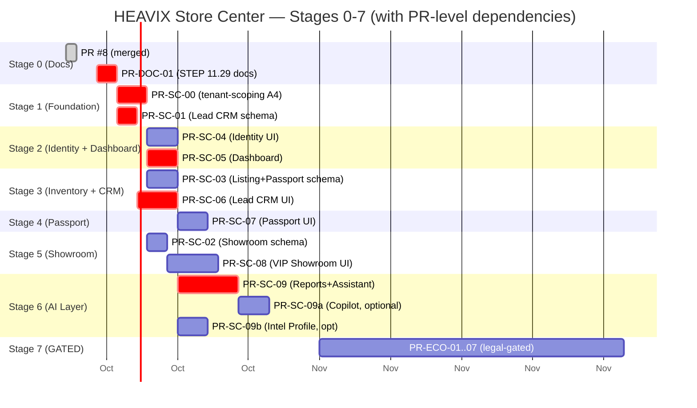

# HEAVIX Store Center — Strategic Roadmap (Stages 0–7)

- **Status:** PROPOSED — for owner review
- **Author:** /strategy agent (STEP 11.29-S, Task ID 14)
- **Date:** 2026-10-09
- **Baseline:** `main` = `4566efd` (post PR #8 merge). PR #9 (PR-SC-01 Lead CRM Foundation) OPEN on `feature/pr-sc-01-lead-crm-foundation` @ `6881f2a` — 68 tests green, NOT merged.
- **Amends:** none. This roadmap integrates — does not modify — ADR-005, ADR-005-amendment-01, the implementation plan, the detailed design, the analytics plan, the SEO architecture, the innovation program, and the engineering quality gates.
- **Scope of this document:** sequence the Store Center program into 8 stages (0–7) with measurable Definition of Done, dependencies, PRs (revised to reflect ADR-005-amendment-01 + BLOCKER-A4), test requirements, acceptance criteria, rollback, risks, and a critical-path Gantt. **No code, schema, migration, or PR is modified by this document.** Documentation only.

---

## 0. How to read this roadmap

### 0.1 Source documents grounded into this roadmap

Every stage, PR, test, and acceptance criterion below traces to one of the following STEP 11.29 deliverables. The roadmap integrates them; it does not re-derive them.

| # | Source document | Lines | Used in this roadmap for |
|---|---|---|---|
| D1 | `docs/product/STORE-CENTER-IMPLEMENTATION-PLAN.md` | 267 | Original PR-SC-01..09 sequence + dependency graph + risk register |
| D2 | `docs/ADR-005-store-center-architecture.md` | 218 | The 8 architecture decisions (Company extension, Showroom, Lead.status, SalesTeamMember, Smart Inventory Score, Machine Passport, 11 permission keys, AI advisory-only) |
| D3 | `docs/ADR-005-amendment-01.md` | 78 | Schema-reality corrections: §1 Company branding (only `brandColor` + `storeDescription` genuinely new); §2 PremiumSubscription per-USER (no migration); §3 Lead has no `sellerId` (JOIN via `listing.sellerId`); §5 inventoryScore relocated Part→Listing; §6 MachinePassport 8 verification fields all NEW. Records BLOCKER-A4. |
| D4 | `docs/product/STORE-CENTER-DETAILED-DESIGN.md` | 1212 | 7-page implementation-ready design + 31-row reconciliation table (R0–R30) + 9 BLOCKER-level gaps + 8 open questions for owner |
| D5 | `docs/ENGINEERING-QUALITY-GATES.md` | 1039 | 9 BLOCKERs (A1–A5, AI-1..AI-4) + 12-row ADR-005 alignment + 7-item migration checklist (M1–M7) + per-PR scope matrix + Pre-PR checklist (~50 items) |
| D6 | `docs/product/STORE-ANALYTICS-BI.md` | 774 | 8 KPIs (KPI-1..KPI-8 incl. cross-DB KPI-2b) + Lead Score v1 + Smart Inventory Score v1 + 26 migration items (Appendix A) + 9 production-readiness gates |
| D7 | `docs/product/HEAVIX-INNOVATION-PROGRAM.md` | 2273 | 17 ideas (A–Q) + 7 GATED items (G1–G7) + 4-wave sequencing + priority matrix |
| D8 | `docs/product/SEO-ARCHITECTURE.md` | 1179 | URL patterns + per-page metadata templates + sitemap policy + faceted-SEO + structured data + sold/expired behavior + AI role in SEO + 10-PR sequencing (PR-SEO-01..10) |
| D9 | `docs/product/PR-SC-01-SCOPE.md` | 117 | The actual PR-SC-01 scope (Lead CRM foundation only — NOT Company branding) + DoD + status labels |
| D10 | `docs/research/COMPETITIVE-MARKETPLACE-RESEARCH.md` | — | Competitive + technology research grounding the program direction |

### 0.2 Hard rules carried forward

These rules bind every stage. Violating any of them voids the stage's COMPLETE status.

1. **AI is advisory-only.** Every AI surface goes through the AI Gateway; every mutation goes through an authorized + audited non-AI path (ADR-005 §8, reinforced by D4 §2.3 rules A1–A8 and D5 §3).
2. **Financing/investment STAYS GATED.** Stage 7 (Ecosystem) is design-only until legal clearance. This roadmap does **not** de-gate G1–G7 (D7 §6).
3. **Each PR is independently revertible.** No migration runs on prod without review + rollback plan (D1 principles 1–3; D5 §1.4 item M5).
4. **BLOCKER-A4 (tenant-scoping) must be fixed before Stage 2.** PR-SC-00 ships the `buildTenantWhere(userId, config)` helper. Without it, every seller-scoped UI/API fails §2.2 cross-seller negative tests (D5 §1.2, §7).
5. **ADR-005 amendments must be reflected in every migration PR.** Each PR description must cite the amendment section it implements (D3 §1/§2/§3/§5/§6).
6. **A stage is not COMPLETE until its acceptance criteria are met.** Status labels (IMPLEMENTED → FUNCTIONAL → VERIFIED → COMPLETE) are explicit per stage (§3 below; D9 status labels).
7. **No target number without a baseline definition.** KPI claims must cite a captured pre-period (D6 §0, Appendix B; D8 §9 measurement).
8. **Ground every claim in real schema/code.** "AI works" / "tests green" without reviewable evidence is rejected (D5 ground rule).

### 0.3 Status labels (per PR and per stage)

Borrowed from `docs/product/PR-SC-01-SCOPE.md` §"Status labels" and `docs/ENGINEERING-QUALITY-GATES.md` §5 final-status block:

| Label | Meaning |
|---|---|
| **IMPLEMENTED** | Code + tests + docs committed and pushed; compiles; lint clean. |
| **FUNCTIONAL** | CI green on HEAD; manual smoke test passes (implementer). |
| **VERIFIED** | Automated tests pass on CI; independent /critic review finds no BLOCKER. |
| **COMPLETE** | Merged to `main` after owner decision; all gates green; critic signed off. |

**A stage is COMPLETE only when every PR in the stage is COMPLETE and the stage-level acceptance criteria (§4 per stage) are met.** "Merged" alone is not COMPLETE — the stage's evidence bundle (critic report + test output + rollback drill) must be attached.

---

## 1. Cross-cutting gates (apply to every stage)

These gates are enforced by `docs/ENGINEERING-QUALITY-GATES.md` (D5). Each stage's PR description must cite the gate it passes ("Passes ENGINEERING-QUALITY-GATES.md §N.M").

### 1.1 BLOCKER register (D5 §7)

| ID | Title | Must be resolved by | Affects stages |
|---|---|---|---|
| **BLOCKER-A1** | `PremiumSubscription` is per-USER not per-Company → VIP showroom enforcement unimplementable as written | Stage 5 PR-SC-02 (define `companyHasActivePremium(companyId)` helper; NO migration per amendment §2) OR future PremiumSubscription migration | Stage 5 |
| **BLOCKER-A2** | `Lead` has no `sellerId` column → KPI/CRM queries must JOIN via `Lead.listing.sellerId` | Acknowledged in PR-SC-01 (ADR-005-amendment-01 §3); enforced in PR-SC-05 + PR-SC-06 | Stages 2, 3 |
| **BLOCKER-A3** | ADR-005 §6 falsely claims `MachinePassport` has `source`/`verification` fields | PR-SC-03 (treat all 8 per-section verification fields as NEW); ADR-005-amendment-01 §6 correction (DONE) | Stage 3 |
| **BLOCKER-A4** | Universal Resource API has NO tenant-scoping — any user with `*.read` sees ALL records | **PR-SC-00** (new, Stage 1 security PR) — `buildTenantWhere(userId, config)` helper wired into all universal routes | Stages 2–6 |
| **BLOCKER-A5** | Store-DB TOCTOU: `updateResourceNonTransactional` has no `SELECT FOR UPDATE` | Document as KNOWN LIMITATION (ADR-003 §5); no PR-SC-01..09 touches store-domain controller-status fields | Future PRs only |
| **BLOCKER-AI-1** | `SELLER_ASSISTANT` input has no whitelist/PII-strip/other-seller filter | PR-SC-09 (`src/lib/ai-input-filter.ts`) | Stage 6 |
| **BLOCKER-AI-2** | AI output has no zod schema validation; raw `JSON.parse` with regex extraction | PR-SC-09 (`src/lib/ai-output-schemas.ts`) | Stage 6 |
| **BLOCKER-AI-3** | `AIGatewayLog` lacks accept/reject/confidence/evidence/promptTemplate fields; `tokensUsed` declared but never populated | PR-SC-09 (extend AIGatewayLog OR create `AISuggestion` model — D5 §3.4 recommends Option B) | Stage 6 |
| **BLOCKER-AI-4** | `SELLER_ASSISTANT` system prompt does not require uncertainty/evidence clauses | PR-SC-09 (system prompt + test) | Stage 6 |

### 1.2 Migration review checklist (D5 §1.4 — every PR that touches schema)

Every Stage-1/2/3/5 schema PR must document items M1–M7 in its PR description: M1 Additive; M2 Defaults; M3 Backfill plan; M4 Indexes; M5 Rollback safe; M6 Impact on existing API paths; M7 Seed update (permissions.ts + seed-rbac.ts + ROLE_PERMISSIONS).

### 1.3 Per-PR test category matrix (D5 §4.1)

| Category | Required for | Mandatory file pattern |
|---|---|---|
| Unit | ALL PRs | `tests/unit/<feature>.test.ts` |
| Integration | ALL PRs touching API/DB | `tests/integration/<feature>.test.ts` |
| Security (cross-tenant, 401/403, readonly bypass, export/PII) | ALL seller-facing PRs (Stages 2–6) | `tests/security/<feature>-security.test.ts` |
| Regression | ALL PRs | `tests/regression/<feature>.test.ts` |
| Migration (reversible, backfill runs, rollback SQL works) | PR-SC-01, PR-SC-02, PR-SC-03, PR-SC-09 (if AIGatewayLog extended) | `tests/migration/<pr-id>.test.ts` |
| Accessibility (axe-core, keyboard, screen reader, contrast) | All UI PRs (PR-SC-04..09) | `tests/a11y/<page>.test.ts` |
| Responsive (320/768/1280 px; no h-scroll; tap targets ≥44 px) | All UI PRs | `tests/responsive/<page>.test.ts` |
| AI cost cap (single call ≤ `costCeilingUsd`; daily/monthly budgets) | PR-SC-09 + any AI-task PR | `tests/security/ai-cost-cap.test.ts` |
| AI quality eval (20+ golden inputs; schema pass; confidence/uncertainty populated) | PR-SC-09 | `tests/ai-eval/seller-assistant-golden.test.ts` |
| AI forbidden-data leakage (PII not echoed; other-seller data not referenced) | PR-SC-09 | `tests/security/ai-leakage.test.ts` |
| Concurrency (two simultaneous requests; exactly one succeeds) | PRs adding transactional actions | `tests/concurrency/<action>.test.ts` |

Coverage thresholds (D5 §4.2): Unit ≥90%, Integration ≥80%, Security 100% of negative-test scenarios, AI 100% of input/output rules.

### 1.4 Pre-PR checklist (D5 §5)

Every PR-SC-XX must copy the §5 template into its PR description and tick every box. ~50 items across 13 sub-sections: scope manifest, CI, tests by category, migration review, architecture, security, AI, rollback, permissions in code+seed+test, multi-tenant negative test, accessibility+responsive, AI cost/quality, independent critic report.

### 1.5 Independent critic report

Every PR must attach an independent /critic report (separate from the implementer) that re-runs D5 §1 (Architecture), §2 (Security), §3 (AI) against the merged result. The critic signs off OR lists remaining gaps with severity. "Forgot" is not a justification for a skipped gate (D5 §0).

---

## 2. Stage overview (Stages 0–7)

| Stage | Name | Primary outcome | PRs in stage | Gated? |
|---|---|---|---|---|
| 0 | Documentation Stabilization | STEP 11.29 deliverables on `main`; one source of truth | PR #8 (DONE) + PR-DOC-01 (NEW) | No |
| 1 | Foundation — Security + Lead CRM Schema | `buildTenantWhere` helper + Lead.status pipeline + Lead Score v1 algorithm | PR-SC-00 (NEW) + PR-SC-01 (OPEN, 68 tests green) | No |
| 2 | Store Identity & Dashboard | First seller-scoped UI: real-data dashboard + Company branding (2 new fields only) | PR-SC-04 + PR-SC-05 | No |
| 3 | Inventory & CRM | Smart Inventory Score on Listing + Lead CRM API/UI + dynamic cross-seller test | PR-SC-03 (revised) + PR-SC-06 | No |
| 4 | Machine Passport | Per-section verification (8 new fields) + Passport Score v1 | PR-SC-07 | No |
| 5 | VIP Showroom | Public indexable showroom pages + server-side VIP enforcement (per-USER resolution) | PR-SC-02 (revised) + PR-SC-08 | No |
| 6 | AI Business Layer | HEAVIX Copilot + listing draft generation + semantic search + lead analysis + smart reports — each with cost+quality measurement. Advisory-only. Refactor bypass routes (R11). | PR-SC-09 (revised) + optional PR-SC-09a/09b | No (advisory-only enforced) |
| 7 | Ecosystem — Leasing / Investment | Bank partnerships + investment models | PR-ECO-01..07 | **YES — legal clearance required for each** |

Critical path: **Stage 0 → Stage 1 → Stage 2 → Stage 3 → Stage 6** (full chain in §6 below). Stages 4 and 5 are independent branches that parallelize off Stage 1/3 but do not gate Stage 6.

---

## 3. Stage 0 — Documentation Stabilization

### 3.1 Definition of Done (measurable, evidence-based)

1. PR #8 is merged to `main` (DONE — `main` = `4566efd`).
2. PR-DOC-01 is merged to `main` containing exactly these 7 uncommitted deliverables (verified `git status` clean post-merge):
   - `docs/research/COMPETITIVE-MARKETPLACE-RESEARCH.md` (D10)
   - `docs/product/HEAVIX-INNOVATION-PROGRAM.md` (D7)
   - `docs/product/STORE-ANALYTICS-BI.md` (D6)
   - `docs/product/SEO-ARCHITECTURE.md` (D8)
   - `docs/product/STORE-CENTER-DETAILED-DESIGN.md` (D4)
   - `docs/ENGINEERING-QUALITY-GATES.md` (D5)
   - `docs/product/STORE-CENTER-ROADMAP.md` (this document)
3. Every cross-reference between these docs resolves (no broken `docs/...md` links).
4. Owner sign-off recorded in worklog.

### 3.2 Dependencies

- PR #8 MERGED (Store Center UX Prototype + ADR-005 + Implementation Plan). DONE.
- No code dependency. PR-DOC-01 is documentation-only.

### 3.3 PRs in stage

#### PR-DOC-01 — Land STEP 11.29 deliverables on `main`

- **Branch:** `docs/step-11.29-deliverables` (NEW, off `main` @ `4566efd`)
- **Scope (in):** the 7 files listed in §3.1 item 2.
- **Scope (out):** ADR-005-amendment-01.md + PR-SC-01-SCOPE.md (these ship with PR-SC-01, already on `feature/pr-sc-01-lead-crm-foundation`); this roadmap file may be split into its own PR if the owner prefers.
- **Migration:** none. No schema, no code, no test changes.
- **Tests:** `bun run lint:docs` (markdown link check) if available; otherwise manual link audit.
- **Acceptance:**
  1. `git diff main..docs/step-11.29-deliverables --stat` shows exactly 7 files added, 0 modified.
  2. All 7 files render correctly on GitHub (no broken tables, no broken anchors).
  3. Cross-references between docs resolve (e.g., D5 §1.1 row references to ADR-005 sections point to ADR-005 as merged in PR #8).
- **Rollback:** `git revert <merge-commit>`. Documentation-only — no runtime impact.

### 3.4 Tests required

- Markdown lint (if configured).
- Manual link audit (one human pass).
- No unit/integration/security tests apply (no code).

### 3.5 Acceptance criteria

- **IMPLEMENTED:** 7 files committed + pushed on the PR branch.
- **FUNCTIONAL:** PR renders correctly on GitHub (reviewer check).
- **VERIFIED:** owner or /critic confirms all 7 docs are present and cross-references resolve.
- **COMPLETE:** merged to `main`; `main` advances past `4566efd`.

### 3.6 Rollback plan

`git revert <PR-DOC-01 merge SHA>` — pure documentation revert; no DB/code impact.

### 3.7 Risks + mitigations

| Risk | Severity | Mitigation |
|---|---|---|
| Doc cross-references break after merge (e.g., ADR-005-amendment-01.md still on PR-SC-01 branch) | LOW | The 7 files in PR-DOC-01 reference ADR-005 (already on main via PR #8); references to ADR-005-amendment-01.md must wait for PR-SC-01 merge OR be written as "pending PR-SC-01 merge" with a TODO |
| Doc drift between PR-DOC-01 and PR-SC-01 (both amend the same conceptual surface) | LOW | PR-SC-01 already contains ADR-005-amendment-01.md + PR-SC-01-SCOPE.md; PR-DOC-01 explicitly excludes these. Reviewer verifies no overlap. |
| Owner decision delays PR-DOC-01 merge, blocking Stage 1 | MEDIUM | PR-DOC-01 is independent of PR-SC-00/01 — Stages 1+ can proceed in parallel without PR-DOC-01 merged, but the roadmap itself (this doc) lands with PR-DOC-01 |

### 3.8 Stage completeness gate

> **Stage 0 is not COMPLETE until PR #8 is merged (DONE) AND PR-DOC-01 is merged with all 7 files present AND owner sign-off is recorded in worklog.**

---

## 4. Stage 1 — Foundation: Security + Lead CRM Schema

### 4.1 Definition of Done (measurable, evidence-based)

1. **PR-SC-00 merged:** `buildTenantWhere(userId, config)` helper exists in `src/lib/admin/data-adapter.ts`; `tenantScope?: { ownerField, userToOwner, moderatePermission }` declared on `AdminResourceConfig` (`src/lib/admin/types.ts`); the helper is wired into `listResources`, `getResource`, `createResource` (force-set `ownerField`), `updateResource`, `deleteResource`, `executeAction`, `executeBulkAction`, `executeExport`. A SELLER with `listing.read` can NO LONGER list other sellers' listings (proven by `tests/security/tenant-isolation-listing.test.ts`).
2. **PR-SC-01 merged:** `Lead` has `status String @default("NEW")` + 9 other nullable score/assignment/override columns + 3 indexes (`@@index([status])`, `@@index([assignedToId])`, `@@index([listingId, status])`); `src/lib/crm/lead-score.ts` (pure function, 6 factors, 0–100 clamped, `LEAD_SCORE_VERSION = "v1"`) exists; `src/lib/crm/lead-status.ts` (5 statuses + `ALLOWED_TRANSITIONS` + `validateTransition` fail-closed) exists; permission keys `store.crm.read` + `store.crm.manage` exist in `permissions.ts` PERMISSIONS array + ROLE_PERMISSIONS map + `seed-rbac.ts`. 68 tests green.
3. **BLOCKER-A4 resolved:** Stage 2 PRs can cite PR-SC-00 in their §2.2 cross-seller negative tests.
4. **BLOCKER-A2 acknowledged:** ADR-005-amendment-01 §3 is on `main` (shipped with PR-SC-01) — every subsequent Lead query uses `where: { listing: { sellerId } }`, not `where: { sellerId }`.
5. **BLOCKER-A5 acknowledged:** PR-SC-01 description documents the store-DB TOCTOU limitation (ADR-003 §5) — no PR-SC-01..09 touches store-domain controller-status fields.
6. **Critic report** attached for both PRs; no BLOCKER findings.

### 4.2 Dependencies

- Stage 0 PR #8 MERGED (DONE — provides ADR-005 + Implementation Plan on `main`).
- PR-DOC-01 NOT a hard dependency for Stage 1 (Stage 1 references ADR-005 + amendment, both reachable on PR-SC-01 branch or after merge).
- PR-SC-00 and PR-SC-01 are independent of each other and may land in either order or in parallel. Both MUST be COMPLETE before Stage 2 opens.

### 4.3 PRs in stage

#### PR-SC-00 — Security: Universal API tenant-scoping (BLOCKER-A4)

- **Branch:** `feature/pr-sc-00-tenant-scoping` (NEW, off `main` @ `4566efd`)
- **Scope (in):**
  - `src/lib/admin/types.ts` — add `tenantScope?: { ownerField: 'sellerId' | 'companyId' | 'userId'; userToOwner: 'userId' | 'userCompanyId'; moderatePermission?: string }` to `AdminResourceConfig`.
  - `src/lib/admin/data-adapter.ts` — add `buildTenantWhere(userId, config)` returning `{ [ownerField]: derivedOwnerValue }` or `{}` when the caller has `moderatePermission`. Wire into `listResources`, `getResource`, `createResource` (force-set `ownerField` from session, ignore client-supplied value), `updateResource`, `deleteResource`, `executeAction`, `executeBulkAction`, `executeExport`.
  - `src/lib/admin/resources/listing.ts` — declare `tenantScope: { ownerField: 'sellerId', userToOwner: 'userId', moderatePermission: 'listing.read.all' }` (the moderate permission is ADMIN-only — ADMIN bypasses tenant filter).
  - Other resource configs (`lead.ts` if registered, `company.ts` self-owned, etc.): declare tenant-scope where applicable.
  - Store-domain resources (`partConfig`, `orderConfig`, `paymentConfig`): declare NO `tenantScope` — these remain ADMIN-only (SELLER cannot access them via Universal Resource API; per-Company ownership migration is a future ADR).
- **Migration:** NONE. Pure code change.
- **Tests:**
  - `tests/security/tenant-isolation-listing.test.ts` — Seller A cannot read/list/export/action Seller B's listings (D5 §1.2 negative-test pattern).
  - `tests/security/tenant-isolation-create.test.ts` — Seller A cannot create a listing with `sellerId = sellerB.id` (force-set ignores client-supplied ownerField).
  - `tests/security/tenant-isolation-admin-bypass.test.ts` — ADMIN with `listing.read.all` (or just ADMIN role) bypasses tenant filter and sees all.
  - `tests/regression/admin-still-sees-all.test.ts` — ADMIN list-all behavior preserved.
  - Unit tests for `buildTenantWhere` (ownerField derivation, moderatePermission bypass, empty-config fallback).
- **Acceptance:** all 4 security tests pass; ADMIN regression test passes; `bun run typecheck` + `bun run lint` clean; `bun run test:coverage` ≥80% on `data-adapter.ts`.
- **Rollback:** `git revert <PR-SC-00 merge SHA>`. No schema impact. Re-introduces BLOCKER-A4 — every Stage 2+ PR would then fail §2.2 negative tests, so rollback must be coordinated with Stage 2 freeze.

#### PR-SC-01 — Lead CRM Foundation (OPEN, head `6881f2a`, 68 tests green)

- **Branch:** `feature/pr-sc-01-lead-crm-foundation` (EXISTING — off `main` @ `4566efd`)
- **Scope (in):** per `docs/product/PR-SC-01-SCOPE.md` (D9) — Lead.status pipeline (NEW|CONTACTED|QUALIFIED|CLOSED|LOST) + 9 other nullable Lead columns (assignedToId, score, scoreVersion, scoreBreakdown, scoredAt, scoreOverrideById, scoreOverrideReason, scoreOverrideNote, scoreOverrideAt) + 3 indexes + 2 User back-relations + 2 permission keys (`store.crm.read`, `store.crm.manage`) + `src/lib/crm/lead-score.ts` pure function + `src/lib/crm/lead-status.ts` + 3 test files (unit×2, security×1) + `docs/ADR-005-amendment-01.md` + `docs/product/PR-SC-01-SCOPE.md`.
- **Scope (out — explicitly deferred per D9):** Company `brandColor`+`storeDescription` (→ PR-SC-04); Showroom model (→ PR-SC-02); SalesTeamMember (→ PR-SC-02); MachinePassport 8 verification fields (→ PR-SC-03); Listing.inventoryScore (→ PR-SC-03 revised); Lead CRM API/UI (→ PR-SC-06); tenant-scoping fix (→ PR-SC-00); Lead Score recalc background job (→ PR-SC-06).
- **Migration review (D5 §1.4):** all 7 items (M1–M7) documented in PR-SC-01-SCOPE.md §"Migration review".
- **Tests (already green, 68 tests):**
  - `tests/unit/lead-score.test.ts` — determinism, 6 factor weights, clamping, structure, band thresholds.
  - `tests/unit/lead-status.test.ts` — legal/illegal transitions, fail-closed on unknown, terminal detection.
  - `tests/security/lead-crm-permissions.test.ts` — static contract (keys exist, SELLER+ADMIN granted, BUYER excluded, format convention).
- **Note:** the **dynamic** cross-seller negative test (Seller A cannot list Seller B's leads) is deferred to PR-SC-06 because PR-SC-01 ships no lead-listing API (D9 §"Permissions + unauthorized-access test").
- **Acceptance (D9 §"Acceptance criteria"):** 10 items including `bun run db:validate` + typecheck + lint + test all pass; CI green on HEAD; independent /critic review finds no BLOCKER.
- **Rollback (D9 §"Migration review" item 5):** `ALTER TABLE "Lead" DROP COLUMN ...` for all 10 new columns + `DROP INDEX` for the 3 indexes. No data loss (all columns nullable/new).

### 4.4 Tests required (Stage 1 aggregate)

- PR-SC-00: Unit (buildTenantWhere) + Security (4 tenant-isolation tests) + Regression (admin bypass).
- PR-SC-01: Unit (lead-score, lead-status) + Security (lead-crm-permissions static contract) + Migration (reversibility).
- No UI → no a11y/responsive tests.
- No AI → no AI tests.

### 4.5 Acceptance criteria

- **IMPLEMENTED:** both PRs committed + pushed.
- **FUNCTIONAL:** CI green on both PR HEADs; `bun run db:validate` passes for PR-SC-01.
- **VERIFIED:** independent /critic reports attached for both; D5 §1.1 rows 1, 4, 5 (Company branding reconciliation, Lead.status, Lead.sellerId JOIN) all aligned; D5 §1.2 (tenant scope) satisfied by PR-SC-00.
- **COMPLETE:** both merged to `main`; BLOCKER-A4 + BLOCKER-A2 + BLOCKER-A5 acknowledged; Stage 2 unblocked.

### 4.6 Rollback plan

- PR-SC-01 rollback: DROP 10 Lead columns + 3 indexes (additive only — safe).
- PR-SC-00 rollback: `git revert` — re-introduces BLOCKER-A4. If PR-SC-00 is reverted AFTER Stage 2 ships, Stage 2 PRs must also be reverted (or held) until PR-SC-00 is re-merged. Rollback order: (1) revert Stage 2 UI PRs, (2) revert PR-SC-00.

### 4.7 Risks + mitigations

| Risk | Severity | Mitigation |
|---|---|---|
| PR-SC-00 tenant-scope breaks an existing admin flow (e.g., ADMIN list-all) | HIGH | `tests/regression/admin-still-sees-all.test.ts` mandatory; ADMIN bypass via `moderatePermission` or role check; D5 §1.2 negative-test pattern explicitly tests both seller-isolation AND admin-bypass |
| PR-SC-00 force-set `ownerField` on create breaks a caller that legitimately sets `sellerId` client-side | MEDIUM | Audit all `createResource` callers before merge; force-set is the secure default — callers must NOT pass `sellerId` in payload (it's ignored) |
| PR-SC-01 Lead.status backfill misses orphan leads (Lead with no listing) | LOW | `Lead.listingId` is required (`onDelete: Cascade`); orphans cannot exist. `status @default("NEW")` backfills at column level. |
| PR-SC-01 score columns stay NULL until PR-SC-06 recalc job — dashboard may render "no score" | LOW | Expected behavior. UI shows "—" until PR-SC-06. Documented in D9 §"Scope (out)". |
| PR-SC-00 + PR-SC-01 both touch `src/lib/admin/` — merge conflict | LOW | PR-SC-00 touches `types.ts` + `data-adapter.ts` + resource configs; PR-SC-01 touches `permissions.ts` + `seed-rbac.ts` + new `src/lib/crm/`. No file overlap. |

### 4.8 Stage completeness gate

> **Stage 1 is not COMPLETE until PR-SC-00 and PR-SC-01 are both merged AND the dynamic cross-seller negative test infrastructure from PR-SC-00 is proven on at least one resource (Listing) AND BLOCKER-A4 is marked RESOLVED in D5 §7.**

---

## 5. Stage 2 — Store Identity & Dashboard

### 5.1 Definition of Done (measurable, evidence-based)

1. **PR-SC-04 merged:** Company has `brandColor String?` + `storeDescription String?` (the only 2 genuinely-new fields per D3 §1). Existing `logoUrl`, `coverImage`, `slug`, `metaTitle`, `metaDescription` are REUSED (not re-added). `GET /api/seller/identity` returns the seller's own Company branding; `PATCH /api/seller/identity` updates only `brandColor` + `storeDescription` + `logoUrl` + `coverImage` + `metaTitle` + `metaDescription` (existing fields). `/seller/identity` page renders the form. Permission keys `store.profile.read` + `store.profile.manage` in code + seed.
2. **PR-SC-05 merged:** `GET /api/seller/dashboard` returns 4+ real KPI cards fed by Prisma queries against real data (no sample numbers — D6 §5.4 gate #1 sentinel test enforces). Lead KPIs use `where: { listing: { sellerId } }` (D3 §3 BLOCKER-A2 enforced). `/seller/layout.tsx` shared sidebar exists (R21 resolved). Loading skeleton + empty state + error state all rendered.
3. **Tenant-scoping proven in real UI:** `tests/security/tenant-isolation-identity.test.ts` + `tests/security/tenant-isolation-dashboard.test.ts` pass (Seller A cannot fetch Seller B's identity/dashboard data).
4. **a11y + responsive:** axe-core 0 violations on both pages; 320/768/1280 px breakpoints pass; tap targets ≥44 px.
5. **Critic report** attached for both PRs.

### 5.2 Dependencies

- **Stage 1 COMPLETE** (PR-SC-00 + PR-SC-01 merged). PR-SC-04 and PR-SC-05 both depend on `buildTenantWhere` (PR-SC-00). PR-SC-05 depends on Lead.status (PR-SC-01) for the "new leads" KPI.
- PR-SC-04 and PR-SC-05 are independent of each other and may land in parallel.

### 5.3 PRs in stage

#### PR-SC-04 — Store Identity API + UI (revised per D3 §1)

- **Branch:** `feature/pr-sc-04-store-identity` (NEW, off `main` post-Stage-1)
- **Scope (in):**
  - `prisma/schema.prisma` — add `brandColor String?` + `storeDescription String?` to `Company` (2 columns, additive, nullable). NOT `logoUrl`/`bannerUrl`/`storeSlug` (already exist or overlap with `coverImage`/`slug` per D3 §1).
  - `src/app/api/seller/identity/route.ts` (NEW) — `GET` returns seller's own Company branding; `PATCH` updates branding fields, wrapped in `auditMutation`.
  - `src/app/seller/identity/page.tsx` (NEW) — form UI with brandColor picker, storeDescription textarea, logoUrl/coverImage upload (reusing existing fields).
  - `src/lib/authorization/permissions.ts` + `prisma/seed-rbac.ts` — add `store.profile.read` + `store.profile.manage` to PERMISSIONS array + ROLE_PERMISSIONS.SELLER + seed.
- **Migration review (D5 §1.4):** M1 Additive ✓; M2 NULL defaults ✓; M3 no backfill needed; M4 no new indexes (low-cardinality); M5 rollback = `ALTER TABLE "Company" DROP COLUMN "brandColor", "storeDescription"`; M6 no existing API path reads these (universal Company resource config may need to declare them as fields); M7 seed update ✓.
- **Tests:**
  - `tests/unit/identity-validation.test.ts` — brandColor hex format, storeDescription length cap.
  - `tests/integration/identity-patch.test.ts` — PATCH updates Company, audit row created.
  - `tests/security/tenant-isolation-identity.test.ts` — Seller A cannot GET/PATCH Seller B's Company (403 + audit).
  - `tests/security/identity-permissions.test.ts` — non-seller users get 403.
  - `tests/a11y/identity-page.test.ts` + `tests/responsive/identity-page.test.ts`.
- **Acceptance:** D4 §4.7 (Page 2 acceptance test) — GET returns own Company; PATCH updates fields, audit created; non-seller 403; a11y 0 violations; responsive breakpoints pass.
- **Rollback:** `git revert` PR + `ALTER TABLE "Company" DROP COLUMN "brandColor", "storeDescription"`. No data loss.

#### PR-SC-05 — Store Dashboard Enhancement (real KPIs, per D4 §3 + D6)

- **Branch:** `feature/pr-sc-05-dashboard` (NEW, off `main` post-Stage-1)
- **Scope (in):**
  - `src/app/seller/dashboard/page.tsx` — enhance existing (currently 6 KPI cards per D4 §1.4); switch to real KPI data from `GET /api/seller/dashboard`.
  - `src/app/api/seller/dashboard/route.ts` (NEW) — aggregate KPI endpoint. KPIs (per D6 KPI-1..KPI-4):
    - Active Listings: `db.listing.count({ where: { sellerId, status: 'PUBLISHED' } })` (main DB).
    - New Leads: `db.lead.count({ where: { status: 'NEW', listing: { sellerId } } })` (main DB, JOIN via `listing.sellerId` per D3 §3 — NOT `where: { sellerId }`).
    - Open Orders: `storeDb.order.count({ where: { status: 'PENDING' } })` ⚠ CROSS-DB (D6 KPI-2b) — only if seller has a store link; labeled "store orders" in UI. ⚠ Note: store-domain Order has no `sellerId` (R13) — this KPI is ADMIN-only in MVP per D4 §13 question 6.
    - Low Stock: `storeDb.inventoryBalance.count({ where: { quantity: { lte: lowStockThreshold } } })` ⚠ CROSS-DB — ADMIN-only in MVP.
    - Spec-completeness rate (D6 KPI-1) — main DB, seller-scoped.
    - Slow-moving listings (D6 KPI-2) — main DB, seller-scoped.
  - `src/app/seller/layout.tsx` (NEW) — shared sidebar for all seller pages (R21 resolved). PR-SC-04 page adopts this layout.
- **Migration:** NONE. Pure code + UI change.
- **Tests:**
  - `tests/integration/dashboard-real-data.test.ts` — sentinel test (D6 §5.4 gate #1): no sample numbers; all KPI values come from real Prisma queries.
  - `tests/integration/dashboard-empty-state.test.ts` — new seller sees zeros + onboarding CTA.
  - `tests/security/tenant-isolation-dashboard.test.ts` — Seller A cannot see Seller B's KPIs.
  - `tests/a11y/dashboard-page.test.ts` + `tests/responsive/dashboard-page.test.ts`.
- **Acceptance:** D4 §3.7 (Page 1 acceptance test) — 4+ KPI cards with real counts; loading skeleton; empty state; a11y 0 violations; responsive breakpoints pass; cross-seller isolation enforced.
- **Rollback:** `git revert` PR. No schema impact.

### 5.4 Tests required (Stage 2 aggregate)

- Unit (identity validation), Integration (identity-patch, dashboard-real-data, dashboard-empty-state), Security (4 tests: identity isolation, identity permissions, dashboard isolation, plus cross-tenant regression), a11y (2 pages), responsive (2 pages).
- Coverage: Unit ≥90% (`src/lib/crm/`-equivalent for identity), Integration ≥80% on new routes.

### 5.5 Acceptance criteria

- **IMPLEMENTED:** both PRs committed + pushed; `bun run typecheck` + lint clean.
- **FUNCTIONAL:** CI green; manual smoke: seller can update identity, dashboard shows real counts.
- **VERIFIED:** /critic reports attached; D5 §2.1 (permission enforcement) satisfied on all 4 new routes (`/api/seller/identity` GET/PATCH, `/api/seller/dashboard` GET, plus the identity page server component); D5 §2.2 (cross-seller negative test) satisfied for both pages; D5 §2.3 (readonlyWhen + TOCTOU) satisfied on identity PATCH (brandColor/storeDescription are not controller-status fields, but PATCH must use `auditMutation`).
- **COMPLETE:** both merged to `main`; BLOCKER-A4 proven on 2 real seller-scoped pages; Stage 3 unblocked.

### 5.6 Rollback plan

- PR-SC-04 rollback: `git revert` + `ALTER TABLE "Company" DROP COLUMN "brandColor", "storeDescription"`. UI reverts to no identity page (404). No data loss.
- PR-SC-05 rollback: `git revert`. Dashboard reverts to existing 6-KPI-card version. No schema impact.
- Rollback order: revert PR-SC-05 first (it depends on PR-SC-04 layout), then PR-SC-04.

### 5.7 Risks + mitigations

| Risk | Severity | Mitigation |
|---|---|---|
| Dashboard KPI aggregation slow (cross-DB: main + store queries) | MEDIUM | D6 §5.4 gate #5 — cache KPI counts with 5-minute TTL (D1 risk register); label cross-DB KPIs as "store orders"/"low stock" with ADMIN-only visibility in MVP (R13) |
| Identity PATCH allows logoUrl XSS via uploaded file | MEDIUM | Reuse existing image-upload pipeline (next/image + CDN); validate MIME + size server-side; never inline base64 |
| Seller without Company (null `companyId`) hits identity page | LOW | `/api/seller/identity` returns 404 with onboarding CTA ("Create your store profile first") |
| a11y: brandColor picker not keyboard-accessible | MEDIUM | Use native `<input type="color">` + visible hex text field; axe-core test catches violations |
| Dashboard KPI baseline not captured before merge | HIGH | D6 §5.4 gate #2 — capture 30-day baseline at first run; persist in `Setting` or compute on-demand from rolling window shifted back 30d. No "increase by X%" claim without baseline. |

### 5.8 Stage completeness gate

> **Stage 2 is not COMPLETE until PR-SC-04 and PR-SC-05 are both merged AND the dashboard sentinel test (no sample numbers) passes on CI AND the cross-seller negative tests pass on both pages AND axe-core reports 0 violations on both pages.**

---

## 6. Stage 3 — Inventory & CRM

### 6.1 Definition of Done (measurable, evidence-based)

1. **PR-SC-03 merged (revised per D3 §5 + §6):** `Listing.inventoryScore Int?` + `inventoryScoreVersion String?` + `inventoryScoredAt DateTime?` + `inventoryScoreBreakdown Json?` (RELOCATED from Part per D3 §5 — Listing lives in main DB, all 6 score factors source from main-DB models per D6 §3.1). `MachinePassport` gets 8 NEW per-section verification fields (`specsVerifiedAt/By`, `ownershipVerifiedAt/By`, `inspectionVerifiedAt/By`, `serviceHistoryVerifiedAt/By`) + `passportScore Int?` + `passportScoreVersion String?` (all NEW per D3 §6). Backfill scripts `scripts/calculate-inventory-score.ts` + `scripts/calculate-passport-score.ts` exist and run without error.
2. **PR-SC-06 merged:** `GET /api/seller/leads` returns seller-scoped leads with Lead Intelligence labels (Hot/Warm/Cold, deterministic per D6 §2); `PATCH /api/seller/leads/[id]` updates status (uses `validateTransition` from PR-SC-01); `/seller/leads` page renders Kanban (desktop) + select-mobile (D4 §6). Dynamic cross-seller negative test (Seller A cannot list/patch Seller B's leads) passes — this is the test deferred from PR-SC-01 per D9. Lead Score recalc background job exists.
3. **Smart Inventory Score v1 deterministic algorithm** (D6 §3.2) implemented as a pure function with version stamp `v1` and explainability `breakdown[]`.
4. **Cross-DB limitation flagged:** store-DB Part Catalog Score (P2 follow-up per D6 Appendix A item 23) is NOT in this stage — only the Listing-side Smart Inventory Score ships here.
5. **Critic report** attached for both PRs.

### 6.2 Dependencies

- **Stage 1 COMPLETE** (PR-SC-00 for tenant-scoping on Lead resource; PR-SC-01 for Lead.status + Lead Score v1 algorithm).
- **Stage 2 COMPLETE** (PR-SC-05 dashboard layout — `/seller/leads` adopts the shared sidebar; PR-SC-04 identity not a hard dependency).
- PR-SC-03 (schema) and PR-SC-06 (CRM UI) are independent of each other; PR-SC-06 needs PR-SC-01 COMPLETE; PR-SC-03 has no UI dependency.

### 6.3 PRs in stage

#### PR-SC-03 — Schema: Listing.inventoryScore + MachinePassport verification (revised per D3 §5 + §6)

- **Branch:** `feature/pr-sc-03-inventory-passport-schema` (NEW, off `main` post-Stage-1)
- **Scope (in):**
  - `prisma/schema.prisma`:
    - `Listing` += `inventoryScore Int?` + `inventoryScoreVersion String?` + `inventoryScoredAt DateTime?` + `inventoryScoreBreakdown Json?` + `@@index([inventoryScore])` (D6 Appendix A items 8–11). RELOCATED from Part per D3 §5.
    - `MachinePassport` += `specsVerifiedAt DateTime?` + `specsVerifiedBy String?` + `ownershipVerifiedAt DateTime?` + `ownershipVerifiedBy String?` + `inspectionVerifiedAt DateTime?` + `inspectionVerifiedBy String?` + `serviceHistoryVerifiedAt DateTime?` + `serviceHistoryVerifiedBy String?` + `passportScore Int?` + `passportScoreVersion String?` (D6 Appendix A items 12–17). All NEW per D3 §6.
  - `src/lib/inventory/inventory-score.ts` (NEW) — pure function, Smart Inventory Score v1 per D6 §3.2 (6 factors: spec completeness, media, verification, inspection freshness, documentation, engagement), 0–100 clamped, `INVENTORY_SCORE_VERSION = "v1"`, explainability `breakdown[]`.
  - `src/lib/passport/passport-score.ts` (NEW) — pure function, Passport Score v1 per D4 §7 (5 sections, 100 pts), `PASSPORT_SCORE_VERSION = "v1"`, explainability `breakdown[]`.
  - `scripts/calculate-inventory-score.ts` (NEW) — backfill script. Idempotent. Tolerates partial failure (cross-DB implication noted in D6 §0.1 — but Listing score is main-DB only, so no cross-DB issue here).
  - `scripts/calculate-passport-score.ts` (NEW) — backfill script.
- **Migration review (D5 §1.4):** M1 Additive ✓; M2 NULL defaults ✓; M3 backfill scripts documented; M4 `@@index([inventoryScore])` declared (passportScore index optional — low query volume initially); M5 rollback = DROP 4 Listing columns + 10 MachinePassport columns + index; M6 universal Listing + MachinePassport resource configs must declare the new fields as filterable columns; M7 no new permissions in this PR.
- **Tests:**
  - `tests/unit/inventory-score.test.ts` — D6 §5.2 validation: determinism, 6 factor weights, clamping, structure, public-visibility rule (D6 §3.7 — score is seller-internal, NOT shown to buyers).
  - `tests/unit/passport-score.test.ts` — 5-section scoring, clamping, structure.
  - `tests/migration/pr-sc-03-reversibility.test.ts` — apply migration, run backfill, run tests, rollback migration, run tests again.
- **Acceptance:** D5 §1.4 all 7 items documented; backfill scripts run without error; score algorithms pass unit tests; cross-DB isolation test (D6 §5.2) confirms Listing score uses ONLY main-DB fields (no cross-DB read on dashboard render).
- **Rollback:** DROP 4 Listing columns + 10 MachinePassport columns + `@@index([inventoryScore])`. Score columns were NULL until backfill — no data loss.

#### PR-SC-06 — Lead CRM API + UI (per D4 §6 + D6 KPI-3)

- **Branch:** `feature/pr-sc-06-lead-crm-ui` (NEW, off `main` post-Stage-1)
- **Scope (in):**
  - `src/app/api/seller/leads/route.ts` (NEW) — `GET` returns seller-scoped leads with Lead Intelligence labels; uses `where: { listing: { sellerId } }` per D3 §3 (BLOCKER-A2). `PATCH /api/seller/leads/[id]` updates status via `validateTransition` from PR-SC-01, wrapped in `auditMutationTransactional`.
  - `src/app/seller/leads/page.tsx` (REWRITE — currently a client component fetching `/api/ai-sales-agent` per D4 §1.4) — Kanban desktop (NEW/CONTACTED/QUALIFIED/CLOSED columns, LOST in collapsed tray) + select-mobile per D4 §6.6.
  - `src/lib/crm/lead-intelligence.ts` (NEW) — deterministic Hot/Warm/Cold per D6 §2 + D1 PR-SC-06 Lead Intelligence:
    - Hot: ≥3 inquiries OR status=QUALIFIED
    - Warm: 1–2 inquiries, last contact ≤7 days
    - Cold: No contact ≥14 days
  - `src/lib/crm/lead-score-recalc.ts` (NEW) — background recalc job (invoked from API PATCH + scheduled). Idempotent.
  - Permission keys: `store.crm.read` + `store.crm.manage` already in PR-SC-01 — no new permissions in this PR.
- **Migration:** NONE. PR-SC-01 already added the Lead columns.
- **Tests:**
  - `tests/integration/lead-crm-patch.test.ts` — PATCH status, verify `validateTransition` rejects illegal transitions, audit row created.
  - `tests/security/tenant-isolation-leads.test.ts` — **DYNAMIC cross-seller negative test** (Seller A cannot list/patch Seller B's leads). This is the test deferred from PR-SC-01 per D9 — mandatory merge gate for PR-SC-06.
  - `tests/unit/lead-intelligence.test.ts` — Hot/Warm/Cold classification, edge cases (no inquiries, exactly 3, exactly 14 days).
  - `tests/regression/leads-page-no-ai-sales-agent.test.ts` — confirms the old `/api/ai-sales-agent` route is no longer called from `/seller/leads` (R11 partial fix — full refactor in PR-SC-09).
  - `tests/a11y/leads-page.test.ts` (Kanban keyboard nav: arrow keys to move between columns, Enter to open card) + `tests/responsive/leads-page.test.ts`.
- **Acceptance:** D4 §6.7 (Page 4 acceptance test) — leads in pipeline columns; status change creates audit; Lead Intelligence labels shown; cross-seller isolation enforced; a11y 0 violations; responsive breakpoints pass.
- **Rollback:** `git revert` PR. UI reverts to old client component (which still calls `/api/ai-sales-agent` — R11 unfixed, acceptable). No schema impact.

### 6.4 Tests required (Stage 3 aggregate)

- Unit (inventory-score, passport-score, lead-intelligence), Integration (lead-crm-patch), Security (tenant-isolation-leads — the deferred dynamic test), Migration (pr-sc-03-reversibility), Regression (leads-page-no-ai-sales-agent), a11y (leads page), responsive (leads page).
- AI: NONE in this stage (Lead Intelligence is deterministic per D7 idea D MVP — no AI in MVP).

### 6.5 Acceptance criteria

- **IMPLEMENTED:** both PRs committed + pushed; `bun run db:validate` passes for PR-SC-03.
- **FUNCTIONAL:** CI green; manual smoke: seller sees leads in Kanban, can transition status, sees Lead Intelligence labels; backfill scripts run.
- **VERIFIED:** /critic reports attached; D5 §1.1 rows 7 (Part disambiguation — Listing score, NOT Part) + 8 (MachinePassport all-new fields) aligned; D5 §1.5 (main vs store DB) — Listing score uses ONLY main-DB fields proven by isolation test; D5 §2.1 (permission enforcement) on `/api/seller/leads` GET/PATCH; D5 §2.2 (cross-seller negative test) — the deferred dynamic test now passes; D5 §2.3 (readonlyWhen + TOCTOU) on status PATCH (status is a controller field — `validateTransition` is the precondition check, must use persistedRecord for the current state per D5 §2.3).
- **COMPLETE:** both merged to `main`; BLOCKER-A2 (Lead.sellerId JOIN) proven in real API; BLOCKER-A3 (MachinePassport fields all NEW) reflected in PR-SC-03 description; Stage 4 unblocked.

### 6.6 Rollback plan

- PR-SC-03 rollback: DROP 4 Listing columns + 10 MachinePassport columns + index. Score columns NULL until backfill — no data loss. Rollback order: (1) revert PR-SC-07 (Passport UI) if shipped, (2) revert PR-SC-03.
- PR-SC-06 rollback: `git revert`. UI reverts to old client component. No schema impact. Rollback order: revert PR-SC-06 first (it consumes Lead columns from PR-SC-01, not PR-SC-03), then PR-SC-03 independently.

### 6.7 Risks + mitigations

| Risk | Severity | Mitigation |
|---|---|---|
| Lead Score recalc job runs on every PATCH — performance | MEDIUM | Idempotent + cached `scoredAt`; job only recomputes if input factors changed (compare hash of breakdown inputs) |
| Kanban a11y — drag-and-drop not keyboard-accessible | HIGH | D4 §6.6 contract: Kanban must support arrow-key navigation + Enter-to-move (no drag-only interaction); axe-core + keyboard-nav test mandatory |
| Backfill script times out on large Listing table | MEDIUM | Batch processing (1000 listings per tick); idempotent — safe to resume; `CONCURRENTLY` index creation per /ceo #5 |
| Cross-DB confusion: developer accidentally puts Part-catalog score on Listing | MEDIUM | D5 §1.3 duplicate-model prevention — PR-SC-03 description must explicitly cite "Listing.inventoryScore (main DB), NOT Part.partCatalogScore (store DB, P2 follow-up)" |
| `/seller/leads` rewrite breaks existing AI features (R11 partial) | LOW | Old `/api/ai-sales-agent` route stays available during Stage 3; full deprecation in PR-SC-09 (Stage 6) |

### 6.8 Stage completeness gate

> **Stage 3 is not COMPLETE until PR-SC-03 and PR-SC-06 are both merged AND the dynamic cross-seller negative test (deferred from PR-SC-01) passes on CI AND the backfill scripts have been run on a staging database with verified output AND the Lead Intelligence classification is proven deterministic (same input → same label).**

---

## 7. Stage 4 — Machine Passport

### 7.1 Definition of Done (measurable, evidence-based)

1. **PR-SC-07 merged:** `/admin/store/passport/[listingId]` page renders 5 sections (Specs, Ownership, Inspection, Service History, Documents) with per-section verification status (verified/unverified + verifiedAt/By). `GET /api/seller/passport/[listingId]` returns all sections + Passport Score. `PATCH /api/seller/passport/[listingId]` updates verification fields (admin/seller with `passport.manage`). `POST /api/seller/passport/[listingId]/request-inspection` creates an Inspection request. Permission keys `passport.read` + `passport.manage` in code + seed.
2. **Passport Score v1** rendered (0–100) with explainability breakdown (D4 §7).
3. **"Request Inspection" CTA** visible and functional (creates `Inspection` record per D4 §7.4).
4. **Cross-seller isolation:** Seller A cannot view/patch Seller B's passport (403 + audit).
5. **Critic report** attached.

### 7.2 Dependencies

- **Stage 3 PR-SC-03 COMPLETE** (MachinePassport 8 verification fields + passportScore columns).
- **Stage 1 PR-SC-00 COMPLETE** (tenant-scoping on MachinePassport resource).
- Stage 2 PR-SC-05 layout (sidebar) — soft dependency.

### 7.3 PRs in stage

#### PR-SC-07 — Machine Passport UI (per D4 §7)

- **Branch:** `feature/pr-sc-07-passport-ui` (NEW, off `main` post-Stage-3)
- **Scope (in):**
  - `src/app/admin/store/passport/[listingId]/page.tsx` (NEW) — server component, requires `passport.read`, queries `db.machinePassport.findUnique({ where: { listingId }, include: { events: true, inspection: true } })`.
  - `src/app/api/seller/passport/[listingId]/route.ts` (NEW) — `GET` returns all 5 sections + Passport Score + breakdown; `PATCH` updates verification fields (each `*VerifiedAt/By` set only when admin/seller marks verified). Wrapped in `auditMutationTransactional`.
  - `src/app/api/seller/passport/[listingId]/request-inspection/route.ts` (NEW) — `POST` creates `Inspection` record (status=PENDING), wrapped in `auditMutationTransactional`.
  - `src/lib/authorization/permissions.ts` + `prisma/seed-rbac.ts` — add `passport.read` + `passport.manage` to PERMISSIONS + ROLE_PERMISSIONS.SELLER + seed.
- **Migration:** NONE. Schema from PR-SC-03.
- **Tests:**
  - `tests/integration/passport-get.test.ts` — GET returns all 5 sections with verification status.
  - `tests/integration/passport-patch.test.ts` — PATCH sets `specsVerifiedAt/By`, audit row created.
  - `tests/integration/passport-request-inspection.test.ts` — POST creates Inspection record.
  - `tests/security/tenant-isolation-passport.test.ts` — Seller A cannot view/patch Seller B's passport.
  - `tests/unit/passport-score-display.test.ts` — score renders with breakdown tooltip.
  - `tests/a11y/passport-page.test.ts` + `tests/responsive/passport-page.test.ts`.
- **Acceptance:** D4 §7.7 (Page 5 acceptance test) — 5 sections with verification status; score displayed (0–100); Request Inspection CTA visible; cross-seller isolation; a11y 0 violations.
- **Rollback:** `git revert` PR. No schema impact. UI reverts to 404 on `/admin/store/passport/[listingId]`.

### 7.4 Tests required

- Unit (passport-score-display), Integration (passport-get, passport-patch, passport-request-inspection), Security (tenant-isolation-passport), a11y, responsive.
- No migration tests (schema from PR-SC-03).
- No AI tests.

### 7.5 Acceptance criteria

- **IMPLEMENTED:** PR committed + pushed.
- **FUNCTIONAL:** CI green; manual smoke: admin/seller views passport, marks section verified, score updates.
- **VERIFIED:** /critic report attached; D5 §1.1 row 8 (MachinePassport all-new fields) aligned; D5 §2.1 permission enforcement on 3 new routes; D5 §2.2 cross-seller negative test; D5 §2.3 (readonlyWhen + TOCTOU — verification fields use persistedRecord for current state).
- **COMPLETE:** merged to `main`; Passport Score v1 proven deterministic; Stage 5 unblocked (Passport feeds Showroom's "verified machine" badge per D4 §8).

### 7.6 Rollback plan

`git revert` PR. No schema impact. Verification fields remain in DB (from PR-SC-03) but no UI renders them. Rollback order: revert PR-SC-07 first, then PR-SC-03 if needed.

### 7.7 Risks + mitigations

| Risk | Severity | Mitigation |
|---|---|---|
| Passport verification UI used to imply "HEAVIX guarantees ownership" — legal exposure | HIGH | D4 §7 contract: verification badge means "seller self-attested + admin checked", NOT "HEAVIX guarantees". UI text + tooltip must say "تأیید شده توسط فروشنده" (verified by seller) or "تأیید شده توسط ادمین" (verified by admin), never "HEAVIX-guaranteed". |
| Request Inspection creates Inspection record but no ServiceProvider assigned | LOW | MVP: Inspection record status=PENDING, admin manually assigns ServiceProvider later. Future: auto-assign per D7 idea N. |
| Passport Score gaming — seller self-verifies all sections for 100 pts | MEDIUM | D4 §7 scoring weights: self-verification earns fewer points than admin-verification; admin-verified sections earn full points. UI shows who verified each section. |

### 7.8 Stage completeness gate

> **Stage 4 is not COMPLETE until PR-SC-07 is merged AND the passport page renders all 5 sections with verification status AND the Passport Score v1 algorithm output matches the unit test golden values AND the legal-disclaimer text ("verified by seller/admin, NOT guaranteed by HEAVIX") is present on the page.**

---

## 8. Stage 5 — VIP Showroom

### 8.1 Definition of Done (measurable, evidence-based)

1. **PR-SC-02 merged (revised per D3 §2):** `Showroom` model exists (`companyId @unique`, `isActive Boolean`, `template String`, `layout Json`, `featuredListingIds String[]`) + `SalesTeamMember` model exists (`companyId`, `userId?`, `name`, `role`, `phone`, `email`, `photoUrl`, `isActive`). Permission keys `showroom.read` + `showroom.manage` + `showroom.admin` in code + seed. **NO PremiumSubscription migration** — per D3 §2, VIP status is resolved via `companyHasActivePremium(companyId)` helper (queries `PremiumSubscription` where `user.companyId = companyId AND status = 'ACTIVE' AND (expiresAt IS NULL OR expiresAt > now())`).
2. **PR-SC-08 merged:** `/showroom/[slug]` public page renders active showroom (404 for inactive — D5 §2.6 VIP-1 path). `/api/seller/showroom` GET/PATCH management API (403 for non-VIP — VIP-2 path). `showroom-auth.ts` server-side enforcement on all 4 paths (VIP-1 public-active, VIP-2 public-inactive-404, VIP-3 management-active, VIP-4 management-non-VIP-403). Featured listings can be added/removed. SalesTeamMember section feature-flagged (can ship without per D4 §12).
3. **SEO per D8:** `/showroom/[slug]` is indexable ONLY if `Showroom.isActive` AND valid PremiumSubscription (D8 §1.6 + §2.7); otherwise 404 + `noindex` + `X-Robots-Tag: noindex`. `generateMetadata` exported (D8 §2.7 template). Structured data `Organization` + `ItemList` for featured machines (D8 §5).
4. **4-path VIP enforcement** tested (D5 §2.6).
5. **Critic report** attached.

### 8.2 Dependencies

- **Stage 1 PR-SC-00 COMPLETE** (tenant-scoping — Showroom is company-scoped).
- **Stage 4 PR-SC-07 COMPLETE** (Passport feeds "verified machine" badge in showroom — soft dependency, can ship without but degraded UX).
- PR-SC-02 (schema) must be COMPLETE before PR-SC-08 (UI) opens.
- Stage 2 PR-SC-04 (Company branding) — soft dependency (showroom uses `Company.brandColor` + `storeDescription`).

### 8.3 PRs in stage

#### PR-SC-02 — Schema: Showroom + SalesTeamMember (revised per D3 §2)

- **Branch:** `feature/pr-sc-02-showroom-schema` (NEW, off `main` post-Stage-1)
- **Scope (in):**
  - `prisma/schema.prisma`:
    - `Showroom` model (NEW): `id`, `companyId String @unique`, `company Company @relation(...)`, `isActive Boolean @default(false)`, `template String @default("default")`, `layout Json?`, `featuredListingIds String[]` (PG array — D4 R23 confirms String[] support), `createdAt`, `updatedAt`. `@@index([isActive])`.
    - `SalesTeamMember` model (NEW): `id`, `companyId String`, `company Company @relation(...)`, `userId String?`, `name String`, `role String`, `phone String?`, `email String?`, `photoUrl String?`, `isActive Boolean @default(true)`, `createdAt`, `updatedAt`. `@@index([companyId])`.
    - `Company` += `showroom Showroom?` + `salesTeamMembers SalesTeamMember[]` back-relations.
  - `src/lib/authorization/permissions.ts` + `prisma/seed-rbac.ts` — add `showroom.read` + `showroom.manage` + `showroom.admin` to PERMISSIONS + ROLE_PERMISSIONS (SELLER gets `showroom.read` + `showroom.manage`; ADMIN gets all 3 including `showroom.admin`).
  - `src/lib/showroom/premium.ts` (NEW) — `companyHasActivePremium(companyId)` helper per D3 §2. Pure function (takes a Prisma client). Returns boolean. NO migration to PremiumSubscription.
- **Migration review (D5 §1.4):** M1 Additive ✓ (2 new tables); M2 defaults (`isActive=false`, `template="default"`); M3 no backfill (showrooms created on-demand); M4 indexes declared; M5 rollback = `DROP TABLE "Showroom", "SalesTeamMember"`; M6 no existing API path touches these; M7 seed update ✓.
- **Tests:**
  - `tests/unit/company-has-active-premium.test.ts` — helper returns true when Company has a user with active PremiumSubscription; false when expired; false when no subscription; false when Company has no users.
  - `tests/migration/pr-sc-02-reversibility.test.ts` — apply migration, run tests, rollback, run tests.
- **Acceptance:** both models exist; helper returns correct boolean; seed has 3 new permission keys; rollback safe.
- **Rollback:** `DROP TABLE "Showroom", "SalesTeamMember"`. No existing data affected.

#### PR-SC-08 — VIP Showroom UI + Public Page (per D4 §8 + D8 §1.6/§2.7)

- **Branch:** `feature/pr-sc-08-vip-showroom` (NEW, off `main` post-PR-SC-02)
- **Scope (in):**
  - `src/app/showroom/[slug]/page.tsx` (NEW) — public showroom page. Server component. Calls `showroom-auth.ts` to enforce VIP-1 (active + premium → render) / VIP-2 (inactive or no premium → 404 + noindex). Exports `generateMetadata` per D8 §2.7.
  - `src/app/api/showroom/[slug]/route.ts` (NEW) — public GET JSON. Same VIP-1/VIP-2 enforcement.
  - `src/app/seller/showroom/page.tsx` (NEW) — management UI. Server component. VIP-3 (active premium → render) / VIP-4 (non-VIP → 403).
  - `src/app/api/seller/showroom/route.ts` (NEW) — `GET` returns showroom; `PATCH` updates template/layout/isActive.
  - `src/app/api/seller/showroom/feature/route.ts` (NEW) — `POST` adds listing to `featuredListingIds`.
  - `src/app/api/seller/showroom/feature/[listingId]/route.ts` (NEW) — `DELETE` removes.
  - `src/lib/showroom/showroom-auth.ts` (NEW) — `assertPublicShowroomAccessible(slug)` + `assertManagementAccessible(user)` server-side enforcement. All 4 paths tested.
  - SalesTeamMember section: feature-flagged (`NEXT_PUBLIC_SHOWROOM_SALES_TEAM_ENABLED=false` by default); can ship without per D4 §12.
- **Migration:** NONE. Schema from PR-SC-02.
- **Tests:**
  - `tests/security/showroom-vip-paths.test.ts` — all 4 paths (VIP-1 public-active renders; VIP-2 public-inactive 404; VIP-3 management-active renders; VIP-4 management-non-VIP 403) per D5 §2.6.
  - `tests/security/tenant-isolation-showroom.test.ts` — Seller A cannot PATCH Seller B's showroom.
  - `tests/integration/showroom-feature-toggle.test.ts` — POST/DELETE featured listing.
  - `tests/integration/showroom-seo.test.ts` — `generateMetadata` returns correct title/description/canonical; `robots` meta = `noindex` when inactive.
  - `tests/a11y/showroom-page.test.ts` + `tests/responsive/showroom-page.test.ts`.
- **Acceptance:** D4 §8.7 (Page 6 acceptance test) — VIP seller sets up showroom; public URL renders; non-VIP 403 on management, 404 on public if inactive; 4 VIP paths enforced; SEO metadata correct.
- **Rollback:** `git revert` PR. Showroom table remains (from PR-SC-02) but no UI renders. Public `/showroom/[slug]` returns 404.

### 8.4 Tests required

- Unit (company-has-active-premium), Migration (pr-sc-02-reversibility), Security (showroom-vip-paths — 4 paths, tenant-isolation-showroom), Integration (showroom-feature-toggle, showroom-seo), a11y, responsive.
- SEO test (showroom-seo) — `generateMetadata` output + `robots` meta + `X-Robots-Tag` header per D8.

### 8.5 Acceptance criteria

- **IMPLEMENTED:** both PRs committed + pushed; `bun run db:validate` passes for PR-SC-02.
- **FUNCTIONAL:** CI green; manual smoke: VIP seller creates showroom, public URL renders, non-VIP gets 403/404.
- **VERIFIED:** /critic reports attached; D5 §1.1 row 3 (PremiumSubscription per-USER — `companyHasActivePremium` helper, NO migration) aligned per D3 §2; D5 §2.1 permission enforcement on 6 new routes; D5 §2.2 cross-seller negative test; D5 §2.6 (VIP Showroom 4 paths) — all 4 tested; D8 §1.6 + §2.7 SEO policy enforced.
- **COMPLETE:** both merged to `main`; BLOCKER-A1 resolved via helper (no migration); Stage 6 unblocked (showroom is a surface for HEAVIX Copilot suggestions per D7 idea A).

### 8.6 Rollback plan

- PR-SC-02 rollback: `DROP TABLE "Showroom", "SalesTeamMember"`. No existing data. Rollback order: (1) revert PR-SC-08, (2) revert PR-SC-02.
- PR-SC-08 rollback: `git revert`. UI reverts to 404 on `/showroom/[slug]`. No schema impact.

### 8.7 Risks + mitigations

| Risk | Severity | Mitigation |
|---|---|---|
| PremiumSubscription per-USER → company VIP status flaps as users subscribe/unsubscribe | MEDIUM | `companyHasActivePremium` checks ANY user in the company with active subscription; once granted, showroom stays active until ALL premium users expire. Cache the result for 5 minutes to reduce DB load. |
| Showroom leaks inactive existence via 404 vs 403 distinction | HIGH | D5 §2.6: inactive showroom → 404 (not 403) on public path; non-VIP on management → 403 (seller knows the feature exists). This is the correct distinction — public must not learn the showroom exists. |
| SEO: showroom indexed when it shouldn't be (e.g., premium expired mid-crawl) | HIGH | D8 §1.6: server-side check on EVERY render (not just at build time); `robots: { index: false }` in metadata when inactive; `X-Robots-Tag: noindex` header on API response; sitemap excludes inactive showrooms |
| `featuredListingIds String[]` PG array — Prisma support | LOW | D4 R23 confirms PG String[] support; use `Prisma.String[]` type |
| SalesTeamMember PII (phone/email) exposed publicly | HIGH | SalesTeamMember section is feature-flagged OFF by default; when enabled, only `name` + `role` + `photoUrl` are public; `phone`/`email` require a `Lead` to be created first (D4 §8.6 R30) |

### 8.8 Stage completeness gate

> **Stage 5 is not COMPLETE until PR-SC-02 and PR-SC-08 are both merged AND all 4 VIP enforcement paths are tested on CI AND the showroom-seo test confirms `noindex` on inactive showrooms AND the `companyHasActivePremium` helper is proven correct on a real PremiumSubscription record.**

---

## 9. Stage 6 — AI Business Layer

### 9.1 Definition of Done (measurable, evidence-based)

1. **PR-SC-09 merged (revised):** `/seller/reports` page renders 30-day performance KPIs (views, leads, conversion, revenue) with cross-DB flag (D6 KPI-2b/4/8). `POST /api/seller/assistant` returns advisory-only suggestions (text + CTA links, NO mutations). Existing `/api/ai-sales-agent` + `/api/ai-seller-assistant` routes are REFACTORED to go through `/api/ai-gateway` OR DEPRECATED (R11 — D4 §11 R11 + D5 §3).
2. **All 4 AI BLOCKERs resolved:**
   - BLOCKER-AI-1: `src/lib/ai-input-filter.ts` ships — input whitelist + PII strip + other-seller-data strip.
   - BLOCKER-AI-2: `src/lib/ai-output-schemas.ts` ships — zod schemas for every AI task output; raw `JSON.parse` with regex eliminated.
   - BLOCKER-AI-3: `AISuggestion` model created (D5 §3.4 Option B) — `gatewayLogId`, `suggestionType`, `suggestionJson`, `status` (PENDING/ACCEPTED/REJECTED/DISMissed), `rejectedReason`, `acceptedAt`, `acceptedBy`. AIGatewayLog `tokensUsed` now populated from `completion.usage`.
   - BLOCKER-AI-4: SELLER_ASSISTANT system prompt includes uncertainty + evidence clauses (D5 §3.5 — 6 rules including "اطلاعات کافی نیست" + evidence citation + confidence threshold 0.7 + no-fabrication + no-legal/financial advice + draft-only).
3. **Advisory-only enforced:** test asserts no ZAI call passes `tools`/`function_call`/`tool_choice` (D5 §3.3 — BLOCKER-AI-1 partial). Every mutation goes through authorized + audited non-AI path.
4. **Cost + quality measured:** `tests/security/ai-cost-cap.test.ts` (single call ≤ `policy.costCeilingUsd`; daily/monthly budgets enforced) + `tests/ai-eval/seller-assistant-golden.test.ts` (20+ golden inputs, schema pass, confidence/uncertainty populated) + `tests/security/ai-leakage.test.ts` (PII not echoed; other-seller data not referenced). KPI-8 (AI cost per task + acceptance rate per D6 §1 KPI-8) is computable.
5. **Optional PR-SC-09a (HEAVIX Copilot daily briefing) + PR-SC-09b (Machine Intelligence Profile surfacing)** — may ship with PR-SC-09 or as follow-ups. Copilot reuses `SELLER_ASSISTANT` task type (D7 idea A); Machine Intelligence Profile is pure surfacing on `ListingAttributeValue` provenance (D7 idea B, no migration).
6. **Critic report** attached.

### 9.2 Dependencies

- **Stage 2 PR-SC-05 COMPLETE** (Reports page adopts dashboard layout + sidebar; KPI baseline captured).
- **Stage 3 PR-SC-06 COMPLETE** (Lead Intelligence explanation is an AI feature in this stage per D4 §10.2 — needs Lead CRM API).
- **Stage 1 PR-SC-00 COMPLETE** (tenant-scoping on `/api/seller/assistant` input — Seller A's suggestions must not reference Seller B's data).
- Stages 4 + 5 NOT hard dependencies (Reports page can ship without Passport/Showroom; Copilot suggestions are richer with them but not blocked).

### 9.3 PRs in stage

#### PR-SC-09 — Reports + Business Assistant (revised per D5 §3 + D7 idea A)

- **Branch:** `feature/pr-sc-09-reports-assistant` (NEW, off `main` post-Stages 2+3)
- **Scope (in):**
  - `prisma/schema.prisma` — `AISuggestion` model (NEW per D5 §3.4 Option B): `id`, `gatewayLogId String`, `gatewayLog AIGatewayLog @relation(...)`, `suggestionType String`, `suggestionJson String`, `status String @default("PENDING")`, `rejectedReason String?`, `acceptedAt DateTime?`, `acceptedBy String?`, `createdAt`, `updatedAt`. Indexes: `@@index([gatewayLogId])`, `@@index([status, createdAt])`, `@@index([suggestionType, status])`.
  - `AIGatewayLog` += `tokensUsed Int?` populated from `completion.usage` (already declared, never set — fix in `/api/ai-gateway/route.ts`).
  - `src/app/seller/reports/page.tsx` (NEW) — 30-day KPI cards (D6 KPI-1..KPI-4 + KPI-8 AI cost/acceptance).
  - `src/app/api/seller/reports/route.ts` (NEW) — aggregate KPI endpoint.
  - `src/app/api/seller/assistant/route.ts` (NEW) — `POST` calls `/api/ai-gateway` with task `SELLER_ASSISTANT`; returns suggestions; creates `AISuggestion` rows (PENDING).
  - `src/app/api/seller/assistant/suggestions/[id]/accept/route.ts` + `reject/route.ts` (NEW) — human-review lifecycle; `auditMutationTransactional` on accept/reject.
  - `src/app/api/seller/assistant/dismiss/route.ts` (NEW) — `POST` dismisses suggestion (status=DISMISSED); `AdminPreference.hiddenItems` (D4 R20 reuse).
  - `src/lib/ai-input-filter.ts` (NEW) — whitelist + PII strip + other-seller-data strip (BLOCKER-AI-1).
  - `src/lib/ai-output-schemas.ts` (NEW) — zod schemas for SELLER_ASSISTANT, LISTING_BUILDER, SEMANTIC_SEARCH, etc. (BLOCKER-AI-2).
  - `src/lib/ai/prompts/seller-assistant.ts` (NEW) — system prompt with 6 uncertainty/evidence clauses (BLOCKER-AI-4).
  - Refactor `/api/ai-sales-agent` + `/api/ai-seller-assistant` to call `/api/ai-gateway` OR mark `@deprecated` and route traffic to `/api/seller/assistant` (R11 fix per D4 §11).
- **Migration review (D5 §1.4):** M1 Additive ✓ (1 new table + 1 column populated); M2 defaults (`status="PENDING"`); M3 no backfill; M4 indexes declared; M5 rollback = `DROP TABLE "AISuggestion"` (AIGatewayLog.tokensUsed reverts to never-set — no-op); M6 no existing API path breaks (old routes still work, just refactored); M7 no new permissions (uses existing `ai.execute`).
- **Tests:**
  - `tests/security/ai-cost-cap.test.ts` — single call ≤ `costCeilingUsd`; daily budget: 100 calls → 101st denied; monthly budget: exhausted → all denied.
  - `tests/ai-eval/seller-assistant-golden.test.ts` — 20+ golden inputs, schema pass, confidence/uncertainty populated (D5 §3.5).
  - `tests/security/ai-leakage.test.ts` — PII in input not echoed; other-seller data not referenced (D5 §3.1).
  - `tests/security/ai-no-function-calling.test.ts` — static assertion: no ZAI call in the codebase passes `tools`/`function_call`/`tool_choice` (D5 §3.3 — BLOCKER-AI-1 partial).
  - `tests/integration/ai-suggestion-lifecycle.test.ts` — PENDING → ACCEPTED, audited; PENDING → REJECTED with reason, audited (D5 §3.4 test pattern).
  - `tests/security/tenant-isolation-assistant.test.ts` — Seller A's suggestions do not reference Seller B's data.
  - `tests/integration/reports-real-data.test.ts` — sentinel test: no sample numbers; KPI-8 cost-per-task computed from real `AIGatewayLog.cost`.
  - `tests/regression/old-ai-routes-deprecated.test.ts` — confirms `/api/ai-sales-agent` + `/api/ai-seller-assistant` either route through `/api/ai-gateway` or return 410 Gone.
  - `tests/a11y/reports-page.test.ts` + `tests/responsive/reports-page.test.ts`.
- **Acceptance:** D4 §9.7 (Page 7 acceptance test) — 30-day KPIs; 3+ real advisory suggestions; all suggestions advisory (no auto-action); a11y 0 violations.
- **Rollback:** `git revert` PR + `DROP TABLE "AISuggestion"`. Old `/api/ai-sales-agent` route restored if deprecated. No data loss.

#### PR-SC-09a — HEAVIX Copilot Daily Briefing (optional, D7 idea A)

- **Branch:** `feature/pr-sc-09a-copilot` (NEW, off `main` post-PR-SC-09)
- **Scope:** `src/app/api/seller/copilot/daily-briefing/route.ts` (NEW) — reuses `SELLER_ASSISTANT` task; returns daily summary (new leads, slow-moving listings, expiring premium, recent views). Advisory-only.
- **Tests:** same AI test categories as PR-SC-09 (cost-cap, golden, leakage, no-function-calling).
- **May be folded into PR-SC-09** if the owner prefers one PR.

#### PR-SC-09b — Machine Intelligence Profile surfacing (optional, D7 idea B)

- **Branch:** `feature/pr-sc-09b-intelligence-profile` (NEW, off `main` post-PR-SC-03)
- **Scope:** pure surfacing on `ListingAttributeValue` provenance (`sourceType`, `confidence`, `verifiedAt/By` — all exist per D6 F8). NO migration. Renders a "Data Completeness Index" + per-attribute source chips on `/listings/[slug]` and `/seller/passport/[listingId]`.
- **Tests:** unit (completeness calculation), integration (renders on listing page), a11y, responsive.
- **May ship with PR-SC-07** (Passport UI) instead of waiting for Stage 6.

### 9.4 Tests required (Stage 6 aggregate)

- Unit (output-schema parsing, input-filter logic), Integration (ai-suggestion-lifecycle, reports-real-data), Security (ai-cost-cap, ai-leakage, ai-no-function-calling, tenant-isolation-assistant), AI eval (seller-assistant-golden — 20+ inputs), Regression (old-ai-routes-deprecated), a11y (reports page), responsive (reports page).
- Coverage: 100% of AI input/output rules tested (D5 §4.2).

### 9.5 Acceptance criteria

- **IMPLEMENTED:** PR-SC-09 committed + pushed; `bun run db:validate` passes.
- **FUNCTIONAL:** CI green; manual smoke: seller sees 30-day reports, requests assistant suggestions, accepts/rejects one, sees audit trail.
- **VERIFIED:** /critic report attached; D5 §3.1 (input whitelist + PII strip + other-seller strip) satisfied; D5 §3.2 (output zod schema) satisfied; D5 §3.3 (no function-calling — static test passes); D5 §3.4 (AISuggestion lifecycle) satisfied; D5 §3.5 (uncertainty + evidence clauses in prompt) satisfied; D5 §1.1 row 10 (AI advisory-only — now enforced by test) aligned.
- **COMPLETE:** merged to `main`; all 4 AI BLOCKERs (AI-1..AI-4) marked RESOLVED in D5 §7; KPI-8 (AI cost + acceptance rate) computable from real data; R11 (Gateway bypass) fixed.

### 9.6 Rollback plan

- PR-SC-09 rollback: `git revert` + `DROP TABLE "AISuggestion"`. Old `/api/ai-sales-agent` route restored. AIGatewayLog.tokensUsed reverts to never-set (no-op). No data loss.
- PR-SC-09a/09b rollback: `git revert`. No schema impact.

### 9.7 Risks + mitigations

| Risk | Severity | Mitigation |
|---|---|---|
| AI suggestion quality low — seller ignores all suggestions | MEDIUM | KPI-8 acceptance rate tracked; golden dataset evolves with real feedback; suggestions with confidence <0.7 suppressed (BLOCKER-AI-4) |
| AI cost exceeds `AIBudget` ($10/day, $200/month per D7 §3) | HIGH | BLOCKER-AI-1 cost-cap test mandatory; `AITaskPolicy.costCeilingUsd` default $0.05 enforced; daily/monthly budget auto-reset (D5 §3.1) |
| AI hallucinates data (e.g., invents a listing price) | HIGH | BLOCKER-AI-4 no-fabrication rule in prompt; output zod schema rejects unknown fields; evidence citation required; `tests/security/ai-leakage.test.ts` includes a hallucination-detection case |
| AI suggests a mutation (e.g., "publish this listing") and seller expects 1-click | MEDIUM | UI never offers 1-click action on AI suggestions; every CTA links to the canonical authorized page where the seller manually clicks publish. Advisory-only enforced by UX, not just prompt. |
| Old `/api/ai-sales-agent` consumers break after deprecation | LOW | Deprecation follows 2-step: (1) PR-SC-09 marks `@deprecated` + routes through Gateway (still returns same shape), (2) future PR returns 410 Gone after one release cycle |
| `AISuggestion` table grows unbounded | LOW | Status index allows efficient cleanup; archival job deletes DISMISSED/REJECTED >90 days old (future PR) |

### 9.8 Stage completeness gate

> **Stage 6 is not COMPLETE until PR-SC-09 is merged AND all 4 AI BLOCKERs (AI-1..AI-4) are marked RESOLVED in D5 §7 AND the golden dataset test passes on CI AND the cost-cap test proves the 101st daily call is denied AND the no-function-calling static test passes AND the R11 Gateway-bypass routes are refactored or deprecated.**

---

## 10. Stage 7 — Ecosystem (Leasing / Investment / Partnerships) — GATED

### 10.1 Definition of Done (measurable, evidence-based)

**Stage 7 is GATED.** No DoD is actionable until the gate clears. For each PR-ECO-XX below, the DoD is:

1. **Legal clearance** recorded (regulatory opinion + partner contract + ADR approval) in worklog.
2. **Stage 1–6 COMPLETE** (the ecosystem features build on the seller-scoped, tenant-isolated, advisory-AI foundation).
3. **No fund movement on HEAVIX's balance sheet.** HEAVIX is a facilitator, NOT a lender / fund manager / appraiser (D7 §6 G1–G7).
4. **Each PR ships with a legal-disclaimer surface** ("HEAVIX facilitates introduction; not a lender / not a fund manager / not a licensed appraiser").
5. **Critic report** attached, including a legal review sign-off.

### 10.2 Dependencies

- **Stages 1–6 COMPLETE.**
- **Legal clearance per item** (G1..G7) — separate workstream, NOT controlled by this roadmap.
- **Partner contracts** per item — separate workstream.
- **ADR approval per item** — the ADR must be accepted before engineering starts.

### 10.3 PRs in stage (all GATED — design-only until clearance)

| PR | Gated item (D7 §6) | Source doc | Gate requirement |
|---|---|---|---|
| PR-ECO-01 | G2 — Financing & Leasing Partnerships (HEAVIX as facilitator, NOT lender; Machine Dossier; inspection ≠ credit approval) | `docs/PRODUCT-FINANCING-LEASING-PARTNERSHIPS.md` | Credit-decision law + lender licensing + consumer protection review; partner contract with licensed lessor/bank; ADR-006 (proposed) |
| PR-ECO-02 | G1 — Machinery Investment Framework (4 investment models, no fund collection until legal compliance) | `docs/PRODUCT-MACHINERY-INVESTMENT.md` | Securities/regulatory law; fund-collection licensing; ADR-007 (proposed) |
| PR-ECO-03 | G3 — Leasing Eligibility Pre-Check (advisory only, but touches credit) | D7 §6 G3 | Credit decisioning; partnership with licensed lessor; ADR-008 (proposed) |
| PR-ECO-04 | G4 — Official Appraisal Service (licensed appraiser network, paid) | D7 §6 G4 | Appraisal licensing; liability review; partner contracts with licensed appraisers; ADR-009 (proposed) |
| PR-ECO-05 | G5 — Third-Party Document Verification (forgery detection) | D7 §6 G5 | Legal evidence rules; forgery-accusation liability; ADR-010 (proposed) |
| PR-ECO-06 | G6 — Auto-Publish TTL for Low-Risk Listings (skip human moderation) | D7 §6 G6 | Liability for prohibited/fraudulent listings published without human review; ADR-011 (proposed) |
| PR-ECO-07 | G7 — Manufacturer API Integration for Automated Spec Ingestion | D7 §6 G7 | Data licensing; manufacturer IP; contract law; ADR-012 (proposed) |

### 10.4 Tests required (per PR, after gate clears)

- All Stage 1–6 test categories apply (unit, integration, security, regression, a11y, responsive).
- Additional: **legal-compliance test** — assert no fund movement on HEAVIX's balance sheet; assert legal-disclaimer text present on every surface; assert HEAVIX's role is "facilitator" not "lender/appraiser/fund-manager".
- For PR-ECO-06 (auto-publish): **human-review-bypass test** — assert a human reviewer can override any auto-published listing within 24h; assert prohibited-content classifier has a manual-override path.

### 10.5 Acceptance criteria

- **IMPLEMENTED:** legal clearance + partner contract + ADR approval recorded in worklog BEFORE engineering starts; PR committed + pushed.
- **FUNCTIONAL:** CI green; manual smoke: user sees partner-service surface with legal disclaimer; no fund movement on HEAVIX.
- **VERIFIED:** /critic report + legal-review sign-off attached; Stage 1–6 gates still pass (no regression); legal-compliance test passes.
- **COMPLETE:** merged to `main`; legal disclaimer live; partner contract in force; ADR accepted.

### 10.6 Rollback plan

Per PR: `git revert` + `DROP TABLE/COLUMN` if a migration was needed. Legal: pause partner integration (contractual exit clause must be in the partner contract). No fund movement to reverse (HEAVIX is facilitator).

### 10.7 Risks + mitigations

| Risk | Severity | Mitigation |
|---|---|---|
| Legal exposure: HEAVIX deemed a lender / fund manager despite "facilitator" framing | CRITICAL | Legal review BEFORE engineering; disclaimer on every surface; no HEAVIX bank account holds user funds; partner contract indemnifies HEAVIX |
| Auto-publish (G6) publishes prohibited content | HIGH | Human-review override within 24h; prohibited-content classifier + manual flagging; rollback within 1h of detection; G6 stays gated until classifier precision ≥99% on golden dataset |
| Manufacturer API (G7) ingests copyrighted specs | MEDIUM | Data licensing contract with each manufacturer; specs watermarked; takedown procedure agreed |
| Forgery detection (G5) makes false accusations | HIGH | HEAVIX never accuses; surfaces "document could not be verified — please request original" only; licensed third-party service makes the determination |

### 10.8 Stage completeness gate

> **Stage 7 is not COMPLETE for any PR-ECO-XX until (a) legal clearance is recorded, (b) partner contract is in force, (c) ADR is accepted, (d) the PR is merged, (e) the legal-compliance test passes, and (f) the legal disclaimer is live on every surface.** Until then, Stage 7 remains DESIGN-ONLY. **This roadmap does NOT de-gate any of G1–G7.**

---

## 11. Gantt-style dependency diagram

### 11.1 Mermaid — stage-level + PR-level + critical path



### 11.2 ASCII dependency graph (PR-level)

```
                       Stage 0
                  ┌──────────────────────────────┐
                  │ PR #8 (DONE — main=4566efd)  │
                  │ PR-DOC-01 (NEW, docs only)   │
                  └──────────────┬───────────────┘
                                 │
                                 ▼
                       Stage 1 (Foundation)
            ┌────────────────────┴────────────────────┐
            │                                         │
   PR-SC-00 (A4 tenant-scoping)              PR-SC-01 (Lead CRM schema)
   [security, no migration]                  [OPEN, 68 tests green, head=6881f2a]
            │                                         │
            └────────────────────┬────────────────────┘
                                 │
                                 ▼   (both MUST be COMPLETE)
                       Stage 2 (Identity + Dashboard)
            ┌────────────────────┴────────────────────┐
            │                                         │
   PR-SC-04 (Identity UI)                    PR-SC-05 (Dashboard) ◄──┐
   [needs brandColor+storeDescription]       [needs Lead.status]     │
   [tenant-scoped via SC-00]                 [tenant-scoped via SC-00]│
            │                                         │              │
            └────────────────────┬────────────────────┘              │
                                 │                                   │
                                 ▼                                   │
                       Stage 3 (Inventory + CRM)                     │
            ┌────────────────────┴────────────────────┐              │
            │                                         │              │
   PR-SC-03 (Listing+Passport schema)        PR-SC-06 (Lead CRM UI) ◄┘
   [Listing.inventoryScore, MP 8 fields]     [dynamic cross-seller test]
   [backfill scripts]                        [Lead Intelligence deterministic]
            │                                         │
            │                                         │
            ▼                                         ▼
   ┌─────────────────┐                     ┌────────────────────────┐
   │  Stage 4        │                     │  Stage 6 (AI Layer)    │
   │  PR-SC-07       │                     │  PR-SC-09 ◄────────────┘
   │  (Passport UI)  │                     │  (Reports + Assistant)
   │  depends on     │                     │  BLOCKER-AI-1..AI-4
   │  PR-SC-03       │                     │  R11 refactor
   └────────┬────────┘                     │  + PR-SC-09a/b (optional)
            │                              └───────────┬────────────┘
            │                                          │
            ▼                                          ▼
   ┌──────────────────────────┐              ┌────────────────────────┐
   │  Stage 5 (Showroom)      │              │  Stage 7 (GATED)       │
   │  PR-SC-02 (schema)       │              │  PR-ECO-01..07         │
   │  PR-SC-08 (VIP Showroom) │              │  Legal clearance       │
   │  depends on PR-SC-02     │              │  required per item     │
   │  soft-dep on SC-04/SC-07 │              │  NOT de-gated          │
   └──────────────────────────┘              └────────────────────────┘
```

### 11.3 Critical path

The critical path is the longest dependency chain that gates Stage 6 (AI Business Layer), which is the highest-value, latest-shipping stage:

```
Stage 0 (PR-DOC-01)
  → Stage 1 (PR-SC-00 tenant-scoping)
    → Stage 2 (PR-SC-05 Dashboard — needs Lead.status from PR-SC-01)
      → Stage 3 (PR-SC-06 Lead CRM UI — needs dashboard layout + Lead.status)
        → Stage 6 (PR-SC-09 Reports + Assistant — needs PR-SC-05 + PR-SC-06)
```

**Critical path = 5 stages: 0 → 1 → 2 → 3 → 6.**

Parallel branches (NOT on critical path):
- PR-SC-01 (Lead CRM schema) runs in parallel with PR-SC-00 in Stage 1 — both must be COMPLETE before Stage 2, but neither blocks the other.
- PR-SC-04 (Identity UI) runs in parallel with PR-SC-05 (Dashboard) in Stage 2.
- PR-SC-03 (Listing+Passport schema) runs in parallel with PR-SC-06 in Stage 3 — independent.
- Stage 4 (PR-SC-07 Passport UI) branches off PR-SC-03 — independent of Stages 5 and 6.
- Stage 5 (PR-SC-02 + PR-SC-08 Showroom) branches off PR-SC-00 — independent of Stages 3, 4, and 6.
- Stage 7 (GATED) is off-critical-path entirely until legal clearance.

### 11.4 Critical-path PR sequence (depth = 5 PRs)

1. **PR-DOC-01** (Stage 0) — land STEP 11.29 docs on `main`.
2. **PR-SC-00** (Stage 1) — `buildTenantWhere` helper (BLOCKER-A4).
3. **PR-SC-05** (Stage 2) — Dashboard with real KPIs (needs PR-SC-01 in parallel for Lead.status).
4. **PR-SC-06** (Stage 3) — Lead CRM UI with dynamic cross-seller test.
5. **PR-SC-09** (Stage 6) — Reports + Business Assistant with all 4 AI BLOCKERs resolved.

---

## 12. Top-3 PRs to execute after PR-SC-01

PR-SC-01 (OPEN, head `6881f2a`, 68 tests green) is the Lead CRM schema foundation. After it merges (or in parallel with its review), the three highest-priority PRs are:

### 12.1 PR-SC-00 — Universal API tenant-scoping (BLOCKER-A4)

- **Why first:** gates EVERY seller-scoped UI/API from Stage 2 onward. Without `buildTenantWhere`, PR-SC-04/05/06/07/08/09 all fail §2.2 cross-seller negative tests (D5 §1.2, §7 BLOCKER-A4). It is the single highest-leverage security fix in the program.
- **Branch:** `feature/pr-sc-00-tenant-scoping` (NEW).
- **Scope:** see §4.3 PR-SC-00.
- **Estimated effort:** 2–3 days (code + 4 security tests + regression test).
- **Independent of PR-SC-01** — may open immediately, in parallel with PR-SC-01 review.

### 12.2 PR-SC-04 — Store Identity API + UI (revised per D3 §1)

- **Why second:** smallest UI PR (2 genuinely-new Company fields); validates the tenant-scope helper from PR-SC-00 in real seller-scoped code; delivers the first seller-facing page (`/seller/identity`); unblocks the shared `/seller/layout.tsx` sidebar that PR-SC-05 adopts.
- **Branch:** `feature/pr-sc-04-store-identity` (NEW).
- **Scope:** see §5.3 PR-SC-04.
- **Estimated effort:** 3 days (migration + API + UI + a11y/responsive tests).
- **Depends on:** PR-SC-00 COMPLETE.

### 12.3 PR-SC-05 — Store Dashboard Enhancement (real KPIs)

- **Why third:** delivers the first real seller-facing KPI value (active listings, new leads, conversion rate, slow-moving inventory); captures the 30-day baseline required by D6 §5.4 gate #2 + D8 §9 (no target without baseline); unblocks PR-SC-09 (Reports + Assistant depends on the dashboard layout + KPI aggregation).
- **Branch:** `feature/pr-sc-05-dashboard` (NEW).
- **Scope:** see §5.3 PR-SC-05.
- **Estimated effort:** 3–4 days (API + UI + cross-DB KPI handling + sentinel test).
- **Depends on:** PR-SC-00 COMPLETE (tenant-scoping) + PR-SC-01 COMPLETE (Lead.status for "new leads" KPI).

### 12.4 Honorable mention: PR-SC-03 (Listing + Passport schema)

PR-SC-03 (revised per D3 §5 + §6) is also high-priority because it unblocks Stage 4 (Passport UI). It is independent of PR-SC-04/05/06 and may run in parallel with them. It is NOT in the top-3 because it does not lie on the critical path to Stage 6 (AI Business Layer) — but if the owner prioritizes the Passport/Machine Intelligence track over the AI track, PR-SC-03 should be promoted into the top-3 in place of PR-SC-05.

---

## 13. Gated items register (carried forward from D7 §6)

This roadmap **does not de-gate** any of the following. They remain design-only until legal clearance + partner contract + ADR approval (Stage 7 §10).

| Gate ID | Item | Status | Resolving PR |
|---|---|---|---|
| G1 | Machinery Investment Framework (4 models, no fund collection) | DESIGN-ONLY | PR-ECO-02 (Stage 7) |
| G2 | Financing & Leasing Partnerships (HEAVIX as facilitator, NOT lender) | DESIGN-ONLY | PR-ECO-01 (Stage 7) |
| G3 | Leasing Eligibility Pre-Check (advisory, touches credit) | DESIGN-ONLY | PR-ECO-03 (Stage 7) |
| G4 | Official Appraisal Service (licensed appraiser network) | DESIGN-ONLY | PR-ECO-04 (Stage 7) |
| G5 | Third-Party Document Verification (forgery detection) | DESIGN-ONLY | PR-ECO-05 (Stage 7) |
| G6 | Auto-Publish TTL for Low-Risk Listings (skip human moderation) | DESIGN-ONLY | PR-ECO-06 (Stage 7) |
| G7 | Manufacturer API Integration (automated spec ingestion) | DESIGN-ONLY | PR-ECO-07 (Stage 7) |

**Total gated items: 7.** None are de-gated by this roadmap. Stage 7 §10.8 enforces the gate per PR.

---

## 14. Summary

- **Document:** `docs/product/STORE-CENTER-ROADMAP.md` — this file.
- **Stages:** 8 (Stage 0 through Stage 7).
- **PRs sequenced:** 14 execution PRs (PR-DOC-01 + PR-SC-00..09 + PR-SC-09a/09b) + 7 GATED PRs (PR-ECO-01..07, design-only).
- **Critical path:** Stage 0 → Stage 1 → Stage 2 → Stage 3 → Stage 6 (5 stages, 5 PRs deep: PR-DOC-01 → PR-SC-00 → PR-SC-05 → PR-SC-06 → PR-SC-09).
- **Gated items:** 7 (G1–G7, all design-only, none de-gated).
- **BLOCKERs tracked:** 9 (A1–A5 architecture, AI-1..AI-4 AI) — all assigned to resolving PRs in this roadmap.
- **Cross-cutting gates:** BLOCKER-A4 fixed before Stage 2; ADR-005 amendments reflected in every migration PR; AI advisory-only with authorized+audited mutation path; financing/investment GATED until legal clearance; each PR independently revertible.

**A stage is not COMPLETE until its acceptance criteria are met.** This is stated explicitly per stage (§§3.8, 4.8, 5.8, 6.8, 7.8, 8.8, 9.8, 10.8) and enforced by the status-label definitions in §0.3.

---

**End of document.** This roadmap integrates — does not modify — ADR-005, ADR-005-amendment-01, the implementation plan, the detailed design, the analytics plan, the SEO architecture, the innovation program, and the engineering quality gates. No code, schema, migration, or PR was modified by this document. Documentation only.
