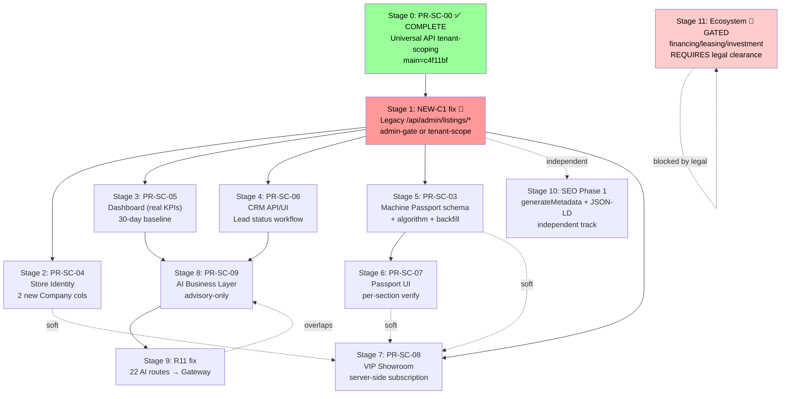

# HEAVIX STEP 11.31 — Strategic Roadmap (Executable Plan)

- **Task ID:** 11.31-/strategy
- **Agent:** /strategy
- **Date:** 2026-10-12
- **Repository:** `/home/z/heavix` (worktree HEAD on `docs/step-11.31-deliverables`)
- **Baseline:** `main = c4f11bf` — "Merge PR #11: Universal API tenant scoping — BLOCKER-A4 fix (#11)" (PR-SC-00 is LIVE on `main`).
- **GitHub:** HEAVIXIR/z-ai-2
- **Scope:** Strategic roadmap only. **No code, schema, migration, or PR changes.** This document is documentation.
- **Hard rules honored:** Documentation only. Financing/investment capabilities remain GATED. No capability passes the security gate because UI is ready. Every stage cites the deliverable it derives from.

---

## 0. Mission

Convert all 9 STEP 11.31 deliverables (7 wave deliverables + 2 cross-cutting review tracks) into a single executable path. The 9 deliverables are:

| # | Deliverable | Path | Lines | Role |
|---|---|---|---|---|
| 1 | Independent System State Research | `docs/research/STEP-11.31-RESEARCH.md` | 638 | /research |
| 2 | Innovation Portfolio (6 ideas) | `docs/product/STEP-11.31-INNOVATION-PORTFOLIO.md` | 1 574 | /brainstorm |
| 3 | Engineering Spec (7 PRs, PR-by-PR) | `docs/product/STEP-11.31-ENGINEERING-SPEC.md` | 1 962 | /detailed |
| 4 | KPI Contract + Lead Score v1 Validation | `docs/analytics/STEP-11.31-KPI-CONTRACT.md` | 735 | /analyst |
| 5 | Security Review of PR #11 (PR-SC-00) | `docs/review/STEP-11.31-SECURITY-REVIEW.md` | 713 | /expert |
| 6 | SEO Audit | `docs/seo/STEP-11.31-SEO-AUDIT.md` | 949 | /seo |
| 7 | Adversarial Review (NEW-C1 origin) | `docs/review/STEP-11.31-ADVERSARIAL-REVIEW.md` | 709 | /Critic |
| 8 | Worklog (cross-step history) | `/home/z/my-project/worklog.md` | ~2 130 | all agents |
| 9 | This roadmap | `docs/strategy/STEP-11.31-ROADMAP.md` | this file | /strategy |

The roadmap's job is to integrate these into one plan where **every stage is owned, dependent, measurable, revertible, security-gated, and grounded in the actual schema/code**.

---

## 1. Baseline State at `main = c4f11bf`

### 1.1 What is LIVE on `main` (verified)

| Capability | Status | Source |
|---|---|---|
| PR #8 — Store Center UX Prototype + ADR-005 + Implementation Plan | MERGED | `git log main` |
| PR #9 — Lead CRM Foundation (PR-SC-01): `Lead.status`, `Lead.score` v1, `validateTransition`, `store.crm.{read,manage}` perms | MERGED (`c66e060`) | `schema.prisma:618-658`, `src/lib/crm/{lead-score,lead-status}.ts` |
| PR #10 — STEP 11.29 research + design foundation (17-idea Innovation Program, ADR-005-amendment-01, financing/leasing docs) | MERGED (`f597562`) | `docs/product/HEAVIX-INNOVATION-PROGRAM.md` et al. |
| **PR #11 — PR-SC-00 Universal API tenant-scoping (BLOCKER-A4 fix)** | **MERGED (`c4f11bf`)** | `src/lib/admin/tenant-scope.ts`, `data-adapter.ts`, 5 universal routes; 51 unit+wiring tests; CI run 37981723334 green (19/19 integration assertions in real PostgreSQL) |
| `/api/admin/resources/listings/*` row-level tenant-scoping | LIVE | `listing.ts` declares `ownership: { ownerField: 'sellerId', moderatePermission: 'listing.moderate' }` — the **only** resource with ownership declared (1 of 36) |
| AI Gateway (`/api/ai-gateway/route.ts`) with 5-gate preflight (`preflightAIRequest`), `AIBudget` singleton, `AITaskPolicy`, `AIGatewayLog` | LIVE | `src/lib/ai-policy.ts`, `src/app/api/ai-gateway/route.ts` |
| `Lead.listing.sellerId` relation (relation-based ownership path) | LIVE (latent — no consumer yet) | `schema.prisma:618-658` |

### 1.2 What is NOT live (carry-forward blockers — verified by /Critic §6 + /research §8)

| ID | Severity | Finding | Source |
|---|---|---|---|
| **NEW-C1** | **CRITICAL** (pre-existing) | Legacy `/api/admin/listings/*` routes (GET list, GET by id, PATCH, POST bulk) bypass tenant-scoping; SELLER-role users can list/get/patch/bulk-modify ANY seller's listings. The bulk POST `action: "delete"` even lets a seller delete a competitor's listing (requires only `listing.publish`, which SELLER has). | `/Critic §5.1` (REPRODUCED) |
| **R-2** | HIGH | Only 1 of 36 resources (`listing`) declares `ownership`. All other seller-scoped resources (Lead, ListingOffer, Deal, RFQ, Inspection, Transport, Dispute, BuyRequest, Company, MachinePassport, etc.) have NO row-level tenant scoping through the Universal API. | `/research §4.7` (CONFIRMED by /Critic) |
| **R-3 / R11** | HIGH | 22 AI routes bypass the AI Gateway (direct `ZAI.create()`); 5 of those have NO AUTH at all (`/api/ai-search`, `/api/ai-seller-assistant`, `/api/ai-price-suggestion`, `/api/ai-listing-builder`, `/api/compare/[id]/ai-summary`). No `preflightAIRequest`, no `AIBudget`, no `AIGatewayLog`. | `/research §5.3` (CONFIRMED by /Critic; minor count inaccuracy on `brands-ai`) |
| **R-A2** | MEDIUM (latent → BLOCKER) | `assertRelationOwned` is referenced in `tenant-scope.ts` comment but does NOT exist in `data-adapter.ts`. Becomes a BLOCKER the moment PR-SC-06 ships Lead as a Universal API resource with `relation: { field: 'listing', ownerField: 'sellerId' }`. | `/research §4.6` (CONFIRMED by /Critic) |
| **R-A3** | MEDIUM | Gateway returns redirect messages (no LLM call) for `PRICE_ANALYSIS`/`MARKET_ANALYST`/`SELLER_ASSISTANT` — defeats the Gateway's purpose for those 3 task types. | `/research §7.3` |
| **H3** | MEDIUM (non-blocking) | Action-engine loads row via `findUnique` (no tenant filter) before `checkRowOwnership`. Not a leak (row discarded on rejection), but a defense-in-depth inconsistency. | `/expert §4.5` + `/Critic §2.5` (VERIFIED) |
| **R-M1** | MEDIUM (pre-existing) | `/api/seller/leads/route.ts` is stale: comment "Lead doesn't have status field" is FALSE since PR #9; no PATCH handler; no `store.crm.read` perm check. | `/research §6.5` (will be fixed in PR-SC-06) |
| SEO C1–C14 | 14 CRITICAL | 13 public page types missing `generateMetadata`; `/sellers/[id]` private-data exposure; `/knowledge/[slug]` vs `/articles/[slug]` duplicate content; zero JSON-LD; no X-Robots-Tag. | `/seo §11` |

### 1.3 What is GATED (legal — NOT de-gated by this roadmap)

Per `docs/product/STEP-11.31-INNOVATION-PORTFOLIO.md §8`, 7 ideas remain GATED behind legal review:

| # | Gated idea | Source doc | Why gated |
|---|---|---|---|
| G1 | Machinery Investment Framework | `docs/PRODUCT-MACHINERY-INVESTMENT.md` | Securities/regulatory law; fund collection requires licensing |
| G2 | Financing & Leasing Partnerships | `docs/PRODUCT-FINANCING-LEASING-PARTNERSHIPS.md` | Credit-decision law; lender licensing; consumer protection |
| G3 | Leasing Eligibility Pre-Check | Innovation Program Idea #5 Future | Credit decisioning; requires partnership with licensed lessor |
| G4 | Official Appraisal Service | Innovation Program Idea I Future | Appraisal licensing; liability |
| G5 | Third-Party Document Verification (forgery detection) | Innovation Program Idea G Future | Legal evidence rules; forgery accusations; liability |
| G6 | Auto-Publish TTL for Low-Risk Listings | Innovation Program Idea L Future | Liability for prohibited/fraudulent listings published without human review |
| G7 | Manufacturer API Integration for Automated Spec Ingestion | Innovation Program Idea P Future | Data licensing; manufacturer IP; contract law |

**This roadmap does NOT de-gate any of G1–G7.** Stage 11 (Ecosystem) is conditional on legal clearance for G1/G2 only; G3–G7 are out of scope for STEP 11.31 entirely.

---

## 2. Hard Rules (binding on every stage)

Inherited from the 9 deliverables. Every stage below must satisfy all 12.

1. **Advisory-only AI** — AI surfaces return text/scores/suggestions. No `tools`/`function_call`/`tool_choice` in any ZAI call site outside the central `/api/ai-gateway`. (ADR-005 §8; /brainstorm §2 rule #1; /detailed §4.3.)
2. **No autonomous mutations** — AI output is treated like user input: validated, rate-limited, audit-logged, written through the normal authenticated/authorized route.
3. **Human-in-the-loop** — Verification, moderation, pricing override, lead-status change, document approval always require a human click.
4. **Financial/investment/leasing ideas stay GATED** — no de-gating without (a) legal review, (b) partner contracts, (c) ADR approval.
5. **Grounded in real data** — every "required data" field cites the actual Prisma model + field. Missing fields are explicitly marked `REQUIRES MIGRATION (PR-SC-XX)`.
6. **AI must go through the AI Gateway** — no direct `ZAI.create()` in new code. Existing pre-Gateway modules (`ai-listing-builder.ts`, `ai-content-assistant.ts`) must be migrated before their consumer UI ships.
7. **No generic chatbot** — each AI capability is a specific product flow with structured output (zod schema) + a CTA deep link.
8. **Cost & rate limits first-class** — every AI idea declares `AITaskPolicy`; respects `AIBudget` (default `$10/day`, `$200/month`); default `costCeilingUsd = $0.05` per call.
9. **Audit everything** — every AI call logs to `AIGatewayLog`; every human action on AI suggestion logs via `auditMutationTransactional` (ADR-003).
10. **Persian-first, accessibility-first** — all UI strings Persian-first; axe-core 0 violations; 375/768/1280 responsive breakpoints.
11. **No fabricated data** — KPIs show "—" when underlying query returns no rows. 30-day baseline required before any growth claim.
12. **No feature passes the security gate because UI is ready.** Server-side ownership enforcement MUST be verified first — independently reviewed by /expert and /Critic — before any seller-scoped UI PR merges.

---

## 3. Stage Overview (11 stages; 1 COMPLETE, 10 active)

| Stage | PR / ID | Type | Branch | Schema change | New perms | Dependencies (hard) | Security gate | Status |
|---|---|---|---|---|---|---|---|---|
| 0 | **PR-SC-00** | Code + tests | `security/pr-sc-00-tenant-scoping` (MERGED) | None | None | — | Universal API tenant-scoping on `listing` | ✅ COMPLETE (`c4f11bf`) |
| 1 | **NEW-C1 fix** | Code + tests | `security/new-c1-legacy-listings` (NEW) | None | None | PR-SC-00 COMPLETE | Legacy `/api/admin/listings/*` admin-gated OR tenant-scoped OR removed | 🔴 BLOCKS Stage 2+ |
| 2 | **PR-SC-04** | UI + API + additive schema | `feature/pr-sc-04-store-identity` | `Company.brandColor`, `Company.storeDescription` (2 cols) | `store.profile.{read,manage}` | NEW-C1 COMPLETE | Custom `/api/seller/identity` route uses `user.companyId` from session as WHERE clause | 🟡 ready after Stage 1 |
| 3 | **PR-SC-05** | UI + API + layout | `feature/pr-sc-05-dashboard` | None | None | NEW-C1 + PR-SC-01 COMPLETE | `sellerScope` predicate from session; ADMIN bypass; `?sellerId=` ADMIN-only | 🟡 ready after Stage 1 |
| 4 | **PR-SC-06** | UI + API | `feature/pr-sc-06-lead-crm-ui` | None | None | NEW-C1 + PR-SC-01 COMPLETE | `Lead.listing.sellerId` relation filter (BLOCKER-A2); dynamic cross-seller negative test (deferred merge gate from PR-SC-01) | 🟡 ready after Stage 1 |
| 5 | **PR-SC-03** | Schema + algorithm + backfill (NO UI) | `feature/pr-sc-03-inventory-passport-schema` | `MachinePassport` +10 cols; `Listing` +4 cols; 4 User back-relations; 2 indexes | None | NEW-C1 COMPLETE | Schema-only; no seller-scoped mutation; ownership deferred to PR-SC-07 | 🟡 ready after Stage 1 |
| 6 | **PR-SC-07** | UI + API | `feature/pr-sc-07-passport-ui` | None | `passport.{read,manage}` | PR-SC-03 COMPLETE | Custom `/api/seller/passport/[listingId]` route; ownership via `passport.listing.sellerId === user.id`; cross-seller negative test (404, not 403) | 🟡 ready after Stage 5 |
| 7 | **PR-SC-08** | UI + API + additive schema | `feature/pr-sc-08-vip-showroom` | `Showroom` (new); `SalesTeamMember` (new); Company back-relations (virtual) | `showroom.{read,manage,admin}` | PR-SC-00 + PR-SC-04 (soft) + PR-SC-03 (soft) COMPLETE | Server-side 4-path VIP enforcement (`companyHasActivePremium(companyId)`); ownership via `user.companyId`; cross-seller negative test (404 on inactive/non-VIP, no existence leak) | 🟡 ready after Stage 1 (soft deps improve UX) |
| 8 | **PR-SC-09** | UI + API + additive schema + AI Gateway integration | `feature/pr-sc-09-reports-assistant` | `AISuggestion` (new); `AIGatewayLog.suggestions` back-relation (virtual) | `store.reports.read`, `store.analytics.read`, + `ai.execute` to SELLER | PR-SC-00 + PR-SC-05 + PR-SC-06 + PR-SC-01 COMPLETE | Seller-scoped AI input (sanitize PII + other-seller-data strip); zod output schema; advisory-only (no `db.*.create/update/delete` in AI path); cross-seller negative test (input-capture fixture); R11 partial fix (deprecated routes route through Gateway) | 🟡 ready after Stages 3 + 4 |
| 9 | **R11 fix** | Code refactor | `security/r11-ai-gateway-migration` (NEW) | None | None | PR-SC-09 COMPLETE (overlaps) | All 22 AI routes call `/api/ai-gateway` (server-side) or return 410 Gone; 5 currently-unauthenticated routes gain `requireAdmin('ai.execute')`; Gateway's redirect messages for `PRICE_ANALYSIS`/`MARKET_ANALYST`/`SELLER_ASSISTANT` removed (R-A3) | 🟡 overlaps Stage 8 |
| 10 | **SEO Phase 1** | UI + lib | `feature/seo-phase-1-metadata-jsonld` (NEW) | None | None | None (independent track) | `/sellers/[id]` noindex + robots disallow; 5 critical detail pages gain `generateMetadata`; duplicate-content collision `/knowledge/[slug]` vs `/articles/[slug]` consolidated | 🟡 independent |
| 11 | **Stage 7 Ecosystem (financing/leasing/investment)** | GATED — design only | n/a | n/a | n/a | **Legal clearance for G1 + G2** | None — no code, no schema, no PR until legal sign-off | 🔴 GATED |

**Totals:** 11 stages. 1 COMPLETE. 8 code PRs (Stages 1–8). 1 refactor (Stage 9). 1 SEO track (Stage 10). 1 GATED (Stage 11). **No capability de-gated.**

---

## 4. Dependency Diagram

### 4.1 ASCII (canonical)

```
                                  main = c4f11bf
                                       │
                              ┌────────┴────────┐
                              │  Stage 0: PR-SC-00  │  ✅ COMPLETE (merged)
                              │  Universal API      │
                              │  tenant-scoping     │
                              └────────┬────────┘
                                       │
                                       ▼
                          ┌─────────────────────────┐
                          │  Stage 1: NEW-C1 fix     │  🔴 CRITICAL — blocks all seller-scoped UI
                          │  Legacy /api/admin/      │
                          │  listings/* admin-gate   │
                          └────────────┬────────────┘
                                       │
            ┌──────────────┬───────────┼───────────┬──────────────┐
            │              │           │           │              │
            ▼              ▼           ▼           ▼              ▼
   ┌─────────────┐ ┌─────────────┐ ┌──────────┐ ┌─────────────┐ ┌──────────────┐
   │ Stage 2:    │ │ Stage 3:    │ │ Stage 4: │ │ Stage 5:    │ │ Stage 10:    │
   │ PR-SC-04    │ │ PR-SC-05    │ │ PR-SC-06 │ │ PR-SC-03    │ │ SEO Phase 1  │
   │ Store       │ │ Dashboard   │ │ CRM UI   │ │ Passport    │ │ (independent │
   │ Identity    │ │             │ │          │ │ schema+algo │ │  track)      │
   └──────┬──────┘ └──────┬──────┘ └────┬─────┘ └──────┬──────┘ └──────────────┘
          │ (soft)        │ (hard)      │ (hard)      │ (hard)
          │               │             │             │
          │               └──────┬──────┘             │
          │                      │                    │
          │                      ▼                    ▼
          │              ┌─────────────────┐   ┌─────────────┐
          │              │  Stage 8:       │   │  Stage 6:   │
          │              │  PR-SC-09       │   │  PR-SC-07   │
          │              │  AI Business    │   │  Passport   │
          │              │  Layer          │   │  UI         │
          │              └────────┬────────┘   └──────┬──────┘
          │                       │ (overlaps)        │ (soft)
          │                       ▼                   │
          │              ┌─────────────────┐          │
          │              │  Stage 9:       │          │
          │              │  R11 fix        │          │
          │              │  (22 AI routes  │          │
          │              │  → Gateway)     │          │
          │              └─────────────────┘          │
          │                                            │
          └──────────────┬─────────────────────────────┘
                         │ (soft deps)
                         ▼
                ┌─────────────────┐
                │  Stage 7:       │
                │  PR-SC-08       │
                │  VIP Showroom   │
                │  (server-side   │
                │  subscription)  │
                └─────────────────┘

                                       ╔═══════════════════════╗
                                       ║  Stage 11: Ecosystem  ║  🔴 GATED
                                       ║  (financing / leasing ║
                                       ║  / investment)        ║
                                       ║  REQUIRES legal       ║
                                       ║  clearance for G1+G2  ║
                                       ╚═══════════════════════╝
```

### 4.2 Mermaid (canonical)



### 4.3 Critical path (longest chain)

```
Stage 0 (PR-SC-00, DONE)
   → Stage 1 (NEW-C1)
      → Stage 3 (PR-SC-05 Dashboard)
         → Stage 8 (PR-SC-09 AI Business Layer)
            → Stage 9 (R11 fix, overlaps)
```

**Critical path length:** 5 stages (1 DONE + 4 to ship). PR-SC-09 is the latest-arriving capability.

**Parallel branches off NEW-C1 (Stage 1):**
- Branch A (critical path): NEW-C1 → PR-SC-05 → PR-SC-09
- Branch B: NEW-C1 → PR-SC-06 → PR-SC-09 (joins Branch A at Stage 8)
- Branch C: NEW-C1 → PR-SC-03 → PR-SC-07 → (soft) PR-SC-08
- Branch D: NEW-C1 → PR-SC-04 → (soft) PR-SC-08
- Branch E (independent): SEO Phase 1 (no dep on NEW-C1)

**Parallelism available after Stage 1:** Up to 5 PRs (PR-SC-04, PR-SC-05, PR-SC-06, PR-SC-03, SEO Phase 1) can be in flight simultaneously. The proposed serial order in the task brief is **valid** but conservative; the executable plan recommends parallel execution on independent branches to compress the critical path.

---

## 5. Stage Specifications

> Each stage below specifies the 7 mandatory fields: Owner · Dependencies · Output · Acceptance Criteria · Rollback Path · "No UI bypasses security" enforcement · Security Gate.

---

### Stage 0 — PR-SC-00: Universal API Tenant-Scoping (BLOCKER-A4 Fix)

- **Status:** ✅ **COMPLETE — merged to `main` as `c4f11bf` (PR #11).**
- **Owner (review):** /expert (security review, /expert §0 verdict NOT VERIFIED on `4a2f579` → VERIFIED after fix on `0ad24c7`); /Critic (adversarial review, REPRODUCED B1 + NEW-C1; verdict: CAN merge).
- **Dependencies:** None (this was the gate).
- **Output:**
  - `src/lib/admin/tenant-scope.ts` (pure functions: `buildTenantWhere`, `mergeTenantWhere`, `assertCreateOwner`, `checkRowOwnership`).
  - `src/lib/admin/data-adapter.ts` wiring (`listResources`, `getResource`, `createResource`, `updateResource`, `deleteResource` thread `tenantCtx`).
  - 5 Universal Resource API routes + bulk + export + action engines resolve `tenantCtx` server-side.
  - `listingConfig.ownership = { ownerField: 'sellerId', moderatePermission: 'listing.moderate' }` (the ONLY resource with ownership declared — 1 of 36).
  - `tests/integration/tenant-scope-real.ts` — 19/19 assertions pass in real PostgreSQL (CI run 37981723334, conclusion=success).
- **Acceptance criteria (evidence-based):**
  - [x] CI `verify` workflow green on PR HEAD `0ad24c7` (all 19 steps pass).
  - [x] Real-PG integration test 19/19 assertions pass.
  - [x] B1 bug (`$queryRaw` identifier interpolation → Postgres 42P01) FIXED via `$queryRawUnsafe` + regex validation (`data-adapter.ts:264-294`).
  - [x] H1 fix (test passes `undefined` fieldCtx so `id` is projected).
  - [x] H2 fix (owner-reassignment guard reads raw `data[ownerField]`, not post-strip `filteredData`).
  - [x] M1 fix (`assertCreateOwner` called on raw `data`, not `filteredData`).
  - [x] Fail-closed verified for: anonymous, misconfigured ownership, null owner, non-owner.
  - [x] Independent /Critic review: no BLOCKER findings on the Universal API path; NEW-C1 documented as out-of-scope critical follow-up.
- **Rollback path:** `git revert c4f11bf`. Returns `main` to `f597562`. The Universal API reverts to RBAC-only (no tenant-scoping). Acceptable because NEW-C1 is the ONLY bypass path in the legacy layer; without PR-SC-00 there is no Universal API tenant-scoping but the seller-facing dedicated routes (`/api/listings/[id]`, `/api/offers`, `/api/orders/[id]`, `/api/seller/leads`) still enforce ownership at the app layer.
- **"No UI bypasses security" enforcement:** N/A (no UI shipped). The PR-SC-00-SCOPE.md §"Gate" rule — *"no seller-scoped UI feature dependent on the Universal Resource API is approved for release"* — was the gate. It is now met.
- **Security gate (what's in place now):**
  - `listing` resource has `ownership` declared → Universal API at `/api/admin/resources/listings/*` is row-level tenant-scoped.
  - 35 of 36 registered resources have NO ownership — they remain RBAC-only and are NOT considered tenant-safe (R-2; explicit follow-up per Stage 1 and per-PR gates below).

---

### Stage 1 — NEW-C1 Fix: Tenant-Scope Legacy `/api/admin/listings/*` Routes

- **Status:** 🔴 **NOT STARTED — CRITICAL blocker for all seller-scoped UI (Stages 2–8).**
- **Owner (implementation):** Backend engineer (security focus). **Owner (review):** /expert (security review), /Critic (independent adversarial — mandatory because /Critic is the originating agent of NEW-C1).
- **Dependencies:**
  - PR-SC-00 — COMPLETE (`c4f11bf`).
  - None other. This is the next P0.
- **Output:**
  - Fix applied to `src/app/api/admin/listings/route.ts` (GET list, POST bulk) and `src/app/api/admin/listings/[id]/route.ts` (GET, PATCH, DELETE).
  - Three fix options (recommended: option (c) admin-gate):
    - **(a)** Add tenant-scoping (resolve `tenantCtx` + `checkRowOwnership`) mirroring the Universal API pattern.
    - **(b)** Remove the legacy routes and migrate all admin-UI callers to `/api/admin/resources/listings/*` (which IS tenant-scoped).
    - **(c) [RECOMMENDED]** Add `isAdmin` gate to all 4 routes; sellers continue to use `/api/listings/*` (which IS ownership-checked at app layer per /Critic §5.4).
  - New test: `tests/security/legacy-admin-listings-admin-gate.test.ts` — Seller A attempts `GET /api/admin/listings` → 403; `GET /api/admin/listings/{any-id}` → 403; `PATCH /api/admin/listings/{any-id}` → 403; `POST /api/admin/listings` bulk → 403. ADMIN → 200 on all four.
  - Negative test for the "steal listing" exploit: Seller A attempts `PATCH /api/admin/listings/{sellerB-listing-id}` with `{ sellerId: sellerA.id }` → 403 (option c) OR ownership-enforced rejection (option a).
- **Acceptance criteria (measurable, evidence-based):**
  - [ ] `bun run typecheck` + `bun run lint` pass.
  - [ ] `bun run test` passes (existing + new).
  - [ ] `tests/security/legacy-admin-listings-admin-gate.test.ts` — all 8 assertions (4 routes × 2 roles) pass.
  - [ ] Verify by grep: `rg "isAdmin|requireAdmin" src/app/api/admin/listings/` returns matches on every route handler.
  - [ ] Verify the seller-facing dedicated routes (`/api/listings/*`, `/api/offers`, `/api/orders/[id]`, `/api/seller/leads`) STILL work for sellers (no regression). They were already ownership-checked per /Critic §5.4.
  - [ ] Manual smoke: SELLER logs in → navigates to legacy admin listings endpoint → 403; SELLER uses `/api/listings/[id]` (own listing) → 200.
  - [ ] CI `verify` green on PR HEAD.
  - [ ] Independent /Critic review: no BLOCKER findings on the fix; NEW-C1 classified FIXED; the legacy bypass is closed.
- **Rollback path:** `git revert <merge SHA>`. The legacy routes revert to RBAC-only (the pre-Stage-1 state). This re-opens NEW-C1 — acceptable only as a temporary measure because the seller-scoped UI PRs (Stages 2–8) will not have shipped; sellers have no seller-scoped UI to abuse the bypass through. If Stages 2–8 have shipped when rollback is needed, **do NOT rollback Stage 1** — fix forward.
- **"No UI bypasses security" enforcement:** This stage is itself the enforcement mechanism. Every subsequent stage's "Security Gate" subsection assumes NEW-C1 is FIXED. The gate is: **no Stage 2+ PR may merge until Stage 1 is COMPLETE and /Critic has confirmed the legacy bypass is closed.**
- **Security gate (what must be in place before this stage ships):**
  - PR-SC-00 COMPLETE (Stage 0). ✓
  - After this stage ships: ALL seller-listing CRUD paths go through tenant-scoped routes (Universal API at `/api/admin/resources/listings/*` for admin-side, `/api/listings/*` for seller-side). The legacy `/api/admin/listings/*` is admin-only.
  - **NEW-C1 IS the critical-path root for every seller-scoped UI PR.** It is the second-most-important fix in STEP 11.31 (after PR-SC-00 itself).

---

### Stage 2 — PR-SC-04: Store Identity (Company Branding)

- **Status:** 🟡 Ready to start after Stage 1.
- **Owner (implementation):** Full-stack engineer (UI + API). **Owner (review):** /expert (security review), /Critic (independent adversarial), /seo (metadata on the management page).
- **Dependencies:**
  - PR-SC-00 — COMPLETE (mandatory: first seller-scoped UI PR; cross-seller negative test gate).
  - NEW-C1 — COMPLETE (mandatory: the seller-scoped UI PR gate).
  - PR-SC-01 — COMPLETE (already merged; baseline permission pattern).
  - NOT a dependency: PR-SC-05 (Dashboard), PR-SC-06, PR-SC-03, PR-SC-07, PR-SC-08, PR-SC-09. (Per /detailed §5.9.)
- **Output:**
  - Schema: `Company` += `brandColor String?` + `storeDescription String?` (2 cols; ONLY these 2 — `logoUrl`/`coverImage`/`slug`/`metaTitle`/`metaDescription` already exist per ADR-005-amendment-01 §1).
  - API: `GET /api/seller/identity`, `PATCH /api/seller/identity` (NEW; custom route, NOT Universal Resource API).
  - UI: `/seller/identity` (server-component shell + client form).
  - Validation: `src/lib/seller/identity-validation.ts` (pure functions: `brandColor` regex `^#[0-9A-Fa-f]{6}$`, `storeDescription` ≤2000 chars, logo path allowlist).
  - Permissions: `store.profile.read`, `store.profile.manage` (2 new keys; added to SELLER + ADMIN).
  - Migration: `prisma/migrations/<timestamp>_pr_sc_04_company_branding/migration.sql` (additive `ALTER TABLE`).
- **Acceptance criteria (measurable, evidence-based):**
  - [ ] `bun run db:validate` + `typecheck` + `lint` + `test` pass.
  - [ ] `tests/unit/identity-validation.test.ts` — `brandColor` regex, `storeDescription` length cap, logo path validation pinned.
  - [ ] `tests/integration/identity-patch.test.ts` — PATCH updates `Company.brandColor` + `Company.storeDescription`; `AuditLog` row written with `action: 'store.profile.update'`, `entityType: 'Company'`, `beforeJson`/`afterJson` populated.
  - [ ] `tests/security/tenant-isolation-identity.test.ts` — Seller A cannot GET/PATCH Seller B's Company (route writes only to `user.companyId`'s Company from session, NOT from request body).
  - [ ] `tests/security/identity-permissions.test.ts` — BUYER → 403; MODERATOR → 403; SELLER → 200.
  - [ ] `tests/a11y/identity-page.test.ts` — axe-core 0 violations.
  - [ ] Manual smoke: SELLER edits `brandColor` → 200, audit log entry visible.
  - [ ] CI `verify` green on PR HEAD.
  - [ ] Independent /Critic review: no BLOCKER findings; cross-seller negative test confirmed real (not stubbed); ownership enforcement is server-side (WHERE clause from session, not body).
- **Rollback path:** `git revert <merge SHA>` + `ALTER TABLE "Company" DROP COLUMN "brandColor", DROP COLUMN "storeDescription";` + `bun run db:seed-rbac` to remove the 2 permission keys. Additive only — no data loss. If PR-SC-05 has landed, revert PR-SC-05 first (it adopts the seller layout that PR-SC-04 also adopts), then PR-SC-04. (Per /detailed §5.10.)
- **"No UI bypasses security" enforcement:** The `/seller/identity` UI page MUST NOT ship in this PR unless `tests/security/tenant-isolation-identity.test.ts` passes AND the route handler uses `db.company.findUnique({ where: { id: user.companyId } })` (session-derived `companyId`, NOT request-body `id`). The PATCH handler MUST use `db.company.update({ where: { id: user.companyId }, data })` — the WHERE clause IS the ownership filter. Defense-in-depth: the route also 400s on immutable fields (`id`, `slug`, `verified`, `premium`, `status`, `viewCount`, `avgRating`, `reviewCount`, `createdAt`, `updatedAt`) appearing in the body.
- **Security gate (what must be in place before this stage ships):**
  - PR-SC-00 COMPLETE ✓
  - NEW-C1 COMPLETE (Stage 1) — without this, the seller could read/write any Company via the legacy bypass.
  - `companyConfig` in `store-resources.ts` is NOT modified (admin-side Universal Resource API for Company remains admin-only). Seller-side Company editing goes through the custom `/api/seller/identity` route exclusively.
  - No `ownership` config added to `companyConfig` (deferred to a separate follow-up PR per PR-SC-00-SCOPE.md).

---

### Stage 3 — PR-SC-05: Dashboard (Real KPIs)

- **Status:** 🟡 Ready to start after Stage 1. **On the critical path** (PR-SC-09 depends on this).
- **Owner (implementation):** Full-stack engineer (UI + API). **Owner (review):** /analyst (KPI contract compliance — sentinel test for no fabricated numbers), /expert (security review), /Critic (independent adversarial).
- **Dependencies:**
  - PR-SC-00 — COMPLETE.
  - NEW-C1 — COMPLETE (Stage 1).
  - PR-SC-01 — COMPLETE (already merged; `Lead.status` + `Lead.listing.sellerId` relation filter required for `newLeads` KPI per BLOCKER-A2).
  - NOT a dependency: PR-SC-04, PR-SC-06, PR-SC-03, PR-SC-07, PR-SC-08, PR-SC-09. (Per /detailed §6.9.)
- **Output:**
  - API: `GET /api/seller/dashboard` (NEW; aggregate KPIs — `activeListings`, `newLeads`, `openOffers`, `totalViews` lifetime-labeled per R10, `lowStockParts` null for SELLER per R13, `openStoreOrders` null for SELLER per R13, `conversionRate`, `recentLeads` (max 10), `inventoryAlerts` ADMIN-only, `storeDbReachable`).
  - UI: `/seller/dashboard/page.tsx` REWRITE (currently 305 lines, no RBAC check) → calls the new API + RBAC check (`admin.dashboard.read` already in SELLER) + loading skeleton + empty state + error state + cross-DB best-effort state.
  - Layout: `src/app/seller/layout.tsx` (NEW; shared sidebar + mobile bottom tab bar — R21 resolved).
  - KPI computation uses REAL Prisma counts only — no sample numbers, no fabricated baseline. Per /analyst §0 + /analyst §9.1 (9 KPIs computable end-to-end today with NO migration).
  - NO schema change.
- **Acceptance criteria (measurable, evidence-based):**
  - [ ] `bun run typecheck` + `lint` + `test` pass.
  - [ ] `tests/integration/dashboard-real-data.test.ts` — **sentinel**: no sample numbers; all KPIs from real Prisma queries. (Per /analyst §11 hard rule.)
  - [ ] `tests/integration/dashboard-empty-state.test.ts` — new seller → 0 KPIs + onboarding CTA card.
  - [ ] `tests/security/tenant-isolation-dashboard.test.ts` — Seller A GET `/api/seller/dashboard` → response contains ONLY Seller A's listings/leads/offers (no Seller B data); Seller A attempts `?sellerId=sellerB.id` → 403.
  - [ ] `tests/a11y/dashboard-page.test.ts` — axe-core 0 violations.
  - [ ] `tests/responsive/dashboard-page.test.ts` — 375/768/1280 breakpoints pass.
  - [ ] Manual smoke: SELLER with 30d activity sees real KPIs; SELLER with no listings sees onboarding CTA.
  - [ ] CI `verify` green on PR HEAD.
  - [ ] Independent /Critic review: no BLOCKER findings; cross-seller negative test confirmed real.
- **Rollback path:** `git revert <merge SHA>`. No schema impact. UI reverts to existing 305-line page (no RBAC check — acceptable as a regression because the dashboard is read-only aggregate). (Per /detailed §6.10.)
- **"No UI bypasses security" enforcement:** The dashboard UI page MUST NOT ship in this PR unless `tests/security/tenant-isolation-dashboard.test.ts` passes AND the `sellerScope` predicate is built from session (`user.id`, `user.companyId`) — NOT from request body or query string. `?sellerId=<other>` MUST be ADMIN-only (403 for SELLER). The KPIs MUST be computed from real Prisma counts (sentinel test enforces no fabricated numbers — /analyst §11 hard rule). 30-day baseline window: per /analyst §8, no growth claim ("X% increase") may appear on the dashboard without a captured 30-day baseline. MVP renders `currentValue` only; growth-rate card shows "insufficient historical data — baseline unavailable" until 30 post-merge days have elapsed (per /analyst §8.6 KPI-3 cutover caveat).
- **Security gate (what must be in place before this stage ships):**
  - PR-SC-00 COMPLETE ✓
  - NEW-C1 COMPLETE (Stage 1) — without this, a seller could read all sellers' listings via the legacy bypass and the dashboard's `activeListings` KPI would leak.
  - `Lead.listing.sellerId` relation filter (BLOCKER-A2) used for `newLeads` + `recentLeads` KPIs — NOT `where: { sellerId }` (Lead has no direct `sellerId`; /analyst G6 confirmed).
  - `sellerScope` predicate: `user.companyId ? { OR: [{ sellerId: user.id }, { companyId: user.companyId }] } : { sellerId: user.id }`. Session-derived; ADMIN bypass; `?sellerId=` ADMIN-only.
  - No `AdminResourceConfig.ownership` change in this PR.

---

### Stage 4 — PR-SC-06: CRM API/UI (Lead Status Workflow + Dynamic Cross-Seller Negative Test)

- **Status:** 🟡 Ready to start after Stage 1. **On the critical path** (PR-SC-09 depends on this; also unblocks PR-SC-09's `intelligence-explain` route).
- **Owner (implementation):** Full-stack engineer (UI + API). **Owner (review):** /expert (security review — particularly the AI route's input sanitization), /Critic (independent adversarial — particularly the **deferred dynamic cross-seller negative test from PR-SC-01**), /analyst (Lead Score v1 recalc validation).
- **Dependencies:**
  - PR-SC-00 — COMPLETE.
  - NEW-C1 — COMPLETE (Stage 1).
  - PR-SC-01 — COMPLETE (already merged; `Lead.status`, `validateTransition`, `Lead.listing.sellerId` relation, `src/lib/crm/{lead-score,lead-status}.ts`, `store.crm.{read,manage}` perms).
  - NOT a dependency: PR-SC-04, PR-SC-05, PR-SC-03, PR-SC-07, PR-SC-08, PR-SC-09. (Per /detailed §7.9.)
- **Output:**
  - API: `GET /api/seller/leads` (REWRITE — currently 73 lines, no PATCH handler, no `store.crm.read` check, stale comment per R-M1) + `PATCH /api/seller/leads/[id]` (NEW; status workflow via `validateTransition`) + `POST /api/seller/leads/[id]/intelligence-explain` (NEW; AI advisory route through `/api/ai-gateway`).
  - UI: `/seller/leads/page.tsx` REWRITE — server-component shell + client Kanban (NEW/CONTACTED/QUALIFIED/CLOSED columns; LOST in collapsed tray) + select-mobile.
  - Algorithm: `src/lib/crm/lead-intelligence.ts` (NEW; deterministic Hot/Warm/Cold — pure function, no LLM) + `src/lib/crm/lead-score-recalc.ts` (NEW; idempotent background recalc job).
  - Sanitizer: `src/lib/ai-sanitize.ts` (NEW; `sanitizeAiInput(payload)` strips `viewerPhone`, `viewerName`, `buyerPhone`, `buyerEmail`, `buyerName`, `paymentRef` before LLM call).
  - Permissions: NO new keys (`store.crm.{read,manage}` already from PR-SC-01).
  - NO schema change.
- **Acceptance criteria (measurable, evidence-based):**
  - [ ] `bun run typecheck` + `lint` + `test` pass.
  - [ ] `tests/integration/lead-crm-patch.test.ts` — PATCH updates `Lead.status`; `AuditLog` row written with `action: 'store.lead.status_update'`, `entityType: 'Lead'`, `before/after` JSON; `validateTransition` rejects illegal transitions (e.g., `CLOSED → NEW` → 409).
  - [ ] `tests/security/tenant-isolation-leads.test.ts` — **dynamic cross-seller negative test passes**: Seller A GET `/api/seller/leads` → response contains ONLY Seller A's leads; Seller A PATCH `/api/seller/leads/{sellerB_lead_id}` → 404 (NOT 403 — do not leak existence); Seller A POST `/api/seller/leads/{sellerB_lead_id}/intelligence-explain` → 404. **This is the deferred merge gate from PR-SC-01.**
  - [ ] `tests/unit/lead-intelligence.test.ts` — Hot (3+ leads OR QUALIFIED), Warm (1-2 leads ≤7d), Cold (last lead ≥14d); edge cases.
  - [ ] `tests/regression/leads-page-no-ai-sales-agent.test.ts` — `/seller/leads` no longer calls `/api/ai-sales-agent` (R11 partial fix — full deprecation in Stage 9).
  - [ ] `tests/security/ai-leakage.test.ts` — `viewerPhone`/`viewerName` NOT in the LLM input (input-capture fixture); `leadCountFromSamePhone` is a number, not the phone string.
  - [ ] `tests/a11y/leads-page.test.ts` — Kanban keyboard nav (arrow keys between columns, Enter to open card); select-mobile works.
  - [ ] Manual smoke: Seller sees leads in Kanban; drags NEW → CONTACTED; audit log entry visible; Lead Intelligence labels render; "Explain with AI" on a Hot lead returns Persian explanation with no PII in network response.
  - [ ] CI `verify` green on PR HEAD.
  - [ ] Independent /Critic review: no BLOCKER findings; cross-seller negative test confirmed real (not stubbed); AI input sanitized; advisory-only enforced.
- **Rollback path:** `git revert <merge SHA>`. No schema impact (Lead columns from PR-SC-01 remain). UI reverts to old client component (which calls `/api/ai-sales-agent` — R11 unfixed, acceptable). Old route still exists (Stage 9 will deprecate it). If Stage 8 has landed, revert PR-SC-09 first (it depends on PR-SC-06's CRM API), then PR-SC-06. (Per /detailed §7.10.)
- **"No UI bypasses security" enforcement:** The `/seller/leads` UI page MUST NOT ship in this PR unless `tests/security/tenant-isolation-leads.test.ts` passes (the deferred PR-SC-01 merge gate). The route handler MUST use `where: { listing: { OR: [{ sellerId: user.id }, { companyId: user.companyId }] } }` — relation filter via `Lead.listing.sellerId` (BLOCKER-A2). The `intelligence-explain` route MUST sanitize PII before the LLM call (`tests/security/ai-leakage.test.ts` enforces this with input-capture). The route MUST be advisory-only — no `db.*.create/update/delete` in the LLM path; only `AIGatewayLog.create` (by the Gateway) is permitted. The PATCH handler MUST use `auditMutationTransactional` + `validateTransition` against the persisted `lead.status` (loaded fresh at the start of the transaction, NOT the request body's claimed state).
- **Security gate (what must be in place before this stage ships):**
  - PR-SC-00 COMPLETE ✓
  - NEW-C1 COMPLETE (Stage 1) — without this, a seller could read all sellers' listings via the legacy bypass and the CRM would expose other sellers' leads via the `Lead.listingId` join.
  - `Lead.listing.sellerId` relation filter (BLOCKER-A2) used for GET and PATCH ownership checks.
  - **R-A2 latent BLOCKER:** If PR-SC-06 registers `Lead` as a Universal Resource with `ownership: { relation: { field: 'listing', ownerField: 'sellerId' } }`, then `assertRelationOwned` MUST first be implemented in `data-adapter.ts` (it does NOT exist — /research §4.6, /Critic §5.2). **Decision per /detailed §7.6:** PR-SC-06 uses a custom route (NOT Universal API for Lead), so `assertRelationOwned` is NOT required. The Universal API registration of Lead is a follow-up PR after PR-SC-06.
  - AI input sanitization: `sanitizeAiInput(payload)` strips PII before LLM call. Pure function, unit-tested with a fixture containing all forbidden keys.
  - AI advisory-only: no `tools`/`function_call`/`tool_choice` in the LLM call (enforced by `tests/security/ai-no-function-calling.test.ts` in Stage 8 — but PR-SC-06 should add a regression test for the `intelligence-explain` route specifically).

---

### Stage 5 — PR-SC-03: Machine Passport Schema + Algorithm + Backfill (NO UI)

- **Status:** 🟡 Ready to start after Stage 1. Schema-only PR — parallel-friendly.
- **Owner (implementation):** Backend engineer (schema + algorithm). **Owner (review):** /expert (security review — migration reversibility), /analyst (KPI-6 Passport Score alignment), /Critic (independent adversarial — verify all 8 verification fields are genuinely new per ADR-005-amendment-01 §6 B2 finding).
- **Dependencies:**
  - PR-SC-00 — COMPLETE (not strictly required for schema PR; baseline alignment for PR-SC-07's passport tenant-isolation test).
  - NEW-C1 — COMPLETE (Stage 1) — required only because the integration test pattern from PR-SC-00 is the template for PR-SC-07's test.
  - PR-SC-01 — COMPLETE (baseline alignment).
  - NOT a dependency: PR-SC-04, PR-SC-05, PR-SC-06, PR-SC-07, PR-SC-08, PR-SC-09. (Per /detailed §8.9.)
- **Output:**
  - Schema: `MachinePassport` += 10 NEW cols: `specsVerifiedAt`, `specsVerifiedBy`, `ownershipVerifiedAt`, `ownershipVerifiedBy`, `inspectionVerifiedAt`, `inspectionVerifiedBy`, `serviceHistoryVerifiedAt`, `serviceHistoryVerifiedBy`, `passportScore`, `passportScoreVersion` (all 8 verification fields genuinely new per ADR-005-amendment-01 §6 B2 finding). + `@@index([passportScore])`.
  - Schema: `Listing` += 4 NEW cols: `inventoryScore`, `inventoryScoreVersion`, `inventoryScoredAt`, `inventoryScoreBreakdown` (relocated from `Part` per ADR-005-amendment-01 §5 — Listing is in main DB; cross-DB read avoided). + `@@index([inventoryScore])`.
  - Schema: 4 User back-relations (`*VerifiedBy MachinePassport[]`).
  - Algorithm: `src/lib/passport/passport-score.ts` (NEW; pure function — `specs_verified(25) + ownership_verified(20) + inspection_current(25) + service_history(15) + photos_3plus(15) = 100`; `PASSPORT_SCORE_VERSION = "v1"`; explainable `breakdown[]`).
  - Algorithm: `src/lib/inventory/inventory-score.ts` (NEW; pure function — `has_images(20) + image_count_3plus(10) + has_description_50chars(10) + has_price(15) + has_year_hours(10) + verified(15) + recent_inspection(10) + views_above_median(10) = 100`; `INVENTORY_SCORE_VERSION = "v1"`; explainable `breakdown[]`).
  - Backfill: `scripts/calculate-passport-score.ts` + `scripts/calculate-inventory-score.ts` (NEW; idempotent, batched 1000 per tick, partial-failure-tolerant).
  - Migration: `prisma/migrations/<timestamp>_pr_sc_03_passport_inventory_score/migration.sql` (additive `ALTER TABLE` for both models).
  - **NO UI, NO API route.**
- **Acceptance criteria (measurable, evidence-based):**
  - [ ] `bun run db:validate` + `typecheck` + `lint` + `test` pass.
  - [ ] `tests/unit/passport-score.test.ts` — 5-section scoring; clamping; structure; determinism (same input → same output).
  - [ ] `tests/unit/inventory-score.test.ts` — 6-factor scoring; clamping; structure; determinism.
  - [ ] `tests/migration/pr-sc-03-reversibility.test.ts` — apply migration → run backfill → run unit tests → rollback migration → run unit tests (algorithms still pass on in-memory inputs; DB-dependent assertions skipped after rollback).
  - [ ] `bunx tsx scripts/calculate-passport-score.ts --dry-run` runs without error.
  - [ ] `bunx tsx scripts/calculate-inventory-score.ts --dry-run` runs without error.
  - [ ] CI `verify` green on PR HEAD.
  - [ ] Independent /Critic review: no BLOCKER findings; migration purely additive; no existing column modified; all 8 verification fields genuinely new (NOT a duplicate of `MachinePassport.source` or `verification` — both of which ADR-005 §6 falsely claimed existed per the B2 finding).
- **Rollback path:** `git revert <merge SHA>` + `ALTER TABLE "MachinePassport" DROP COLUMN ... (10 cols)` + `ALTER TABLE "Listing" DROP COLUMN ... (4 cols)` + `DROP INDEX`. No data loss — all new columns were nullable; scores were computed by backfill (recomputable on re-apply). If Stage 6 has landed, revert PR-SC-07 first (it consumes the new columns), then PR-SC-03. (Per /detailed §8.10.)
- **"No UI bypasses security" enforcement:** N/A — no UI ships in this stage. The schema is purely additive. The MachinePassport resource is NOT registered in the Universal Resource API in this PR (deferred to Stage 6's decision). No `AdminResourceConfig.ownership` change. The backfill scripts are idempotent (re-running produces the same scores — deterministic algorithms). No `AuditLog` rows written by backfill (acceptable — backfill is a script, not a mutation audit event).
- **Security gate (what must be in place before this stage ships):**
  - PR-SC-00 COMPLETE ✓ (baseline alignment).
  - NEW-C1 COMPLETE (Stage 1) ✓ (baseline alignment; not strictly required for a schema-only PR but enforced for consistency with the Stage 1 gate).
  - No `ownership` config added in this PR (deferred to Stage 6 per /detailed §8.6).
  - Migration is purely additive: nullable columns + new indexes. No existing column modified. Verified by `tests/migration/pr-sc-03-reversibility.test.ts`.
  - The 4 new User back-relations (`*VerifiedBy MachinePassport[]`) are Prisma-virtual — no DB column on User to drop on rollback.

---

### Stage 6 — PR-SC-07: Machine Passport UI (Trust Validation & Experience)

- **Status:** 🟡 Ready to start after Stage 5.
- **Owner (implementation):** Full-stack engineer (UI + API). **Owner (review):** /expert (security review — ownership via `passport.listing.sellerId`), /Critic (independent adversarial — particularly the "404, not 403" non-leakage requirement), /seo (legal disclaimer rendering), /analyst (Passport Score display correctness).
- **Dependencies:**
  - PR-SC-03 — COMPLETE (Stage 5; mandatory — schema + algorithm + backfill).
  - PR-SC-00 — COMPLETE (mandatory — first seller-scoped Passport UI; cross-seller negative test gate).
  - NEW-C1 — COMPLETE (Stage 1).
  - NOT a dependency: PR-SC-04, PR-SC-05, PR-SC-06, PR-SC-08, PR-SC-09. (Per /detailed §9.9.)
- **Output:**
  - API: `GET /api/seller/passport/[listingId]` (NEW; returns passport + 5 sections + Passport Score + breakdown) + `POST /api/seller/passport/[listingId]` (NEW; create blank passport) + `PATCH /api/seller/passport/[listingId]` (NEW; per-section verification `{ section, verified }`) + `POST /api/seller/passport/[listingId]/request-inspection` (NEW; creates `Inspection` row `status: 'REQUESTED'`).
  - UI: `/admin/store/passport/[listingId]/page.tsx` (NEW; server component; renders 5 sections with verification status + Passport Score gauge + "Request Inspection" CTA). Route is under `/admin/store/` per STORE-CENTER-DETAILED-DESIGN §7.1; sellers access via the same route with server-side ownership check.
  - Algorithm usage: `src/lib/passport/passport-score.ts` (from Stage 5) — compute on-the-fly in GET, recompute on PATCH.
  - Permissions: `passport.read`, `passport.manage` (2 new keys; added to SELLER + ADMIN; `passport.read` also to MODERATOR + SUPPORT).
  - NO schema change.
- **Acceptance criteria (measurable, evidence-based):**
  - [ ] `bun run typecheck` + `lint` + `test` pass.
  - [ ] `tests/integration/passport-get.test.ts` — GET returns all 5 sections with verification status + score + breakdown.
  - [ ] `tests/integration/passport-patch.test.ts` — PATCH sets `specsVerifiedAt` + `specsVerifiedBy`; `AuditLog` row written with `action: 'passport.section.verify'`; `PassportEvent` appended with `eventType: 'VERIFICATION'`; `passportScore` recomputed (verifying `specs` adds 25 points).
  - [ ] `tests/integration/passport-request-inspection.test.ts` — POST creates `Inspection` row with `status: 'REQUESTED'`, `requestedBy: user.id`; `PassportEvent` appended with `eventType: 'INSPECTION_REQUESTED'`.
  - [ ] `tests/security/tenant-isolation-passport.test.ts` — Seller A cannot GET/PATCH/POST-inspection on Seller B's listing (all → **404, not 403 — do not leak existence**).
  - [ ] `tests/unit/passport-score-display.test.ts` — score renders with breakdown tooltip; gauge has `role="meter"` + `aria-valuenow` + `aria-valuemin=0` + `aria-valuemax=100`.
  - [ ] `tests/a11y/passport-page.test.ts` — axe-core 0 violations; **legal disclaimer text present** ("تأیید شده توسط فروشنده/ادمین، تضمین HEAVIX نیست" — verified by seller/admin, NOT guaranteed by HEAVIX).
  - [ ] `tests/responsive/passport-page.test.ts` — 375/768/1280 breakpoints pass; score gauge readable on mobile.
  - [ ] Manual smoke: Seller navigates to `/admin/store/passport/{own-listing-id}` → empty state → clicks "ایجاد پاسپورت" → all sections ❌ → score 0 → clicks "تأیید بخش specs" → score 25 → audit log visible.
  - [ ] Manual smoke: Seller clicks "درخواست بازرسی" → `Inspection` row created with `status: 'REQUESTED'`.
  - [ ] CI `verify` green on PR HEAD.
  - [ ] Independent /Critic review: no BLOCKER findings; legal disclaimer present; ownership enforced (404 not 403 on non-owner).
- **Rollback path:** `git revert <merge SHA>`. No schema impact (verification fields from Stage 5 remain in DB but no UI renders them). `/admin/store/passport/[listingId]` returns 404. If Stage 7 has landed, PR-SC-08's "verified machine" badge degrades to "no passport" (acceptable — UI shows fallback). No forced rollback of PR-SC-08. (Per /detailed §9.10.)
- **"No UI bypasses security" enforcement:** The `/admin/store/passport/[listingId]` UI page MUST NOT ship in this PR unless `tests/security/tenant-isolation-passport.test.ts` passes AND the route handler loads `Listing` by `listingId` (select `sellerId`, `companyId`) and verifies `listing.sellerId === user.id` OR `listing.companyId === user.companyId` OR `isAdmin` (else **404, not 403** — do NOT leak existence). The PATCH handler MUST use `auditMutationTransactional` (atomic: update `MachinePassport` section fields + score, append `PassportEvent`, write `AuditLog` — all in one `db.$transaction`). The PATCH handler MUST use `SELECT FOR UPDATE` on the `MachinePassport` row at the start of the transaction (concurrent same-section re-verify is idempotent; concurrent different-section verifies both succeed). **Legal disclaimer MUST be present on the page** (verified by `tests/a11y/passport-page.test.ts`) — Passport verification is a seller/admin attestation, NOT a HEAVIX guarantee (carries no certification liability).
- **Security gate (what must be in place before this stage ships):**
  - PR-SC-03 COMPLETE (Stage 5) ✓ — schema + algorithm + backfill.
  - PR-SC-00 COMPLETE ✓
  - NEW-C1 COMPLETE (Stage 1) ✓ — without this, a seller could read all sellers' listings via the legacy bypass and the passport UI would leak other sellers' passports.
  - Custom route path (`/api/seller/passport/[listingId]`) — NOT Universal Resource API. Ownership via `passport.listing.sellerId === user.id` (relation-based). Future option (recommended follow-up PR after Stage 6): register `MachinePassport` as a Universal Resource with `ownership: { relation: { field: 'listing', ownerField: 'sellerId' }, moderatePermission: 'passport.manage' }` — but this REQUIRES `assertRelationOwned` to first be implemented in `data-adapter.ts` (R-A2 latent BLOCKER).
  - Per-section verification fields are server-controlled (`*VerifiedBy = user.id` from session, NOT from request body). The PATCH body only contains `{ section, verified }` — no `verifiedBy` field accepted.

---

### Stage 7 — PR-SC-08: VIP Showroom (Server-Side Subscription Enforcement)

- **Status:** 🟡 Ready to start after Stage 1 (soft deps: PR-SC-04 + PR-SC-03). Self-contained — does NOT depend on a separate PR-SC-02 schema PR.
- **Owner (implementation):** Full-stack engineer (UI + API + schema). **Owner (review):** /expert (security review — 4-path VIP enforcement), /Critic (independent adversarial — particularly the "404, not 403" non-leakage on public inactive/non-VIP), /seo (showroom SEO policy per /seo §9 — `generateMetadata` + `X-Robots-Tag` + sitemap inclusion rules), /analyst (KPI-5 baseline).
- **Dependencies:**
  - PR-SC-00 — COMPLETE (mandatory — first seller-scoped Showroom UI; cross-seller negative test gate).
  - NEW-C1 — COMPLETE (Stage 1).
  - PR-SC-04 — COMPLETE (soft dep — Showroom uses `Company.brandColor` + `Company.storeDescription` for rendering; if not landed, falls back to default HEAVIX orange + null `storeDescription` — degraded UX but functional).
  - PR-SC-03 — COMPLETE (soft dep — Showroom renders `passportScore` per featured machine; if not landed, the `passportScore` field is `null` in the public response — degraded UX but functional).
  - NOT a dependency: PR-SC-05, PR-SC-06, PR-SC-07, PR-SC-09. (Per /detailed §10.9.)
- **Output:**
  - Schema: `Showroom` model (NEW): `id, companyId @unique, company, isActive Boolean @default(false), template String @default("dealer"), layout Json?, featuredListingIds String[] (PG native array), viewCount Int @default(0), createdAt, updatedAt` + `@@index([isActive])`.
  - Schema: `SalesTeamMember` model (NEW): `id, companyId, company, userId?, name, role String (MANAGER|SALES|TECHNICAL_SALES), phone?, email?, photoUrl?, isActive Boolean @default(true), createdAt, updatedAt` + `@@index([companyId])`. Feature-flagged: `NEXT_PUBLIC_SHOWROOM_SALES_TEAM_ENABLED=false` by default.
  - Schema: `Company` += 2 back-relations (NO new columns; Prisma-virtual).
  - Helper: `src/lib/showroom/premium.ts` (NEW; `companyHasActivePremium(companyId)` — queries `PremiumSubscription` where `user.companyId = companyId AND status = 'ACTIVE' AND (expiresAt IS NULL OR expiresAt > now)`. NO migration to `PremiumSubscription` per ADR-005-amendment-01 §2).
  - Helper: `src/lib/showroom/showroom-auth.ts` (NEW; `assertPublicShowroomAccessible(slug)`, `assertManagementAccessible(user)`).
  - API: `GET /showroom/[slug]` (public page) + `GET /api/showroom/[slug]` (public JSON) + `GET /api/seller/showroom` (management) + `POST /api/seller/showroom` (create) + `PATCH /api/seller/showroom` + `POST /api/seller/showroom/feature` + `DELETE /api/seller/showroom/feature/[listingId]`.
  - UI: `/showroom/[slug]/page.tsx` (public; server component with `generateMetadata`) + `/seller/showroom/page.tsx` (management).
  - Permissions: `showroom.read`, `showroom.manage`, `showroom.admin` (3 new keys; `showroom.read` + `showroom.manage` to SELLER; `showroom.admin` to ADMIN).
  - Migration: `prisma/migrations/<timestamp>_pr_sc_08_showroom_sales_team/migration.sql` (additive `CREATE TABLE`).
- **Acceptance criteria (measurable, evidence-based):**
  - [ ] `bun run db:validate` + `typecheck` + `lint` + `test` pass.
  - [ ] `tests/unit/company-has-active-premium.test.ts` — helper returns true when Company has a user with active PremiumSubscription; false when expired; false when no subscription; false when Company has no users.
  - [ ] `tests/security/showroom-vip-paths.test.ts` — all 4 paths:
    - VIP-1: public `GET /showroom/{slug}` with active showroom + active premium → 200 + `X-Robots-Tag: index, follow`.
    - VIP-2: public `GET /showroom/{slug}` with `isActive=false` OR expired premium → 404 + `X-Robots-Tag: noindex, nofollow`.
    - VIP-3: management `GET /api/seller/showroom` with VIP → 200.
    - VIP-4: management `GET /api/seller/showroom` without VIP → 403 with "اشتراک VIP فعال نیست."
  - [ ] `tests/security/tenant-isolation-showroom.test.ts` — Seller A cannot PATCH Seller B's showroom (route writes only to `user.companyId`'s showroom); cannot feature Seller B's listing (400 not-owned); cannot access Seller B's showroom via public URL when inactive (404 — NOT 403, do not leak existence); public `GET /showroom/{sellerB_slug}` while Seller B's premium expired → 404.
  - [ ] `tests/integration/showroom-feature-toggle.test.ts` — POST adds listing to `featuredListingIds` (max 12); DELETE removes; auto-unpublish when empty.
  - [ ] `tests/integration/showroom-seo.test.ts` — `generateMetadata` returns correct title/description/canonical; `robots: { index: false }` when inactive; `X-Robots-Tag: noindex` header on 404.
  - [ ] `tests/migration/pr-sc-08-reversibility.test.ts` — apply → run tests → rollback → run tests.
  - [ ] `tests/a11y/showroom-page.test.ts` — axe-core 0 violations on public + management pages.
  - [ ] `tests/responsive/showroom-page.test.ts` — 375/768/1280 breakpoints pass; mobile sticky CTA bar visible; no horizontal scroll on machine grid (1-column).
  - [ ] Manual smoke: VIP seller creates showroom → adds 3 featured machines → sets `isActive: true` → public URL `/showroom/{slug}` renders all 3 machines + `X-Robots-Tag: index, follow`.
  - [ ] Manual smoke: VIP seller's premium expires mid-session → `PATCH /api/seller/showroom` → 403 with "اشتراک VIP منقضی شده است."
  - [ ] Manual smoke: Non-VIP seller → `GET /api/seller/showroom` → 403 + link to `/pricing`.
  - [ ] CI `verify` green on PR HEAD.
  - [ ] Independent /Critic review: no BLOCKER findings; all 4 VIP paths enforced; no existence leak (404, not 403, on public inactive).
- **Rollback path:** `git revert <merge SHA>` + `DROP TABLE "Showroom", "SalesTeamMember";` (additive — no existing data affected; `Company` back-relations are Prisma-virtual, no DB column to drop) + `bun run db:seed-rbac` to remove the 3 permission keys. UI reverts to 404 on `/showroom/[slug]` and `/seller/showroom`. If Stage 8 has landed, revert PR-SC-09 first (it may reference Showroom for AI suggestions), then PR-SC-08. (Per /detailed §10.10.)
- **"No UI bypasses security" enforcement:** The `/showroom/[slug]` public UI page and the `/seller/showroom` management UI page MUST NOT ship in this PR unless `tests/security/showroom-vip-paths.test.ts` passes (all 4 paths) AND `tests/security/tenant-isolation-showroom.test.ts` passes. The route handler MUST load the Showroom by `user.companyId` (NOT by a request-body-supplied ID) — the WHERE clause is the ownership filter. The VIP enforcement MUST be server-side and re-validated BEFORE every write (`SELECT FOR UPDATE` on `Showroom` for PATCH/POST/DELETE; VIP status re-checked inside the transaction — mid-session lapse → 403). The public route MUST NOT leak existence (404, not 403, on inactive/non-VIP/unknown slug). The `featuredListingIds` array is NOT writable via PATCH — it can only be mutated via the dedicated `/feature` POST and `/feature/[listingId]` DELETE routes (which enforce VIP + ownership of the listing being featured). SEO: per /seo §9.4, `isActive: true` + active premium → `index, follow`; inactive/expired/unknown → 404 + `noindex` + sitemap-excluded.
- **Security gate (what must be in place before this stage ships):**
  - PR-SC-00 COMPLETE ✓
  - NEW-C1 COMPLETE (Stage 1) ✓ — without this, a seller could read all sellers' listings via the legacy bypass and the showroom's `featuredListingIds` would leak other sellers' listing IDs.
  - Soft deps: PR-SC-04 + PR-SC-03 (recommended for richer UX but NOT blocking).
  - VIP enforcement: `companyHasActivePremium(companyId)` helper queries `PremiumSubscription` via the Company's users (NOT a direct `Company → PremiumSubscription` relation — `PremiumSubscription.userId` is per-user, not per-company, per ADR-005-amendment-01 §2 and /seo §9.3).
  - Server-side ownership: every route uses `user.companyId` from session. A seller CANNOT operate on another Company's Showroom.
  - No migration to `PremiumSubscription` (per ADR-005-amendment-01 §2). The helper-based enforcement path is sufficient.
  - `Showroom.companyId @unique` — one showroom per company in MVP. Multi-showroom is a future PR.

---

### Stage 8 — PR-SC-09: AI Business Layer (Reports + Business Assistant, Advisory-Only)

- **Status:** 🟡 Ready to start after Stages 3 + 4 (PR-SC-05 + PR-SC-06). **End of critical path.**
- **Owner (implementation):** Full-stack engineer (UI + API + AI integration). **Owner (review):** /expert (security review — AI input sanitization + advisory-only enforcement + cost cap), /Critic (independent adversarial — particularly the "no `db.*.create/update/delete` in AI path" verification + cross-seller input-capture fixture), /analyst (KPI-8 cost-per-task + acceptance rate + 30-day baseline), /brainstorm (advisory-only contract compliance — ADR-005 §8 + /brainstorm §2 rule #1).
- **Dependencies:**
  - PR-SC-00 — COMPLETE (mandatory — seller-scoped AI input; cross-seller negative test gate).
  - PR-SC-01 — COMPLETE (already merged; `ai.execute` permission context, AI Gateway task type `SELLER_ASSISTANT`).
  - PR-SC-05 — COMPLETE (Stage 3; mandatory — Reports page adopts the dashboard layout + sidebar; KPI baseline captured).
  - PR-SC-06 — COMPLETE (Stage 4; mandatory — Lead Intelligence explanation is an AI feature; the `/api/seller/leads/[id]/intelligence-explain` route is refactored here to use `src/lib/ai-output-schemas.ts`).
  - NOT a dependency: PR-SC-04, PR-SC-03, PR-SC-07, PR-SC-08. (Per /detailed §11.9.)
- **Output:**
  - Schema: `AISuggestion` model (NEW): `id, gatewayLogId String, gatewayLog AIGatewayLog @relation(...), suggestionType String, suggestionJson String, status String @default("PENDING") (PENDING|ACCEPTED|REJECTED|DISMISSED), rejectedReason String?, acceptedAt DateTime?, acceptedBy String?, createdAt, updatedAt` + 3 indexes.
  - Schema: `AIGatewayLog.suggestions AISuggestion[]` back-relation (virtual — no column change to AIGatewayLog).
  - Code: `AIGatewayLog.tokensUsed` populated in `/api/ai-gateway/route.ts` (already declared at `schema.prisma:765` but never populated — this PR fixes that. NO schema change for this, just code).
  - API: `GET /api/seller/reports` (NEW; 30-day KPI cards + `lastAssistantRun`) + `POST /api/seller/assistant` (NEW; calls `/api/ai-gateway` with `taskType: 'SELLER_ASSISTANT'`; creates `AISuggestion` rows PENDING) + `POST /api/seller/assistant/suggestions/[id]/accept` + `POST /api/seller/assistant/suggestions/[id]/reject` + `POST /api/seller/assistant/dismiss`.
  - API: `src/app/api/seller/leads/[id]/intelligence-explain/route.ts` (REFACTOR from Stage 4 — uses `src/lib/ai-output-schemas.ts`).
  - UI: `/seller/reports/page.tsx` (NEW; 30-day KPI cards + Business Assistant card with "Run assistant" button + suggestions list with accept/reject/dismiss + CTA links).
  - AI helpers: `src/lib/ai-input-filter.ts` (NEW; `sanitizeAiInput(payload)` — whitelist + PII strip + other-seller-data strip — BLOCKER-AI-1) + `src/lib/ai-output-schemas.ts` (NEW; zod schemas for SELLER_ASSISTANT, LISTING_BUILDER, SEMANTIC_SEARCH — BLOCKER-AI-2) + `src/lib/ai/prompts/seller-assistant.ts` (NEW; system prompt with 6 uncertainty/evidence clauses — BLOCKER-AI-4).
  - R11 refactor (partial — full R11 in Stage 9): `/api/ai-sales-agent/route.ts` + `/api/ai-seller-assistant/route.ts` — mark `@deprecated` + route through Gateway (2-step deprecation; full 410 Gone in a future PR after one release cycle).
  - Permissions: `store.reports.read`, `store.analytics.read` (2 new keys; both to SELLER) + `ai.execute` to SELLER (currently MISSING per `permissions.ts:248-271`).
  - Migration: `prisma/migrations/<timestamp>_pr_sc_09_ai_suggestion/migration.sql` (additive `CREATE TABLE "AISuggestion"`).
- **Acceptance criteria (measurable, evidence-based):**
  - [ ] `bun run db:validate` + `typecheck` + `lint` + `test` pass.
  - [ ] `tests/security/ai-cost-cap.test.ts` — single call ≤ `policy.costCeilingUsd` (default 0.05); 100 daily calls → 101st denied (429); monthly budget exhausted → all denied (429).
  - [ ] `tests/ai-eval/seller-assistant-golden.test.ts` — 20+ golden inputs; each output passes the zod schema; confidence ≥0.7 OR suppressed; uncertainty clause present ("اطلاعات کافی نیست" when applicable); evidence cited; no fabrication; ≤5 suggestions.
  - [ ] `tests/security/ai-leakage.test.ts` — `viewerPhone`, `viewerName`, `buyerPhone`, `buyerEmail`, `buyerName` not echoed in the LLM output; other-seller data not referenced (verified via input-capture + output-inspection fixtures).
  - [ ] `tests/security/ai-no-function-calling.test.ts` — static assertion: no ZAI call in codebase passes `tools`/`function_call`/`tool_choice` (the `/api/ai-gateway` route is exempt — it's the central gateway).
  - [ ] `tests/integration/ai-suggestion-lifecycle.test.ts` — PENDING → ACCEPTED (audited); PENDING → REJECTED with reason (audited); PENDING → DISMISSED + `AdminPreference.hiddenItems` updated.
  - [ ] `tests/security/tenant-isolation-assistant.test.ts` — Seller A's suggestions do not reference Seller B's data (input-capture fixture); Seller A cannot accept Seller B's suggestion (404).
  - [ ] `tests/integration/reports-real-data.test.ts` — **sentinel**: no sample numbers; KPI-8 cost-per-task computed from real `AIGatewayLog.cost`; `lastAssistantRun` populated from the latest `AIGatewayLog` row.
  - [ ] `tests/regression/old-ai-routes-deprecated.test.ts` — `/api/ai-sales-agent` + `/api/ai-seller-assistant` either route through `/api/ai-gateway` (verified by `AIGatewayLog` row created on call) OR return 410 Gone.
  - [ ] `tests/a11y/reports-page.test.ts` — axe-core 0 violations.
  - [ ] `tests/responsive/reports-page.test.ts` — 375/768/1280 breakpoints pass.
  - [ ] Manual smoke: Seller sees 30-day reports with real KPIs; clicks "تحلیل با دستیار فروش" → 3+ suggestions returned; clicks accept on one → audit log visible; clicks dismiss on another → suggestion removed + `AdminPreference.hiddenItems` updated.
  - [ ] Manual smoke: AI budget exhausted (mock `AIBudget.dailySpendUsd > dailyLimitUsd`) → click assistant → 429 with friendly message.
  - [ ] Manual smoke: Verify NO PII in the LLM input (server log inspection or input-capture fixture): `viewerPhone`, `buyerPhone` stripped before LLM call.
  - [ ] CI `verify` green on PR HEAD.
  - [ ] Independent /Critic review: no BLOCKER findings; all 4 AI BLOCKERs (AI-1..AI-4) resolved; advisory-only enforced (no `db.*.create/update/delete` in AI path); R11 partially fixed (old routes refactored or deprecated).
- **Rollback path:** `git revert <merge SHA>` + `DROP TABLE "AISuggestion";` (additive — no data loss; `AIGatewayLog` back-relation is virtual, no column to drop) + `bun run db:seed-rbac` to remove the 2 permission keys. Old `/api/ai-sales-agent` + `/api/ai-seller-assistant` routes restored (R11 unfixed — they call ZAI directly again; acceptable, regression to pre-Stage-8 state). `AIGatewayLog.tokensUsed` reverts to never-set (no-op — the column is nullable; existing rows keep their values). No rollback of Stage 4 needed — the intelligence-explain route in Stage 4 used a minimal inline zod schema; reverting Stage 8 restores that inline schema (acceptable). (Per /detailed §11.10.)
- **"No UI bypasses security" enforcement:** The `/seller/reports` UI page MUST NOT ship in this PR unless `tests/security/tenant-isolation-assistant.test.ts` passes (input-capture fixture: Seller A's LLM input does not reference Seller B's data) AND `tests/security/ai-no-function-calling.test.ts` passes (no `tools`/`function_call`/`tool_choice` in any ZAI call site outside `/api/ai-gateway`). The `POST /api/seller/assistant` route MUST assemble the seller-scoped data snapshot BEFORE the LLM input is assembled — the seller-scoped query (§4.1 dual-gate predicate from Stage 3) runs FIRST, then `sanitizeAiInput(payload)` strips PII as defense-in-depth. The LLM call is NOT in a transaction (it's an external HTTP call to the AI Gateway). The ONLY DB writes in the AI path are `AIGatewayLog.create` (by the Gateway) + `AISuggestion.create` PENDING rows (these are NOT mutations to business data; they are records of AI output for the acceptance-rate KPI). Verified by integration test. **Advisory-only is non-negotiable** — ADR-005 §8 + /brainstorm §2 rule #1. Every CTA is a `<Link>` to the canonical authorized page. NO "AI does X for you" button. Cost discipline: every call logs `cost` to `AIGatewayLog`; `AITaskPolicy.costCeilingUsd` default 0.05 enforced by the Gateway; daily/monthly caps in `AIBudget` (10/200 USD). 30-day baseline for KPI-8: per /analyst §8.5, "AI cost per task down X%" growth claim requires 60 days of `AIGatewayLog` data; until then, the card shows "insufficient historical data — baseline unavailable."
- **Security gate (what must be in place before this stage ships):**
  - PR-SC-00 COMPLETE ✓
  - PR-SC-05 COMPLETE (Stage 3) ✓ — Reports page adopts the dashboard layout + sidebar; KPI baseline captured.
  - PR-SC-06 COMPLETE (Stage 4) ✓ — Lead Intelligence explanation route refactored here.
  - AI input sanitization: `sanitizeAiInput(payload)` strips PII (`viewerPhone`, `viewerName`, `buyerPhone`, `buyerEmail`, `buyerName`, `paymentRef`) AND other-seller data (the seller-scoped query runs BEFORE LLM input assembly; sanitization is defense-in-depth).
  - AI output validation: zod schema in `src/lib/ai-output-schemas.ts` for `SELLER_ASSISTANT` (and `LISTING_BUILDER` + `SEMANTIC_SEARCH` for future use). Malformed LLM output → fallback suggestions (3 generic tips).
  - AI advisory-only: no `db.*.create/update/delete` in the AI path (only `AIGatewayLog.create` by the Gateway + `AISuggestion.create` PENDING rows for the acceptance-rate KPI). Verified by `tests/integration/ai-suggestion-lifecycle.test.ts`.
  - AI Gateway enforcement: every call goes through `/api/ai-gateway` (server-side). The Gateway enforces `AITaskPolicy` (deny-by-default — if no policy for `SELLER_ASSISTANT`, 403), `AIBudget` (daily/monthly caps), logs to `AIGatewayLog` with `taskType`, `model`, `cost`, `latencyMs`, `tokensUsed`, `success`, `userId`.
  - AI no function calling: no `tools`/`function_call`/`tool_choice` in any ZAI call site outside `/api/ai-gateway`. Verified by static test.
  - Seller-scoped AI input: ownership filter runs BEFORE LLM input assembly. Cross-seller negative test (input-capture fixture) verifies Seller A's suggestions do not reference Seller B's data.
  - `AISuggestion.gatewayLogId` is a plain FK + a virtual `AIGatewayLog.suggestions AISuggestion[]` back-relation (additive, no `AIGatewayLog` column change — BLOCKER-AI-3 Option B per /detailed §11.1).
  - R11 partial fix: `/api/ai-sales-agent` + `/api/ai-seller-assistant` marked `@deprecated` + route through Gateway. Full deprecation (410 Gone) is a future PR after one release cycle. The 5 currently-unauthenticated AI routes (`/api/ai-search`, `/api/ai-seller-assistant`, `/api/ai-price-suggestion`, `/api/ai-listing-builder`, `/api/compare/[id]/ai-summary`) gain `requireAdmin('ai.execute')` in **Stage 9** (R11 full fix), NOT in this stage.

---

### Stage 9 — R11 Fix: Migrate 22 AI Routes to AI Gateway

- **Status:** 🟡 Overlaps with Stage 8 (PR-SC-09 already refactors 2 of the 22 routes: `/api/ai-sales-agent` + `/api/ai-seller-assistant`). Stage 9 completes the remaining 20 routes + closes R-A3 (Gateway's redirect messages).
- **Owner (implementation):** Backend engineer (AI infra). **Owner (review):** /expert (security review — particularly the 5 currently-unauthenticated routes), /Critic (independent adversarial — verify all 22 routes route through the Gateway OR return 410 Gone), /analyst (KPI-8 cost attribution completeness — every AI call now logs to `AIGatewayLog`).
- **Dependencies:**
  - PR-SC-09 — COMPLETE (Stage 8; overlaps — Stage 8 refactors 2 of the 22 routes as part of its R11 partial fix).
  - PR-SC-00 — COMPLETE (baseline).
  - NOT a dependency: PR-SC-04, PR-SC-05, PR-SC-06, PR-SC-03, PR-SC-07, PR-SC-08.
- **Output:**
  - Refactor 22 AI routes to call `/api/ai-gateway` (server-side) OR return 410 Gone:
    - **Phase 1 (P0 — unauthenticated routes):** Add `requireAdmin('ai.execute')` (or at minimum `getCurrentUser` + `can('ai.execute')`) to the 5 unauthenticated routes (`/api/ai-search`, `/api/ai-seller-assistant`, `/api/ai-price-suggestion`, `/api/ai-listing-builder`, `/api/compare/[id]/ai-summary`). This stops public abuse IMMEDIATELY and can ship as a hotfix before Stage 9 proper.
    - **Phase 2 (structural):** Refactor every AI route to call `/api/ai-gateway` internally (or call a shared `runAiTask(taskType, input, ctx)` lib that does the preflight + ZAI.create + recordAICost + AIGatewayLog). Remove the `ZAI.create()` calls from individual routes.
  - Close R-A3: implement the LLM call for `PRICE_ANALYSIS`/`MARKET_ANALYST`/`SELLER_ASSISTANT` inside the Gateway (delete the bypass routes OR make them call the Gateway). The Gateway becomes the single chokepoint.
  - Tests: `tests/regression/all-ai-routes-through-gateway.test.ts` — for each of the 22 routes, verify an `AIGatewayLog` row is created on call OR the route returns 410 Gone.
  - Tests: `tests/security/ai-routes-auth.test.ts` — the 5 previously-unauthenticated routes now require `ai.execute`; unauthenticated → 401; SELLER without `ai.execute` → 403.
- **Acceptance criteria (measurable, evidence-based):**
  - [ ] `bun run typecheck` + `lint` + `test` pass.
  - [ ] `tests/regression/all-ai-routes-through-gateway.test.ts` — 22 routes verified: each either creates an `AIGatewayLog` row on call OR returns 410 Gone.
  - [ ] `tests/security/ai-routes-auth.test.ts` — the 5 previously-unauthenticated routes now: unauthenticated → 401; SELLER without `ai.execute` → 403; SELLER with `ai.execute` → 200 (subject to AITaskPolicy + AIBudget).
  - [ ] `rg "ZAI\.create" src/app/api/` returns matches ONLY in `/api/ai-gateway/route.ts` (the central gateway). All other routes call the Gateway internally.
  - [ ] `rg "tools|function_call|tool_choice" src/` returns matches ONLY in `/api/ai-gateway/route.ts` (the central gateway is the sole site where LLM tool-calling primitives are used — if at all).
  - [ ] Manual smoke: every AI route call creates an `AIGatewayLog` row with `taskType`, `model`, `cost`, `latencyMs`, `tokensUsed`, `success`, `userId`. KPI-8 cost-per-task is now complete (no blind spots).
  - [ ] R-A3 closed: `/api/ai-gateway` POST handler implements the LLM call for `PRICE_ANALYSIS`/`MARKET_ANALYST`/`SELLER_ASSISTANT` directly (no redirect message).
  - [ ] CI `verify` green on PR HEAD.
  - [ ] Independent /Critic review: no BLOCKER findings; all 22 routes through the Gateway; 5 unauthenticated routes now auth-gated; R-A3 closed.
- **Rollback path:** `git revert <merge SHA>`. Routes revert to direct `ZAI.create()` calls (acceptable regression to pre-Stage-9 state — Stage 8's partial R11 fix is preserved). The 5 unauthenticated routes re-open as a public cost-drain vector — IF rollback is needed, ship Phase 1 (auth-gate the 5 routes) as an immediate hotfix BEFORE reverting Phase 2.
- **"No UI bypasses security" enforcement:** This stage is itself the enforcement mechanism for AI cost discipline + audit completeness. There is no UI in this stage. The gate is: **no AI route may call `ZAI.create()` directly** (except `/api/ai-gateway` itself). Every AI call MUST go through the 5-gate preflight (`preflightAIRequest`), MUST respect `AIBudget` (daily $10, monthly $200 caps), MUST log to `AIGatewayLog` with `taskType`, `model`, `cost`, `latencyMs`, `tokensUsed`, `success`, `userId`. The 5 currently-unauthenticated routes MUST gain `requireAdmin('ai.execute')` (or `getCurrentUser` + `can('ai.execute')`) — this is the P0 hotfix that ships FIRST, before the structural refactor.
- **Security gate (what must be in place before this stage ships):**
  - PR-SC-09 COMPLETE (Stage 8) ✓ — overlaps; Stage 8 already refactored 2 of the 22 routes.
  - AI Gateway is the single chokepoint for ALL AI calls. No bypass.
  - `AITaskPolicy` rows seeded for every task type (`SEARCH`, `LISTING_BUILDER`, `PRICE_ANALYSIS`, `MARKET_ANALYST`, `SELLER_ASSISTANT`, `SCRAPER`, `MODERATION`, `SEMANTIC_SEARCH`, plus any new task types from /brainstorm §3.3 — `NEED_MATCH`, `IMAGE_QUALITY`, `LISTING_TRANSLATE`).
  - `AIBudget` singleton enforces daily ($10) + monthly ($200) caps. When exceeded, Gateway returns 429 and the UI degrades gracefully to the deterministic fallback.
  - R-A3 closed: Gateway no longer returns redirect messages for the 3 task types; the LLM call is implemented inside the Gateway.
  - The 5 previously-unauthenticated routes are auth-gated. Public abuse vector closed.

---

### Stage 10 — SEO Phase 1: Metadata + JSON-LD + Duplicate-Content Consolidation

- **Status:** 🟡 Independent track — can start in parallel with any stage after Stage 1.
- **Owner (implementation):** Full-stack engineer (SEO focus). **Owner (review):** /seo (compliance with /seo §11 critical issues), /Critic (independent adversarial — verify private-data exposure closed), /analyst (KPI baseline capture per /seo §10.3 — GA4 wiring is OUT of scope for this stage but the on-page SEO is in scope).
- **Dependencies:**
  - None strictly required (independent track). Recommended to ship AFTER Stage 7 (PR-SC-08) because the showroom route (`/showroom/[slug]`) has its own SEO policy per /seo §9.4 and PR-SC-08 already implements `generateMetadata` + `X-Robots-Tag` for the showroom.
  - NOT a dependency: any of Stages 2–9.
- **Output:**
  - **C1–C5 (5 critical detail pages):** Add `generateMetadata` to `/listings/[slug]`, `/brands/[slug]`, `/categories/[slug]`, `/models/[slug]` (also fix non-deterministic `findFirst` query — change canonical to `/brands/[brandSlug]/models/[modelSlug]`), `/companies/[slug]`.
  - **C6 (duplicate content):** Consolidate `/knowledge/[slug]` and `/articles/[slug]` on `/articles/[slug]` (Option A per /seo §6.2). 301 redirect `/knowledge/[slug]` → `/articles/[slug]`. Update sitemap to emit `/articles/{slug}` (not `/knowledge/{slug}`).
  - **C7 (private-data exposure):** `/sellers/[id]` — add to `robots.ts` disallow + `metadata.robots = { index: false }` + optionally 410 the route.
  - **C8 (filtered URLs):** `/listings?{filter}` — add `generateMetadata` that emits `noindex` on multi-filter combos + canonical on single-filter combos (per /seo §6.1).
  - **C9 (sitemap omissions):** Add `/models/*`, `/companies/*`, `/brand-families/*`, `/articles/*` to sitemap; switch article URLs to `/articles/{slug}`.
  - **C10–C11 (sitemap lastmod):** Use real lastmod (git build timestamp or static date) for static paths; use `publishedAt` (not `updatedAt`) for listings to avoid every-`viewCount`-increment lastmod bumps.
  - **C12 (JSON-LD):** Wire `<script type="application/ld+json">` into each detail page using the existing helpers in `src/lib/seo.ts:141-241` (currently UNUSED — verified by /seo §4.1).
  - **C13 (X-Robots-Tag):** Add to `next.config.ts` `headers()` for `/api/*`, `/admin/*`, `/preview/*`, `/sellers/*`, and the 404 response of `/listings/[slug]`.
  - **H1–H2 (image optimization):** Listing detail + `ListingCard` use `next/image` (not raw ``); `ListingCard` consumes `ListingImage.alt`.
  - **H5 (root layout):** Add canonical, OG image, Twitter card, site URL to `src/app/layout.tsx:9-28`.
  - **H8 (preview route):** `/preview/page/[key]` — add to `robots.ts` disallow + `metadata.robots = { index: false }`.
  - **M5 (robots disallow):** Add `/preview/`, `/compare`, `/find-my-need`, `/rfq/new`, `/transport/request`, `/sell-in-7-days/track` to `robots.ts` disallow.
- **Acceptance criteria (measurable, evidence-based):**
  - [ ] `bun run typecheck` + `lint` + `test` pass.
  - [ ] `rg "generateMetadata" src/app/listings/[slug]/page.tsx src/app/brands/[slug]/page.tsx src/app/categories/[slug]/page.tsx src/app/models/[slug]/page.tsx src/app/companies/[slug]/page.tsx` returns matches in all 5 files.
  - [ ] `tests/seo/metadata.test.ts` — each of the 5 detail pages returns a valid `<title>`, `<meta name="description">`, `<link rel="canonical">`.
  - [ ] `tests/seo/duplicate-content.test.ts` — `/knowledge/[slug]` 301-redirects to `/articles/[slug]`; sitemap emits `/articles/{slug}` (not `/knowledge/{slug}`).
  - [ ] `tests/seo/private-data.test.ts` — `/sellers/[id]` returns `noindex` in metadata + `X-Robots-Tag: noindex` header + in `robots.ts` disallow.
  - [ ] `tests/seo/json-ld.test.ts` — listing/brand/category/model/company pages emit `<script type="application/ld+json">` with valid schema (Product, Brand, ItemList, Organization).
  - [ ] `tests/seo/x-robots-tag.test.ts` — `/api/*`, `/admin/*`, `/preview/*`, `/sellers/*` return `X-Robots-Tag: noindex` header.
  - [ ] `tests/seo/sitemap.test.ts` — sitemap includes `/models/*`, `/companies/*`, `/brand-families/*`, `/articles/*`; uses `publishedAt` (not `updatedAt`) for listings.
  - [ ] Manual smoke: fetch each detail page → view source → confirm `<title>`, `<meta name="description">`, `<link rel="canonical">`, `<script type="application/ld+json">` present.
  - [ ] Manual smoke: `/sellers/[id]` returns 200 with `noindex` (or 410 if route is removed).
  - [ ] CI `verify` green on PR HEAD.
  - [ ] Independent /Critic review: no BLOCKER findings; private-data exposure on `/sellers/[id]` closed; duplicate-content collision resolved; 5 critical detail pages have metadata.
- **Rollback path:** `git revert <merge SHA>`. SEO regressions are acceptable — pages re-render with the homepage title (degraded UX but no functional regression). If the `/sellers/[id]` route was 410'd, reverting restores the route (re-opening the private-data exposure — fix forward, do NOT revert this specific change unless absolutely necessary).
- **"No UI bypasses security" enforcement:** This stage is mostly SEO (no seller-scoped mutation). The one security-relevant fix is C7 (`/sellers/[id]` private-data exposure). The `/sellers/[id]` route MUST NOT remain public after this stage ships — it MUST either be `noindex` + `robots.ts` disallow (minimum) or 410'd (preferred). The route handler itself is not modified in this stage (the page still renders for authenticated users if they have the URL) — the fix is at the SEO layer (noindex + disallow). A future PR should add an ownership check to the route handler itself (out of scope for SEO Phase 1).
- **Security gate (what must be in place before this stage ships):**
  - No seller-scoped mutation in this stage. SEO-only.
  - `/sellers/[id]` MUST be `noindex` + `robots.ts` disallow (minimum). The private-data exposure is mitigated at the SEO layer; the route handler ownership check is a separate follow-up PR.
  - No `generateMetadata` may surface private data (e.g., a seller's mobile number) in the `<meta name="description">` of a public page. Verify by `tests/seo/metadata.test.ts`.
  - The sitemap MUST NOT include `/sellers/*` (per /seo §3.2).

---

### Stage 11 — Ecosystem (Financing / Leasing / Investment) — GATED

- **Status:** 🔴 **GATED.** Design-only. No code, no schema, no PR until legal clearance for G1 (Machinery Investment Framework) + G2 (Financing & Leasing Partnerships).
- **Owner:** Product (design) + Legal (clearance) + Backend (implementation, post-clearance). **Owner (review):** /expert (security review — fund-flow architecture, IF legal clears), /Critic (independent adversarial — verify no de-gating without legal sign-off), /brainstorm (compliance with /brainstorm §2 rule #4 — financial/investment/leasing ideas stay GATED).
- **Dependencies (ALL must be met before any code ships):**
  - **Legal clearance for G1** — Machinery Investment Framework. Per `docs/PRODUCT-MACHINERY-INVESTMENT.md`, the 4 investment models require securities/regulatory law review; fund collection requires licensing. No code ships until legal signs off.
  - **Legal clearance for G2** — Financing & Leasing Partnerships. Per `docs/PRODUCT-FINANCING-LEASING-PARTNERSHIPS.md`, HEAVIX is a facilitator (NOT lender); Machine Dossier; inspection ≠ credit approval. Credit-decision law + lender licensing + consumer protection review required. No code ships until legal signs off AND a partner contract with a licensed lessor is in place.
  - **ADR approval** — a new ADR (e.g., ADR-006-ecosystem-finance) must be authored and approved before any code ships. The ADR must specify: (a) the legal entity that holds funds (NOT HEAVIX unless licensed), (b) the partner bank/lessor/broker-dealer, (c) the fund-flow architecture (escrow vs direct partner), (d) the credit-decision ownership (partner, NOT HEAVIX), (e) the consumer-protection disclosures (Persian, prominent, on every financing surface).
  - PR-SC-00 COMPLETE ✓ (baseline; not a blocker for design but required before any code).
  - NEW-C1 COMPLETE (Stage 1) ✓ (baseline; not a blocker for design but required before any code).
  - NOT a dependency: PR-SC-04, PR-SC-05, PR-SC-06, PR-SC-03, PR-SC-07, PR-SC-08, PR-SC-09, R11, SEO Phase 1. The Ecosystem stage is fully independent of the Store Center PRs.
- **Output (design-only, post-legal-clearance):**
  - G1: 4 investment models (per `docs/PRODUCT-MACHINERY-INVESTMENT.md`) — design docs only. No fund collection, no credit decision, no guaranteed return, no escrow, no security issuance without legal review.
  - G2: Financing & Leasing Partnerships (per `docs/PRODUCT-FINANCING-LEASING-PARTNERSHIPS.md`) — design docs only. HEAVIX as facilitator, NOT lender. Machine Dossier (read-only data package; inspection ≠ credit approval).
  - ADR-006-ecosystem-finance (NEW; post-legal-clearance).
  - **NO CODE, NO SCHEMA, NO PR until legal clearance + ADR approval.**
- **Acceptance criteria (for the GATED state — i.e., what must be true for this stage to REMAIN gated):**
  - [ ] `rg "fund collection|escrow|credit decision|security issuance" src/` returns ZERO matches in any file under `src/app/api/` or `src/lib/` (i.e., no financing code has shipped).
  - [ ] No `prisma/schema.prisma` model named `Investment`, `Loan`, `Escrow`, `Lease`, `CreditDecision`, or similar.
  - [ ] No PR with "financing", "leasing", "investment", or "ecosystem" in the title has merged to `main`.
  - [ ] `docs/PRODUCT-MACHINERY-INVESTMENT.md` and `docs/PRODUCT-FINANCING-LEASING-PARTNERSHIPS.md` remain design-only (no implementation PRs reference them).
  - [ ] /Critic review: confirms no de-gating has occurred; the GATED register in /brainstorm §8 remains unchanged.
- **Acceptance criteria (for UN-gating — i.e., what must be true BEFORE this stage can ship code):**
  - [ ] Legal sign-off document on file (external counsel) for G1.
  - [ ] Legal sign-off document on file (external counsel) for G2.
  - [ ] Partner contract with a licensed lessor (for G2) executed.
  - [ ] ADR-006-ecosystem-finance authored and approved.
  - [ ] /Critic + /expert joint review of the ADR + the first implementation PR (no merge until both sign off).
  - [ ] Owner sign-off (the human owner of HEAVIX, not an agent).
- **Rollback path:** N/A (no code shipped). If code HAS shipped without legal clearance (a process violation), `git revert <merge SHA>` + `DROP TABLE` for any financing-related models + removal of any financing-related permission keys + post-incident review.
- **"No UI bypasses security" enforcement:** This stage has the HIGHEST security bar of any stage in this roadmap. Financing surfaces touch user money, credit decisions, and regulatory liability. The gate is: **no financing code ships without (a) legal sign-off, (b) partner contract, (c) ADR approval, (d) /Critic + /expert joint review, (e) owner sign-off.** UI readiness is IRRELEVANT — a financing UI page that renders beautifully is meaningless without the legal + partner + ADR + review chain complete. The "advisory-only" rule for AI (ADR-005 §8) does NOT extend to financing — financing surfaces that quote rates, terms, or eligibility are NOT advisory; they are credit decisions (or appear to be), and require lender licensing.
- **Security gate (what must be in place before this stage ships):**
  - Legal clearance for G1 + G2 (external counsel).
  - Partner contract with a licensed lessor (for G2).
  - ADR-006-ecosystem-finance approved.
  - /Critic + /expert joint review of the ADR + the first implementation PR.
  - Owner sign-off.
  - Fund-flow architecture: HEAVIX does NOT hold funds (unless licensed). Funds flow through a partner bank/lessor/broker-dealer.
  - Credit-decision ownership: the partner (licensed lessor/broker-dealer) makes the credit decision, NOT HEAVIX. HEAVIX surfaces the partner's decision; HEAVIX does not compute creditworthiness.
  - Consumer-protection disclosures: Persian, prominent, on every financing surface. Includes: "HEAVIX is a facilitator, not a lender", "inspection ≠ credit approval", "this is not financial advice", "terms subject to partner approval".
  - Inspection ≠ credit approval: the Machine Dossier (passport + inspection + service history) is a DATA PACKAGE, not a credit application. The partner uses it as one input among many.
  - No guaranteed return: investment models carry explicit risk disclosure. No "guaranteed X% return" language anywhere.

---

## 6. Critical Path (Recap)

```
Stage 0 (PR-SC-00, DONE)
   → Stage 1 (NEW-C1)                     [P0 — blocks all seller-scoped UI]
      → Stage 3 (PR-SC-05 Dashboard)      [P0 — unblocks Stage 8]
         → Stage 8 (PR-SC-09 AI Layer)    [P0 — end of critical path]
            → Stage 9 (R11 fix)           [overlaps Stage 8]
```

**Critical path length:** 5 stages (1 DONE + 4 to ship).
**Critical path PRs:** NEW-C1 → PR-SC-05 → PR-SC-06 → PR-SC-09.
**Why PR-SC-06 is on the critical path:** PR-SC-09 depends on BOTH PR-SC-05 (Reports page layout + KPI baseline) AND PR-SC-06 (Lead Intelligence explanation route refactored to use `src/lib/ai-output-schemas.ts`). PR-SC-06 is also where the deferred PR-SC-01 dynamic cross-seller negative test finally ships — a mandatory merge gate that has been deferred since PR #9.

---

## 7. Top-3 Next PRs After NEW-C1 Fix

After Stage 1 (NEW-C1) merges, three PRs unlock the most subsequent work:

### 7.1 PR #1 (after NEW-C1): PR-SC-05 — Dashboard (Real KPIs)

- **Why first:** On the critical path. PR-SC-09 (AI Business Layer) hard-depends on PR-SC-05 (Reports page adopts the dashboard layout + sidebar + KPI baseline). Without PR-SC-05, PR-SC-09 cannot start.
- **Effort:** Medium. UI rewrite (305-line page) + 1 new API + 1 new layout + 5 test files. No schema change.
- **Unblocks:** Stage 8 (PR-SC-09).
- **Risk:** Low. The dashboard is read-only aggregate; no mutation; cross-DB best-effort (store DB failure → `storeDbReachable: false`, not a 500).

### 7.2 PR #2 (after NEW-C1): PR-SC-06 — CRM API/UI (Lead Status Workflow)

- **Why second:** On the critical path. PR-SC-09 hard-depends on PR-SC-06 (Lead Intelligence explanation route). PR-SC-06 is ALSO where the deferred PR-SC-01 dynamic cross-seller negative test finally ships — closing a mandatory merge gate that has been open since PR #9 (`c66e060`).
- **Effort:** Medium-high. UI rewrite (Kanban + select-mobile) + 3 new API routes (GET rewrite, PATCH new, intelligence-explain new) + 2 new algorithms + 1 sanitizer + 7 test files. No schema change.
- **Unblocks:** Stage 8 (PR-SC-09); closes the PR-SC-01 deferred merge gate.
- **Risk:** Medium. The intelligence-explain route is the first AI route to go through the Gateway in a seller-facing surface. Input sanitization (`sanitizeAiInput`) MUST be correct — `tests/security/ai-leakage.test.ts` is the merge gate. The dynamic cross-seller negative test MUST be real (not stubbed) — /Critic will verify.

### 7.3 PR #3 (after NEW-C1): PR-SC-03 — Machine Passport Schema + Algorithm + Backfill

- **Why third:** Unblocks Stage 6 (PR-SC-07 Passport UI) AND is a soft dependency for Stage 7 (PR-SC-08 VIP Showroom — renders `passportScore` per featured machine). Schema-only PR — parallel-friendly; can ship in the same sprint as PR-SC-05/PR-SC-06 without conflict.
- **Effort:** Medium. 14 new schema cols + 2 pure-function algorithms + 2 idempotent backfill scripts + 3 test files. No UI, no API.
- **Unblocks:** Stage 6 (PR-SC-07); soft-unblocks Stage 7 (PR-SC-08).
- **Risk:** Low. Purely additive migration. All new columns nullable. Scores recomputable on re-apply. Reversibility test is the merge gate.

**Parallel-branch PR (recommended as a 4th in-flight):** PR-SC-04 (Store Identity) — independent, low-risk, soft-unblocks PR-SC-08 (Showroom uses `Company.brandColor` + `Company.storeDescription`). Can ship in parallel with PR-SC-05/PR-SC-06/PR-SC-03.

**Independent track (can ship any time):** SEO Phase 1 (Stage 10) — no dependency on any Store Center PR.

---

## 8. Cross-Cutting Concerns

### 8.1 Audit contract (every mutation)

Per /detailed §4.5 + ADR-003. Every mutation in Stages 2–8 uses `auditMutationTransactional` (atomic mutation + audit in a single `db.$transaction` on the MAIN DB). No cross-DB transaction (ADR-003 §5 — store DB queries are read-only and best-effort).

| Stage | Mutation | Audit action key | EntityType | EntityId |
|---|---|---|---|---|
| 2 | Update Company branding | `store.profile.update` | `Company` | `company.id` |
| 3 | (none — read-only) | — | — | — |
| 4 | Update Lead status | `store.lead.status_update` | `Lead` | `lead.id` |
| 5 | (none — backfill scripts log to stdout) | — | — | — |
| 6 | Create blank passport | `passport.create` | `MachinePassport` | `passport.id` |
| 6 | Verify/un-verify section | `passport.section.verify` | `MachinePassport` | `passport.id` |
| 6 | Request inspection | `passport.inspection.request` | `Inspection` | `inspection.id` |
| 7 | Create showroom | `showroom.create` | `Showroom` | `showroom.id` |
| 7 | Update showroom layout/isActive | `showroom.layout.update` | `Showroom` | `showroom.id` |
| 7 | Add featured machine | `showroom.featured.add` | `Showroom` | `showroom.id` |
| 7 | Remove featured machine | `showroom.featured.remove` | `Showroom` | `showroom.id` |
| 7 | Auto-unpublish empty showroom | `showroom.auto_unpublish` | `Showroom` | `showroom.id` |
| 8 | Accept suggestion | `ai.suggestion.accept` | `AISuggestion` | `suggestion.id` |
| 8 | Reject suggestion | `ai.suggestion.reject` | `AISuggestion` | `suggestion.id` |
| 8 | Dismiss suggestion | `ai.suggestion.dismiss` | `AdminPreference` | `preference.id` |

### 8.2 Rollback summary (every PR independently revertible)

| Stage | PR | Rollback procedure | Data loss? |
|---|---|---|---|
| 1 | NEW-C1 | `git revert` (legacy routes revert to RBAC-only — re-opens NEW-C1; acceptable only if no Stage 2+ has shipped) | No |
| 2 | PR-SC-04 | `git revert` + `ALTER TABLE "Company" DROP COLUMN "brandColor", "storeDescription"` + `db:seed-rbac` | No (additive nullable) |
| 3 | PR-SC-05 | `git revert` | No (no schema change) |
| 4 | PR-SC-06 | `git revert` | No (no schema change; Lead columns from PR-SC-01 remain) |
| 5 | PR-SC-03 | `git revert` + `ALTER TABLE "MachinePassport" DROP COLUMN ... (10 cols)` + `ALTER TABLE "Listing" DROP COLUMN ... (4 cols)` + `DROP INDEX` | No (additive nullable; scores recomputable) |
| 6 | PR-SC-07 | `git revert` | No (no schema change; verification fields from PR-SC-03 remain) |
| 7 | PR-SC-08 | `git revert` + `DROP TABLE "Showroom", "SalesTeamMember"` + `db:seed-rbac` | No (additive new tables) |
| 8 | PR-SC-09 | `git revert` + `DROP TABLE "AISuggestion"` + `db:seed-rbac` | No (additive new table; `AIGatewayLog.tokensUsed` reverts to never-set) |
| 9 | R11 | `git revert` (routes revert to direct `ZAI.create()` calls; ship Phase 1 auth-gate as hotfix if needed) | No |
| 10 | SEO Phase 1 | `git revert` (SEO regressions acceptable) | No |

**All stages are independently revertible. Rollback = `git revert` + at most 1–2 `DROP` SQL statements. No data loss.**

### 8.3 Mandatory cross-seller negative tests (per-PR merge gate)

Per /detailed §12.5. **No PR in Stages 2–8 merges without its negative test passing AND /Critic confirming the test is real (not stubbed).**

| Stage | PR | Test file | Asserts |
|---|---|---|---|
| 1 | NEW-C1 | `tests/security/legacy-admin-listings-admin-gate.test.ts` | Seller A → 403 on all 4 legacy routes; ADMIN → 200 |
| 2 | PR-SC-04 | `tests/security/tenant-isolation-identity.test.ts` | Seller A cannot GET/PATCH Seller B's Company |
| 3 | PR-SC-05 | `tests/security/tenant-isolation-dashboard.test.ts` | Seller A cannot see Seller B's KPIs; `?sellerId=` ADMIN-only |
| 4 | PR-SC-06 | `tests/security/tenant-isolation-leads.test.ts` | Seller A cannot list/patch/explain Seller B's leads (**deferred dynamic test from PR-SC-01**) |
| 5 | PR-SC-03 | (none — schema-only) | — |
| 6 | PR-SC-07 | `tests/security/tenant-isolation-passport.test.ts` | Seller A cannot GET/PATCH/POST-inspection Seller B's passport (404, not 403) |
| 7 | PR-SC-08 | `tests/security/tenant-isolation-showroom.test.ts` | Seller A cannot PATCH/feature Seller B's showroom; public inactive → 404 (no leak) |
| 7 | PR-SC-08 | `tests/security/showroom-vip-paths.test.ts` | All 4 VIP paths enforced |
| 8 | PR-SC-09 | `tests/security/tenant-isolation-assistant.test.ts` | Seller A's AI input does not reference Seller B's data; Seller A cannot accept Seller B's suggestion |
| 8 | PR-SC-09 | `tests/security/ai-leakage.test.ts` | PII not echoed; other-seller data not referenced |
| 8 | PR-SC-09 | `tests/security/ai-no-function-calling.test.ts` | No `tools`/`function_call`/`tool_choice` outside `/api/ai-gateway` |
| 9 | R11 | `tests/security/ai-routes-auth.test.ts` | 5 previously-unauthenticated routes now auth-gated |

### 8.4 main DB vs store DB boundary

Per /detailed §12.6. **No PR in Stages 1–9 requires a cross-DB transaction.** All mutations are MAIN DB only. Store DB queries are read-only and best-effort (failure → `storeDbReachable: false`, NOT a 500).

| Stage | PR | Main DB | Store DB | Cross-DB transaction? |
|---|---|---|---|---|
| 1 | NEW-C1 | (no DB change — route gating only) | — | No |
| 2 | PR-SC-04 | `db.company.*` | — | No |
| 3 | PR-SC-05 | `db.listing.*`, `db.lead.*`, `db.listingOffer.*`, `db.deal.*` | `storeDb.inventoryBalance.*`, `storeDb.order.*` (ADMIN-only, best-effort) | No — `Promise.all` |
| 4 | PR-SC-06 | `db.lead.*`, `db.listingOffer.*` | — | No |
| 5 | PR-SC-03 | `db.machinePassport.*`, `db.listing.*` | — | No |
| 6 | PR-SC-07 | `db.machinePassport.*`, `db.passportEvent.*`, `db.inspection.*`, `db.listingImage.*` | — | No |
| 7 | PR-SC-08 | `db.showroom.*`, `db.salesTeamMember.*`, `db.company.*`, `db.listing.*`, `db.premiumSubscription.*` | — | No |
| 8 | PR-SC-09 | `db.aISuggestion.*`, `db.aIGatewayLog.*`, `db.deal.*`, `db.lead.*`, `db.listing.*`, `db.adminPreference.*` | `storeDb.inventoryBalance.*`, `storeDb.stockMovement.*` (best-effort) | No — `Promise.all` |

### 8.5 30-day baseline rule (mandatory before any growth claim)

Per /analyst §8. **No target number, no "X% increase" claim, no before/after comparison may appear on the dashboard or in any report without a captured 30-day baseline.** This rule applies to:

- KPI-1 spec-completeness rate (Stages 3, 8)
- KPI-2 days-on-market (Stages 3, 8)
- KPI-3 un-followed-up leads (Stages 3, 4, 8) — **KPI-3 baseline caveat** per /analyst §8.6: `Lead.status` was added in PR-SC-01 (`c66e060`); pre-merge leads have `status` backfilled to `NEW`. The baseline window MUST start AFTER the PR-SC-01 merge date. If the merge is <30 days ago, the baseline is `null` ("insufficient post-migration history").
- KPI-4 view→contact conversion (Stages 3, 8)
- KPI-7 seller response time (Stages 4, 8) — blocked until `Lead.firstRepliedAt`/`Lead.firstResponseMs` migration ships in PR-SC-06 (per /analyst §10 items 21–22). **Note: /detailed §7.1 does NOT include these Lead fields in PR-SC-06's scope.** This is a roadmap discrepancy — see §10 Open Questions.
- KPI-8 AI cost per task (Stage 8) — needs 60 days of `AIGatewayLog` data (30d current + 30d baseline).

### 8.6 "No feature passes the security gate because UI is ready" — explicit enforcement

This rule (Hard Rule #12) is enforced at THREE levels:

1. **Per-PR merge gate:** Every PR in Stages 2–8 has a mandatory cross-seller negative test (§8.3). The test MUST pass AND /Critic MUST confirm the test is real (not stubbed). UI readiness is NOT a merge criterion.
2. **Stage gate:** Every stage's "Security Gate" subsection specifies what tenant-scoping/ownership must be in place BEFORE the stage ships. The gate is checked by /expert (security review) and /Critic (independent adversarial). Both must sign off.
3. **Roadmap gate:** Stage 1 (NEW-C1) is the root gate for ALL seller-scoped UI (Stages 2–8). No Stage 2+ PR may merge until Stage 1 is COMPLETE and /Critic has confirmed the legacy bypass is closed. This is the single highest-leverage gate in the roadmap.

---

## 9. Owner Role Matrix

| Stage | Implementation | Review (security) | Review (adversarial) | Review (analytics) | Review (other) |
|---|---|---|---|---|---|
| 0 (PR-SC-00) | (DONE) | /expert | /Critic | — | — |
| 1 (NEW-C1) | Backend (security) | /expert | /Critic | — | — |
| 2 (PR-SC-04) | Full-stack | /expert | /Critic | — | /seo (metadata) |
| 3 (PR-SC-05) | Full-stack | /expert | /Critic | /analyst (sentinel) | — |
| 4 (PR-SC-06) | Full-stack | /expert | /Critic | /analyst (Lead Score) | — |
| 5 (PR-SC-03) | Backend (schema) | /expert | /Critic | /analyst (KPI-6) | — |
| 6 (PR-SC-07) | Full-stack | /expert | /Critic | /analyst (Passport Score) | /seo (disclaimer) |
| 7 (PR-SC-08) | Full-stack | /expert | /Critic | /analyst (KPI-5) | /seo (showroom SEO) |
| 8 (PR-SC-09) | Full-stack (AI) | /expert | /Critic | /analyst (KPI-8) | /brainstorm (advisory-only) |
| 9 (R11) | Backend (AI infra) | /expert | /Critic | /analyst (KPI-8 completeness) | — |
| 10 (SEO Phase 1) | Full-stack (SEO) | /expert | /Critic | /analyst (baseline capture) | /seo (compliance) |
| 11 (Ecosystem) | Backend (post-legal) | /expert | /Critic | — | Legal + Product + Owner |

---

## 10. Open Questions for Owner

1. **PR-SC-06 scope — `Lead.firstRepliedAt`/`Lead.firstResponseMs`:** /analyst §10 items 21–22 list these as migration fields required for KPI-7 (seller response time), with "unblocking PR: PR-SC-06". But /detailed §7.1 (PR-SC-06 Scope IN) does NOT include these fields. Decision required: (a) add them to PR-SC-06 (extends scope), (b) defer to a follow-up PR (KPI-7 baseline remains `null` until then), or (c) compute KPI-7 from `Message.createdAt`/`DealMessage.createdAt` (per /analyst §4.3 formula — already works today without migration).
2. **NEW-C1 fix option:** /Critic recommends option (c) — add `isAdmin` gate to `/api/admin/listings/*`. Confirm vs option (a) (add tenant-scoping — more work, preserves admin tooling for sellers on their own listings) or option (b) (remove the legacy routes and migrate admin-UI callers to `/api/admin/resources/listings/*`).
3. **PR-SC-09 R11 deprecation strategy:** 2-step deprecation (mark `@deprecated` + route through Gateway in PR-SC-09; return 410 Gone in a future PR) vs immediate 410 (breaks any existing consumers of `/api/ai-sales-agent`).
4. **`AISuggestion.gatewayLogId` relation:** Plain FK + virtual back-relation on `AIGatewayLog` (additive, no `AIGatewayLog` column change — BLOCKER-AI-3 Option B per /detailed §11.1) vs extending `AIGatewayLog` with new columns (Option A). /detailed recommends Option B; confirm.
5. **Seller `ai.execute` permission:** PR-SC-09 adds `ai.execute` to `ROLE_PERMISSIONS.SELLER` (currently MISSING per `permissions.ts:248-271`). Confirm SELLERs should have `ai.execute` (the AI Gateway `AITaskPolicy.allowedRoles` is the finer-grained control; `ai.execute` is the coarse gate).
6. **AIBudget daily cap:** /brainstorm §9.1 — Ideas #1 (HEAVIX Copilot) and #6 (AI Listing Studio) have worst-case daily burns above the `AIBudget` default `$10/day` ($18/day and $22.50/day at 100 sellers). Options: (a) raise the daily cap (affects all AI tasks), (b) aggressive caching + templated-fallback rate, (c) per-tier quotas (free tier throttled before premium tier). Decision required before Stage 8 ships at scale.
7. **Public showroom view-count increment:** /detailed §10.3 — increments `showroom.viewCount` on every public render (acceptable write load for MVP). Confirm vs debounced/Redis-counter approach (TBD infra).
8. **Time-bounded views (R10):** MVP shows lifetime views with explicit label "بازدید کل (از ابتدا)". Confirm vs instrumenting `AnalyticsEvent` for `LISTING_VIEW` first (delays Stages 3 + 8).
9. **Stage 11 (Ecosystem) legal timeline:** Is there an external-counsel engagement in progress for G1 (Machinery Investment) + G2 (Financing & Leasing)? If yes, expected sign-off date? If no, this roadmap assumes Stage 11 remains GATED indefinitely.
10. **SEO Phase 1 (Stage 10) — `/sellers/[id]` route:** 410 the route (preferred — removes the private-data exposure entirely) vs `noindex` + `robots.ts` disallow (minimum — page still renders if URL is known). Confirm.

---

## 11. Summary

- **11 stages total.** 1 COMPLETE (Stage 0). 8 code PRs (Stages 1–8). 1 refactor (Stage 9). 1 SEO track (Stage 10). 1 GATED (Stage 11).
- **Critical path:** Stage 0 (DONE) → Stage 1 (NEW-C1) → Stage 3 (PR-SC-05) → Stage 4 (PR-SC-06) → Stage 8 (PR-SC-09) → Stage 9 (R11, overlaps). **5 stages on the critical path (1 DONE + 4 to ship).**
- **Top-3 next PRs after NEW-C1:** PR-SC-05 (Dashboard, critical path) → PR-SC-06 (CRM, critical path + closes PR-SC-01 deferred gate) → PR-SC-03 (Passport schema, unblocks PR-SC-07 + soft-unblocks PR-SC-08).
- **GATED:** Stage 11 (Ecosystem — financing/leasing/investment). Requires legal clearance for G1 + G2 + ADR-006 + partner contract + /Critic + /expert joint review + owner sign-off. **NOT de-gated by this roadmap.**
- **Security gate root:** Stage 1 (NEW-C1) is the root gate for ALL seller-scoped UI (Stages 2–8). No Stage 2+ PR may merge until Stage 1 is COMPLETE.
- **Every stage is independently revertible.** Rollback = `git revert` + at most 1–2 `DROP` SQL statements. No data loss.
- **No capability passes the security gate because UI is ready.** Server-side ownership enforcement is verified FIRST, by /expert and /Critic, BEFORE any seller-scoped UI PR merges. Enforced at 3 levels: per-PR merge gate (negative test), stage gate (Security Gate subsection), roadmap gate (Stage 1 root).
- **AI is advisory-only.** Routes through the AI Gateway. Tenant isolation enforced. No `tools`/`function_call`/`tool_choice` outside `/api/ai-gateway`. No `db.*.create/update/delete` in the AI path. Cost + budget + audit enforced.
- **Financing/investment remain GATED.** No de-gating without legal clearance + partner contract + ADR + joint review + owner sign-off.

---

**End of document.** This roadmap is documentation only. No code, schema, migration, or PR was modified. Every stage is grounded in the 9 STEP 11.31 deliverables (cited inline). The dependency graph reflects ACTUAL code dependencies verified against `prisma/schema.prisma`, `prisma/store-schema.prisma`, `src/lib/admin/**`, `src/lib/crm/**`, `src/lib/ai-*/**`, and the 5 Universal Resource API routes on `main = c4f11bf`.
